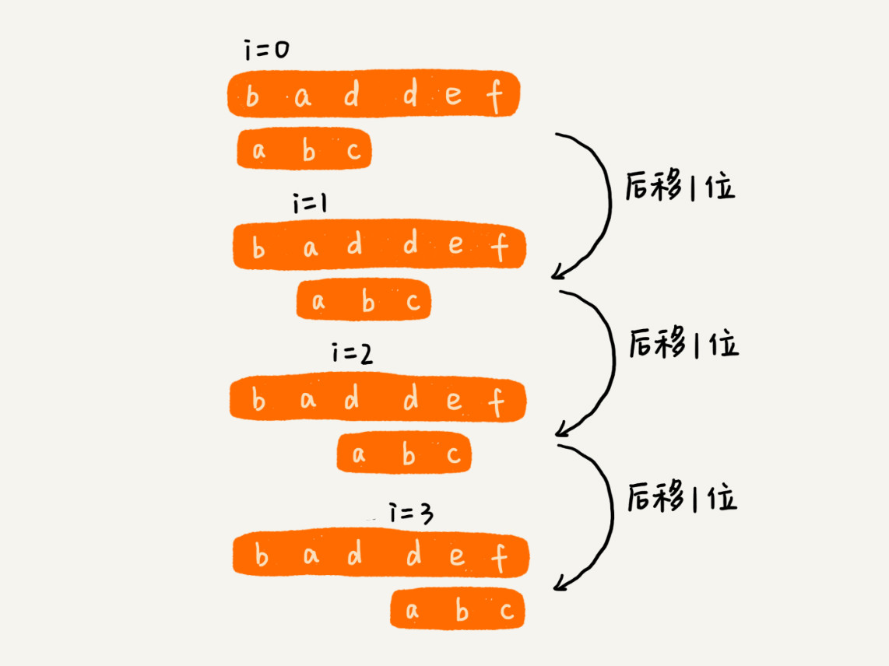

# 字符串匹配基础 I ： BF、RK 算法

[toc]

## 字符串匹配算法分类

### 单模式串匹配：

- `一个模式串跟一个主串进行匹配 ，即，在一个主串中查找一个模式串。`

- 分类：
  - 简单、好理解：BF 算法、RK 算法；
  - 难理解、但更加高效：BM 算法 和 KMP 算法.

### 多模式串匹配：

- `在多个模式串和一个主串之间做匹配，即，在一个主串中查找多个模式串。`

- 分类：
  - Trie 树 ；
  - AC 自动机.

## BF 算法

- BF 算法，即，**Brute Force 暴力匹配算法**，也叫，**朴素匹配算法**。从名字可以看出，这种算法的字符串匹配方式很 **暴力**，当然也就会比较简单、好懂，但相应的性能也不高。

- **主串** 与 **模式串**: 在字符串 A 中查找字符串 B，那字符串 A 就是主串，字符串 B 就是模式串。把主串的长度记作 n,模式串的长度记作 m.因为，是在主串中查找模式串，所以 n > m。

- `算法思想：在主串中，检查起始位置分别是 0、1、2 .... n - m 且长度为 m 的 n - m + 1 个子串，看有没有跟模式串匹配的。`

- 例子：

  

  可以看出，在极端情况下，比如主串是 "aaaaa....aaaaaa"（省略号，代表有很多重复的字符 a），模式串 "aaaaab".每次都比对 m 个字符，要比对 n - m + 1 次，所以，这种算法的最坏情况时间复杂度是 $O(n*m)$.

  

  尽管理论上，BF 算法的时间复杂度很高，是 $O(n*m)$,但在实际开发中，它却是一个比较常用的字符串匹配算法，原因如下：

  

  1. 实际的软件开发中，大部分情况下，模式串和主串的长度都不会太长，而且每次模式串与主串中的子串匹配的时候，当中途遇到不能匹配的字符的时候，就可以停止了，不需要把 m 个字符都比对一下。所以，尽管理论上的最坏情况时间复杂度是 $O(n*m)$,但是，统计意义上，大部分情况下，算法执行效率要比这个高很多。

     

  1. 朴素字符串匹配算法思想简单，代码实现也非常简单。简单意味着不容易出错，如果有 bug 也容易暴露和修复。在工程中，在满足性要求的前提下，简单是首选。这也是常说的 [KISS(Keep it Simple and Stupid) 设计原则]([KISS原则 - 维基百科，自由的百科全书 (wikipedia.org)](https://zh.wikipedia.org/wiki/KISS原则)).

​	所以，在实际的软件开发，绝大部分情况下，朴素的字符串匹配算法就够用了。

## RK 算法

- RK 算法，即，**Rabin-Karp 算法**.由它的两位发明只 Rabin 和 Karp 的名字来命名的。

- BF算法的升级版：

  在讲 BF 算法时，如果模式串长度为 m，主串长度为 n, 那在主串中，就会有 $n-m+1$ 个长度为 m 的子串，只需要暴力地对比这 $n-m+1$个字串与模式串，就可以找出主串与模式串匹配的子串。

  但是，每次检查主串与子串是否匹配，需要依次比对每个字符，所以 BF 算法的时间复杂度就比较高，$O(n*m)$.对朴素的字符串匹配算法稍加改造，引入哈希算法，时间复杂度立刻就会降低。

- `RK 算法的思路：通过哈希算法对主串中的 $n-m+1$个子串分别求哈希值，然后逐个与模式串的哈希值比较大小。如果某个子串的哈希值与模式串相等，那就说明对应的字串和模式串匹配了（先不考虑哈希冲突）。因为哈希值是一个数字，数字之间比较是否相等是非常快速的，所以模式串和子串比较效率就提高了。`

不过,通过哈希算法计算子串的哈希值的时候，需要遍历子串中的每个字符。尽管模式串与子串比较的效率提高了，但是算法整体的效率并没有提高。有没有方法可以提高哈希算法计算子串哈希值得效率呢？

这就需要哈希算法设计的非常有技巧：假设要匹配的字符串的字符集中包含 K 个字符，可以用一个 K 进制数来表示一个子串，这个 K 进制数转化成十进制数，作为子串的哈希值。

举例：比如要处理的字符串只包含 a ~ z 这 26 个小写字母，那就用二十六进制来表示一个字符串。把 a ~ z 这 26 个字符映射到 0 ~ 25 这 26 个数字，a 就表示 0, b 就表示 1，以此类推，z 表示 25.

在十进制的表示法中，一个数字的值是通过下面的方式计算出来的。对应到二十六进制，一个包含 a 到 z 这 26 个字符的字符串，计算哈希德时候，只需要把进位从 10 改成 26 就可以。

为了方便解释，假设字符串中只包含 a ~ z 这 26 个小写字符，用二十六进制来表示一个字符串，对应的哈希值就是二十六进制数转化成十进制的结果。

这种哈希算法有一个特点，在主串中，相邻两个子串的哈希值的计算公式有一定的规律：

**相邻两个子串 s[i-1] 和 s[i] （i 表示子串在主串中的起始位置，子串的长度都为 m)，对应的哈希值计算公式有交集，即，可以使用 s[i-1] 的哈希值很快的计算出 s[i] 的哈希值，公式如下：**

不过，这里有一个小细节需要注意，那就是 $26^{(m-1)}$ 这部分的计算，可以通过查表的方法来提高效率。事先计算好，$26^0、26^1、26^2......26^{(m-1)}$,并且存储在一个长度为 m 的数组中，公式中的 "次方" 就对应数组的下标。当需要计算 26 的 x 次方的时候，就可以从数组的下标为 x 的位置取值，直接使用，省去了计算的时间。

- 时间复杂度分析：

  

  整个 RK 算法包含两部分，计算子串哈希值和模式串哈希值与子串哈希值之间的比较。

  

  第一部分，前面也分析了，可以通过设计特殊的哈希算法，只需要扫描一遍主串就能计算出所有子串的哈希值了，所以这部分的时间复杂度是$O(n)$.

  

  模式串哈希值与每个子串哈希值之间的比较时间复杂度是$O(1)$,总共需要比较 $n-m+1$ 个子串的哈希值，所以，这部分的时间复杂度也是 $O(n)$. 所以，RK 算法整体的时间复杂度就是 $O(n)$.

  

  但是，模式串很长，相应的主串中的子串也会很长，通过上面的哈希算法计算得到的哈希值就可能很大，如果超过了计算机中整型数据可以表示的范围，那该如何解决呢？

  

  刚刚设计的哈希算法是没有散列冲突的，也就是说，一个字符串与一个二十六进制数一一对应，不同的字符串的哈希值肯定不一样。因为，基于进制来表示一个字符串的，可以类比成十进制、十六进制来思考一下。实际上，为了能将哈希值落在整型数据范围内，可以牺牲一下，允许哈希冲突。那这个时候哈希算法该怎么设计呢？

  

  哈希算法的设计方法有很多，例如：假设字符串中只包含 a ~ z 这 26 个英文字母，那每个字母对应一个数字，比如 a对应1，b对应2，以此类推，z对应26。可以把字符串中每个字母对应的数字相加，最后得到的和作为哈希值。这种哈希算法产生的哈希值的数据范围就相对要小很多了。

  

  不过，这种哈希算法的哈希冲突概率也是挺高的。这只举了一个最简单的设计方法，还有很多更加优化的方法，比如将每一个字母从小到大对应一个素数，而不是1、2、3...这样的自然数，这样冲突的概率就会降低一些。

  

  那新问题来了。之前只需要比较一下模式串和子串的哈希值，如果两个值相等，那这个子串就一定可以匹配模式串。但是，当存在哈希冲突的时候，有可能存在这样的情况，子串和模式串的哈希值虽然是相同的，但是两者本身并不匹配。

  

  解决方法很简单，当发现一个子串的哈希值跟模式串的哈希值相等的时候，只需要再对比以下子串和模式串本身就好。当然，如果子串的哈希值与模式串的哈希值不想等，那对应的子串和模式串肯定也是不匹配的，就不需要比对子串和模式串本身了。

  

  所以，哈希算法的冲突概率要相对控制得低一些，如果存在大量冲突，就会导致 RK 算法的时间复杂度退化、效率下降。极端情况下，如果存在大量的冲突，每次都再要比对子串和模式串本身，那时间复杂度就会退化成$O(n*m)$.但是，一般情况下，冲突不会很多，RK算法 的效率还是比 BF算法高。

  

  

## 总结

- BF 算法是最简单、粗暴的字符串匹配算法，它的实现思路是，拿模式串与主串中是所有子串匹配，看是否有能匹配的子串。所以，时间复杂度也比较高，是 $O(n*m)$，n、m 表示主串和模式串的长度。不过，在实际的软件开发中，因为这种算法实现简单，对于处理小规模的字符串匹配很好用。

- RK 算法是借助哈希算法对 BF 算法进行改造，即对每个子串分别求哈希值，然后拿子串的哈希值与模式串的哈希值比较，减少了比较的时间。所以，理想情况下，RK 算法的时间复杂度是 $O(n)$，跟 BF 算法相比，效率提高了很多。不过这样的效率取决于哈希算法的设计方法，如果存在冲突的情况下，时间复杂度可能会退化。极端情况下，哈希算法大量冲突，时间复杂度就退化为 $O(n*m)$。

*`@ 笔记时间 ：2021-02-14	FROM	极客时间 《算法啊与数据结构之美》 王争  专栏`* 