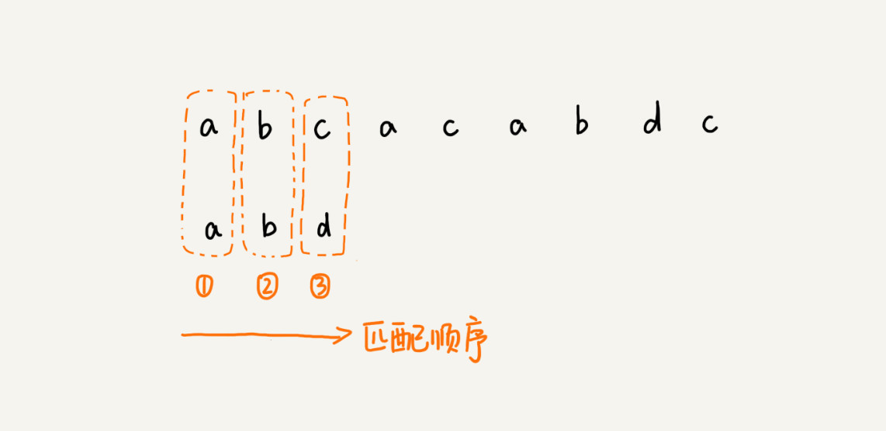
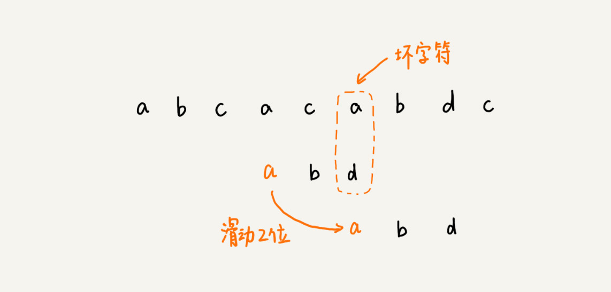
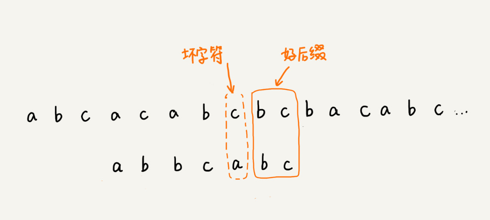
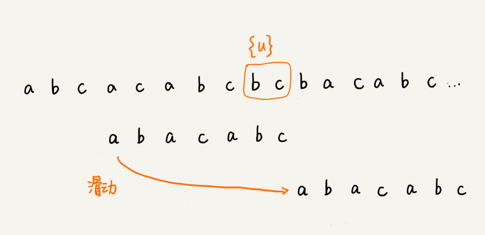
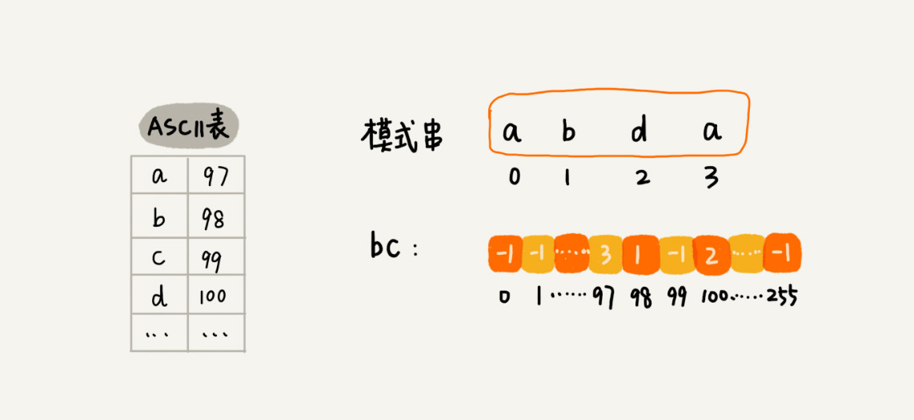

# 字符串匹配算法 II :BM、KMP 算法

[toc]

## BM 算法

把模式串和主串的匹配过程，看作模式串在主串中不停地往后滑动。当遇到不匹配的字符时，BF 算法 和 RK 算法的做法是，模式串往后滑动一位，然后从模式串的第一个字符开始重新匹配，如下图：


在这个例子里，主串中的 c，在模式串中是不存在的，所以，模式串向后滑动的时候，只要 c 与 模式串有重合，肯定无法匹配。所以，可以一次性把模式串往后多滑动几位，把模式串移动到 c 的后面。


所以，可以思考一下，当遇到不匹配的字符时，有什么固定的规律，可以将模式串往后多滑动几位呢?这样一次性往后滑动好几位，匹配的效率岂不就提高了？

而 BM 算法，本质上其实就是在寻找这种规律。借助这种规律，在模式串与主串匹配的过程中，当模式串和主串某个字符不匹配的时候，能够跳过一些肯定不会匹配的情况，将模式串往后多滑动几位。

### BM 算法 原理分析

BM 算法包含两部分，分别是 **坏字符规则（Bad Character Rule)** 和 **好后缀规则（Good Suffix Shift)**.

#### 1. 坏字符规则（Bad Character Rule)

前面两节讲的算法，在匹配的过程中，都是按模式串的下标从小到大的顺序，依次与主串中的字符进行匹配的。这种匹配顺序比较符合我们的思维习惯，而 BM 算法的匹配顺序比较特别，它是按照模式串下标从大到小的顺序，倒着匹配的。如下图：




从模式串的末尾往前倒着匹配，当发现某个字符没法匹配的时候，把这个没有匹配的字符叫作 **坏字符（主串中的字符）**。


拿坏字符 c 在模式中查找，发现模式串中并不存在这个字符，即，字符 c 与 模式串中的任何字符都不可能匹配。这个时候，可以将模式串直接往后滑动三位，将模式串滑动到 c 后面的位置，再从模式串的末尾字符开始比较。


这个时候，模式串中最后一个字符 d，还是无法跟主串中的 a 匹配，但这个时候，就不能将模式串往后滑动三位了。因为，这个时候，坏字符 a 在模式串中是存在的，模式串中下标是 0 的位置也是字符 a.这种情况下，可以将模式串往后滑动两位，让两个 a 上下对齐，然后再从模式串的末尾字符开始，重新匹配。



第一次不匹配的时候，滑动了三位，第二次不匹配的时候，将模式串后移两位，那具体滑动多少位，到底有没有规律呢？

- 移动规律：

  **当发生不匹配的时候，把坏字符对应的模式串中的字符下标记作 si.如果坏字符在模式串中存在，把这个坏字符在模式串中的下标记做 xi。如果不存在，把 xi 记作 -1.那模式串往后移动的位数就等于 si-xi.**

  **特别说明，如果坏字符在模式串里多处出现，那在计算 xi 的时候，选择最靠后那个，因为这样不会让模式串滑动过多，导致本来可能匹配的情况被滑动略过。**

- 复杂度分析：

  利用坏字符规则，BM 算法在最好情况下的时间复杂度非常低，是 $O(n/m)$.比如，主串是 aaabaaabaaabaaab，模式串是 aaaa。每次比对，模式串都可以直接后移四位，所以，匹配具有类似特点的模式和主串的时候，BM 算法非常高效。

  

不过，单纯使用坏字符规则还是不够。因为根据 si-xi 计算出来的移动位数，有可能是负数，比如主串是 aaaaaaaaaaaaaaaa, 模式串是 baaa. 不但不会向后滑动模式串，还有可能倒退，所以，BM 算法还需要用到 "好后缀规则"。

#### 2. 好后缀规则

好后缀规则实际上跟坏字符规则的思路很类似。如下图，当模式串滑动到图中的位置时，模式串和主串有2个字符是匹配的，倒数第3个字符发生了不匹配的情况。



 

这个时候，既可以利用坏字符规则来计算模式串的滑动位数，也可以使用好后缀处理规则。

##### 好后缀处理规则

把已经匹配的 bc 叫作好后缀，记作{u}.拿它在模式串中查找，如果找到了另一个跟{u}相匹配的子串{u\*},那就将模式串滑到子串{u\*} 与 主串中 {u} 对齐的位置。


如果在模式串中找不到另一个等于 {u} 的子串，就直接将模式串，滑动到主串中 {u} 的后面，因为之前的任何一次往后滑动，都没有匹配主串中 {u} 的情况。





不过，当模式串中不存在等于 {u} 的子串时，直接将模式串滑动到主串 {u} 的后面。这样做是否有点过头呢？例子如下：这里面 bc 是好后缀，尽管在模式串中没有另外一个相匹配的子串 {u*}，但是如果将模式串移动到好后缀后面，如图所示，那就回错过模式串和主串可以匹配的情况。


如果好后缀在模式串中不存在可匹配的子串，那在一步一步往后，滑动模式串的过程中，只要主串中的 {u} 与 模式串有重合，那就肯定无法完全匹配。但是当模式串滑动到前缀与主串中 {u} 的后缀有部分重合的时候，并且重合的部分相等的时候，就有可能会存在完全匹配的情况。


所以，针对这种情况，不仅要看好后缀在，模式串中，还要考察好后缀的后的 **后缀子串**，是否存在跟模式串的潜质w


所谓某个字符 s 的后缀子串，就是最后一个字符跟 s 对齐的子串，比如 abc 的后缀子串就包括 c,bc.所谓前缀子串，就是其实字符跟 s 对齐的子串，比如 abc 的前缀子串有 a,ab.从好后缀的后缀子串中，找一个最长的并且能跟模式串的前缀子串匹配，假设是 {v}，然后将模式串滑动到如图所示位置：


#### 如何选择 好后缀规则 还是 坏字符规则，来计算模式串往后滑动的位数？

分别计算好后缀和坏字符往后滑动的位数，然后取两个数中最大的，作为模式串往后滑动的位。这种处理方法，可以避免，前面提到的，根据坏字符规则，计算得到的往后滑动的位数，有可能是负数的情况。


### BM 算法 代码实现

"坏字符规则" 本身不难理解，当遇到坏字符时，要计算往后移动的位数 si-xi，其中 xi 的计算是重点，但如何求 xi呢？或者说，如何查找坏字符在模式串中出现的位置呢？

如果拿坏字符，在模式串中遍历查找，这样就会比较低效，势必影响这个算法的性能。有没有更高效的方式呢？

之前学的散列表，这时就可以派上用场了，可以将模式串中的每个字符及其下标都存到散列表中，这样就可以快速找到坏字符在模式串的位置下标了。

关于这个散列表，只实现一种最简单的情况，假设字符串的字符集不是很大，每个字符长度是 1 字节，用大小为 256 的数组，来记录每个字符在模式串中出现的位置。数组的下标对应字符的 ASCII 码值，数组中存储这个字符在模式串中出现的位置。





代码如下，其中变量 b 是模式串，m 是模式串的长度，bc 表示刚刚说的散列表：


```java
private static final int SIZE = 256; // 全局变量或成员变量
private void generateBC(char[] b, int m, int[] bc) {
  for (int i = 0; i < SIZE; ++i) {
    bc[i] = -1; // 初始化bc
  }
  for (int i = 0; i < m; ++i) {
    int ascii = (int)b[i]; // 计算b[i]的ASCII值
    bc[ascii] = i;
  }
}
```


掌握了坏字符规则之后，先把 BM 算法代码的大框架写好，先不考虑好后缀规则，仅用坏字符规则，并且不考虑 si-xi 计算得到的移动位数可能会出现负数的情况：


```java
public int bm(char[] a, int n, char[] b, int m) {
  int[] bc = new int[SIZE]; // 记录模式串中每个字符最后出现的位置
  generateBC(b, m, bc); // 构建坏字符哈希表
  int i = 0; // i表示主串与模式串对齐的第一个字符
  while (i <= n - m) {
    int j;
    for (j = m - 1; j >= 0; --j) { // 模式串从后往前匹配
      if (a[i+j] != b[j]) break; // 坏字符对应模式串中的下标是j
    }
    if (j < 0) {
      return i; // 匹配成功，返回主串与模式串第一个匹配的字符的位置
    }
    // 这里等同于将模式串往后滑动j-bc[(int)a[i+j]]位
    i = i + (j - bc[(int)a[i+j]]); 
  }
  return -1;
}
```


图示如下：


至此，已经实现了坏字符规则的框架代码，只剩下往框架代码中填充好后缀规则了。如何实现好后缀规则呢？

前面讲过好后缀的处理规则中的最核心内容：

- 在模式串中，查找跟好后缀匹配的另一个子串；
- 在好后缀的后缀子串中，查找最长的、能跟模式串前缀子串匹配的后缀子串。

在不考虑效率的情况下，这两个操作都可以用很 "暴力" 的匹配查找方式解决，但是，如果想要 BM 算法的效率很高，这部分就不能太低效，如何来做呢？

因为好后缀也是模式串本身的后缀子串，所以，可以在模式串和主串正式匹配之前，通过预处理模式串，预先计算好模式串的每个后缀子串，对应的另一个可匹配子串的位置。这个预处理过程比较有技巧，很不好懂，要多读几遍。

先来看，如何表示模式串中不同的后缀子串呢？

因为后缀子串的最后一个字符的位置是固定的，下标为 m - 1,只需要记录长度就可以了。通过长度，可以确定一个唯一的后缀子串。


现在，要 **引入最关键的变量 suffix 数组。** suffix 数组的下标 k,表示后缀子串的长度，下标对应的数组值存储的是，在模式串中跟好后缀 {u} 相匹配的子串 {u*} 的起始下标值。这句话不好理解，举例如下：


但是，如果模式串中有多个 （大于 1 个） 子串跟后缀子串 {u} 匹配，那 suffix 数组中该存储哪一个子串的起始位置呢？

为了避免模式串往后滑动得过头，肯定要存储模式串中最靠后的那个子串的起始位置，也就是下标最大的那个子串的起始位置。不过，这样处理就足够了码？

实际上，仅仅是选最靠后的字串片段来存储是不够的。再回忆一下好后缀规则：

不仅要在模式串中，查找好后缀匹配的另一个子串，还要在好后缀的后缀子串中，查找最长的能跟模式串前缀子串匹配的后缀子串。

如果只记录刚刚定义的 suffix，实际上，只能处理规则的前半部分，也就是，在模式串中，查找跟好后缀匹配的另一个子串。所以，除了 suffix 数组之外，还需要另外一个 boolean 类型的 prefix 数组，来记录模式串的后缀子串是否能匹配模式串的前缀子串。


**但是，如何来计算并填充这两个数组的值呢？** 这个计算过程非常巧妙。

拿下标从 0 到 i 的子串（i 可以是 0 到 m-2) 与 整个模式串，求公共后缀子串。如果公共后缀子串的长度是 k,那就记录 suffix[k] = j (j 表示公共后缀子串的起始下标)。如果 j = 0，那么，公共后缀子串也是模式串的前缀子串，就记录 prefix[k] = true.


把 suffix 数组 和 prefix 数组的计算过程，用代码实现出来，如下：

```java
// b表示模式串，m表示长度，suffix，prefix数组事先申请好了
private void generateGS(char[] b, int m, int[] suffix, boolean[] prefix) {
  for (int i = 0; i < m; ++i) { // 初始化
    suffix[i] = -1;
    prefix[i] = false;
  }
  for (int i = 0; i < m - 1; ++i) { // b[0, i]
    int j = i;
    int k = 0; // 公共后缀子串长度
    while (j >= 0 && b[j] == b[m-1-k]) { // 与b[0, m-1]求公共后缀子串
      --j;
      ++k;
      suffix[k] = j+1; //j+1表示公共后缀子串在b[0, i]中的起始下标
    }
    if (j == -1) prefix[k] = true; //如果公共后缀子串也是模式串的前缀子串
  }
}
```

有了这两个数组之后，现在来看，**在模式串跟主串匹配的过程中，遇到不能匹配的字符时，如何根据好后缀规则，计算模式串往后滑动的位数？**

假设好后缀的长度是 k,先拿好后缀，在 suffix 数组中查找其匹配的子串。如果 suffix[k] 不等于 -1 （-1 表示不存在匹配的子串），那就将模式串往后移动 j - suffix[k] + 1 位（ j 表示坏字符对应的模式串中的字符下标）。如果， suffix[k] = -1, 表示模式串中不存在一个跟好后缀匹配的子串片段。可以用下面这条规则来处理：


如果两条规则都没有找到可以匹配好后缀及其后缀子串的子串，就将整个模式串后移 m 位。


至此，好后缀规则的代码实现也已经讲完了。把好后缀规则加到前面的代码框架里，就可以得到 BM 算法的完整版代码实现：

```java

// a,b表示主串和模式串；n，m表示主串和模式串的长度。
public int bm(char[] a, int n, char[] b, int m) {
  int[] bc = new int[SIZE]; // 记录模式串中每个字符最后出现的位置
  generateBC(b, m, bc); // 构建坏字符哈希表
  int[] suffix = new int[m];
  boolean[] prefix = new boolean[m];
  generateGS(b, m, suffix, prefix);
  int i = 0; // j表示主串与模式串匹配的第一个字符
  while (i <= n - m) {
    int j;
    for (j = m - 1; j >= 0; --j) { // 模式串从后往前匹配
      if (a[i+j] != b[j]) break; // 坏字符对应模式串中的下标是j
    }
    if (j < 0) {
      return i; // 匹配成功，返回主串与模式串第一个匹配的字符的位置
    }
    int x = j - bc[(int)a[i+j]];
    int y = 0;
    if (j < m-1) { // 如果有好后缀的话
      y = moveByGS(j, m, suffix, prefix);
    }
    i = i + Math.max(x, y);
  }
  return -1;
}

// j表示坏字符对应的模式串中的字符下标; m表示模式串长度
private int moveByGS(int j, int m, int[] suffix, boolean[] prefix) {
  int k = m - 1 - j; // 好后缀长度
  if (suffix[k] != -1) return j - suffix[k] +1;
  for (int r = j+2; r <= m-1; ++r) {
    if (prefix[m-r] == true) {
      return r;
    }
  }
  return m;
}
```

### BM 算法的性能分析及优化

- 内存消耗：

  整个算法用到了额外 3 个数组，其中 bc 数组的 大小跟字符集大小有关， suffix 数组 和 prefix 数组的大小跟模式串长度 m 有关。

  如果处理字符集很大的字符串匹配问题，bc 数组对内存的消耗就会比较多。因为好后缀和坏字符规则是独立的，如果运行的环境对内存要求苛刻，可以只使用好后缀规则，不使用坏字符规则，这样就可以避免 bc 数组过多的内存消耗。不过，单纯使用好后缀规则 BM 算法效率就会下降一些。

- 执行效率、时间复杂度：

  实际上，前面讲的 BM 算法是个初级版本。为了让你能容易理解，有些复杂的优化没有讲。基于目前的这个版本，在极端情况下，预处理计算 suffix 数组、prefix 数组的性能会比较差。

  比如模式串是 aaaaaa 这种包含很多重复的字符的模式串，预处理的时间复杂度就是 $O(m^2)$.当然，大部分情况下，时间复杂度不会这么差。

  （参照阅读，[A new proof of the linearity of the Boyer-Moore string searching algorithm](A new proof of the linearity of the Boyer-Moore string searching algorithm"证明了在最坏情况下，BM 算法的比较次数上限是 5n。这篇论文"Tight bounds on the complexity of the Boyer-Moore string matching algorithm"证明了在最坏情况下，BM 算法的比较次数上限是 3n。你可以自己阅读看看。)证明了在最坏情况下，BM 算法的比较次数上限是 5n。这篇论文 [Tight bounds on the complexity of the Boyer-Moore string matching algorithm]([Tight bounds on the complexity of the Boyer-Moore string matching algorithm | Proceedings of the second annual ACM-SIAM symposium on Discrete algorithms](https://dl.acm.org/doi/10.5555/127787.127830))证明了在最坏情况下，BM 算法的比较次数上限是 3n。)

### BM 算法总结

BM 算法是一种比较复杂的字符串匹配算法，BM 算法。尽管复杂、难懂，但匹配的效率却很高，在实际的软件开发中，特别是一些文本编辑器中，应用比较多。如果一遍看不懂的话，就多看几遍。

`BM 算法核心思想是，利用模式串本身的特点，在模式串中某个字符与主串不能匹配的时候，将模式串往后多滑动几位，以此来减少不必要的字符比较，提高匹配的效率。BM 算法构建的规则有两类，坏字符规则和好后缀规则。好后缀规则可以独立于坏字符规则使用。因为坏字符规则的实现比较耗内存，为了节省内存，可以只用好后缀规则来实现 BM 算法。`


## KMP 算法

KMP 算法是根据三位作者（D.E.Knuth, J.H.Morris 和 V.R.Pratt）的名字来命名的，全称是 Knuth Morris Pratt 算法，简称为 KMP 算法。

**核心思想，与BM算法非常相近。假设主串是 a,模式串是 b；在模式串与主串匹配的过程中，当遇到不可匹配的字符的时候，希望找到一些规律，可以将模式串往后多滑动几位，跳过那些肯定不会匹配的情况。**

类比一下好后缀和坏字符，在模式串中和主串匹配的过程中，把不能匹配的那个字符仍然叫作 **坏字符**，把已经匹配的那段字符串叫作 **好前缀**。


当遇到坏字符的时候，就要把模式串往后滑动，在滑动的过程中，只要模式串和好前缀有上下重合，前面几个字符的比较，就相当于拿好前缀的后缀子串，跟模式串的前缀子串在比较。

但，这个比较的过程能否更高效呢？可以不用一个字符一个字符地比较了吗？


**KMP 算法就是在试图寻找一种规律：在模式串和主串匹配的过程中，当遇到坏字符后，对于已经对比过的好前缀，能否找到一种规律，将模式串一次性滑动很多位？**

只需要拿好前缀本身，在它的后缀子串中，查找最长的那个可以跟好前缀的前缀子串匹配。假设最长的可匹配的那部分前缀子串是{v}，长度是 k。把模式串一次性往后滑动 j - k 位，相当于，每次遇到坏字符的时候，就把 j 更新为 k，i 不变，然后继续比较。


为了表述起来方便，把好前缀的所有后缀子串中，最长的可匹配前缀子串的那个后缀子串，叫作 **最长可匹配后缀子串**；对应的前缀子串，叫作 **最长可匹配前缀子串**。


如何来求好前缀的最长可匹配前缀和后缀子串呢？

这个问题其实不涉及主串，只需要通过模式串本身就能求解。所以，能不能先预处理计算好，在模式串和主串匹配的过程中，直接拿过来就用呢？

类似 BM 算法中的 bc、suffix、prefix 数组, KMP 算法 也可以提前构建一个数组，用来存储模式串中每个前缀（这些前缀都有可能是好前缀）的最长可匹配前缀子串的结尾字符下标。把这个数组定义为 **next 数组**，很多书中还给这个数组起了一个名字，叫 **失效函数（Failure Function)**.

数组的下标是每个前缀结尾字符下标，数组的值是这个前缀的最长可以匹配的前缀子串的结尾字符下标。有点拗口，看以下例子：


有了 next 数组，很容易就可以实现 KMP 算法。先假设 next 数组已经计算好了，先给出 KMP 算法的框架代码：

```java
// a, b分别是主串和模式串；n, m分别是主串和模式串的长度。
public static int kmp(char[] a, int n, char[] b, int m) {
  int[] next = getNexts(b, m);
  int j = 0;
  for (int i = 0; i < n; ++i) {
    while (j > 0 && a[i] != b[j]) { // 一直找到a[i]和b[j]
      j = next[j - 1] + 1;
    }
    if (a[i] == b[j]) {
      ++j;
    }
    if (j == m) { // 找到匹配模式串的了
      return i - m + 1;
    }
  }
  return -1;
}
```

### 失效函数计算方法

KMP 算法的基本原理讲完了，现在来看看最复杂度部分，也就是 next 数组是如何计算出来的？

当然，可以用非常笨的方法，比如要计算下面这个模式串 b 的 next[4]，就可以把 b[0,4] 的所有后缀子串，从长到短找出来，依次看看，能否跟模式串的前缀子串匹配。很显然，这个方法也可以计算到 next 数组，但效率非常低。有没有更加高效的方法呢？


这里的处理非常有技巧，类似于动态规划。不过，动态规划在后面才会讲，所以，这里换种方法解释：

按照下标从小到大，依次计算 next 数组的值，当要计算 next[i] 的时候，前面的 next[0], next[1], ...... , next[i-1] 应该已经计算出来了。

利用已经计算出来的 next 值，是否可以快速推导出 next[i] 的值呢?

如果 next[i-1] = k - 1，即，子串 b[0,k-1] 是 b[0,i-1]的最长可匹配的前缀子串。如果子串 b[0,k-1]的下一个字符 b[k], 与 b[0,i-1] 的下一个字符 b[j] 匹配，那子串 b[0,k] 就是 b[0,i] 的最长可匹配前缀子串。所以，next[i] 等于 K.但是，如果 b[0,k-1] 的下一字符 b[k] 跟 b[0,i-1] 的下一个字符 b[i] 不相等呢？这个时候就不能简单地通过 next[i-1] 得到 next[i] 了。这个时候该怎么办呢？


假设 b[0,i] 的最长可匹配后缀子串是 b[r,i]。如果把最后一个字符去掉，那 b[r,i-1] 肯定是 b[0,i-1] 的可匹配后缀子串，但不一定是最长可匹配后缀子串。所以，既然 b[0,i-1] 最长可匹配后缀子串对应的模式串的前缀子串的下一个字符并不等于 b[i]，那么就可以考察 b[0,i-1] 的次长可匹配后缀子串 b[x,i-1] 对应的可匹配前缀子串 b[0,i-1-x] 的下一个字符 b[i-x] 是否等于 b[i]；如果等于，那 b[x,i] 就是 b[0,i]的最长可匹配后缀子串。


可是，如何求得 b[0,i-1]的次长可匹配后缀子串呢？

次长可匹配后缀子串肯定被包含在最长可匹配后缀子串中，而最长可匹配后缀子串又对应最长可匹配前缀子串 b[0,y]。于是，查找 b[0,i-1] 的次长可匹配后缀子串，这个问题就变成，查找 b[0,y]的最长匹配后缀子串的问题了。


按照这个思路，可以考察完所有的 b[0,i-1] 得可匹配后缀子串 b[y,i-1]，直到找到一个可匹配的后缀子串，它对应的前缀子串的下一个字符鞥与 b[i],那这个 b[y,i] 就是 b[0,i] 的最长可匹配后缀子串。

写出这部分代码后，将前面已经给出 KMP 算法的框架代码，和这部分代码合在一起，就是整个 KMP 算法的代码实现。

```java
// b表示模式串，m表示模式串的长度
private static int[] getNexts(char[] b, int m) {
  int[] next = new int[m];
  next[0] = -1;
  int k = -1;
  for (int i = 1; i < m; ++i) {
    while (k != -1 && b[k + 1] != b[i]) {
      k = next[k];
    }
    if (b[k + 1] == b[i]) {
      ++k;
    }
    next[i] = k;
  }
  return next;
}
```

### KMP 算法复杂度分析

- 空间复杂度：

  KMP 算法只需要一个额外的 next 数组，数组的大小跟模式串相同，所以，空间复杂度是 $O(m)$，m - 表示模式串的长度。

- 时间复杂度：

  KMP 算法 包含两部分，第一部分是构建 next 数组，第二部分才是借助 next 数组匹配。

  - 第一部分 构建 next 数组：

    计算 next 数组的代码中，第一层 for 循环中 i 从 1 到 m -1 ，即，内部的代码被执行了 m - 1 次。for 循环内部代码有一个 while 循环，如果能知道每次 for 循环、while 循环平均执行的次数，假设是 k，那时间复杂度就是 $O(k*m)$。但是，while 循环执行的次数不怎么好统计，所以放弃这种方法。可以找一些参照变量，i 和 k。i 从 1 开始一直增加到 m，而 k 并不是每次 for 循环都会增加。所以，k 累加增加的值肯定小于 m. 而 while 循环里 k = next[k]，实际上是在减小 k 的值，k 累积都没有增加超过 m, 所以 while 循环里面 k = next[k] 总的执行次数也不可能超过 m。因此，next 数组计算的时间复杂度是 $O(m)$。

  - 第二部 借助 next 数组匹配：

    i 从 0 循环增长到 n-1,j 的增长量不可能超过 i,所以肯定小于 n.而，while 循环中的那条语句 j = next[j-1]+1，不会让 j 增长的，那有没有可能让 j 不变呢？也没有可能。因为 next[j-1] 的值肯定小于 j - 1,所以 while 循环中的这条语句实际 上也是在 j 的值减少。而 j 总共增长的量都不会超过 n,那减少的量也不可能超过 n,所以 while 循环中的这条语句总的执行次数也不会超过 n，所以这部分的时间复杂度是 $O(n)$.

    

  所以，综合两部分的时间复杂度，KMP 算法的时间复杂度就是 $O(m+n)$.

  

  

### KMP 算法 总结

KMP 算法和上一节讲的 BM 算法的本质非常类似，都是根据规律在遇到坏字符的时候，把模式串往后多滑动几位。

BM 算法有两个规则，坏字符和好后缀。KMP 算法借鉴 BM 算法的思想，可以总结成好前缀规则。这里面最难懂的就是 next 数组的计算。如果用最笨的方法来计算，确实不难，但是效率会比较低。所以，我讲了一种类似动态规划的方法，按照下标 i 从小到大，依次计算 next[i]，并且 next[i]的计算通过前面已经计算出来的 next[0]，next[1]，……，next[i-1]来推导。

KMP 算法的时间复杂度是 O(n+m)，不过它的分析过程稍微需要一点技巧，不那么直观，你只要看懂就好了，并不需要掌握，在我们平常的开发中，很少会有这么难分析的代码。

#### 最难的地方 ： k = next[k]

因为前一个的最长串的下一个字符不与最后一个相等，需要找前一个的次长串，问题就变成了求0到next(k)的最长串，如果下个字符与最后一个不等，继续求次长串，也就是下一个next(k)，直到找到，或者完全没有。


*`@ 笔记时间 ：2021-02-15	FROM	极客时间 《算法啊与数据结构之美》 王争  专栏`* 

