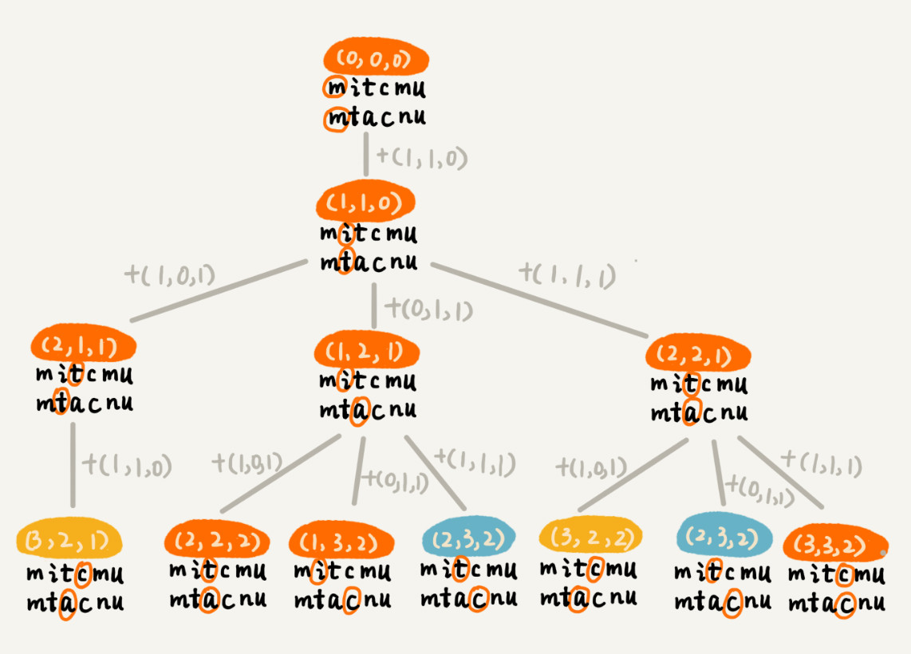

# 动态规划 III : 实战

[toc]

## 如何量化两个字符串的相似度？

有一个非常著名的量化方法，那就是 **编辑距离（Edit Distance）**。

> **编辑距离指的就是，将一个字符串转化成另一个字符串，需要的最少编辑操作次数（比如增加一个字符、删除一个字符、替换一个字符）。编辑距离越大，说明两个字符串的相似程度越小；相反，编辑距离就越小，说明两个字符串的相似程度越大。对于两个完全相同的字符串来说，编辑距离就是 0。**

根据所包含的编辑操作种类的不同，编辑距离有多种不同的计算方式，比较著名的有 **莱文斯坦距离（Levenshtein distance）** 和 **最长公共子串长度（Longest common substring length）**。其中，莱文斯坦距离允许增加、删除、替换字符这三个编辑操作，最长公共子串长度只允许增加、删除字符这两个编辑操作。

而且，**莱文斯坦距离和最长公共子串长度，从两个截然相反的角度，分析字符串的相似程度。莱文斯坦距离的大小，表示两个字符串差异的大小；而最长公共子串的大小，表示两个字符串相似程度的大小。**

关于这两个计算方法，举个例子说明一下。这里面，两个字符串 $mitcmu$ 和 $ mtacnu$ 的莱文斯坦距离是 3，最长公共子串长度是 4。


## 如何编程计算莱文斯坦距离？

思考过程比结论更重要，所以，现在就展示一下，为解决这个问题的完整的思考过程。

这个问题是求把一个字符串变成另一个字符串，需要的最少编辑次数。整个求解过程，涉及多个决策阶段，需要依次考察一个字符串中的每个字符，跟另一个字符串中的字符是否匹配，匹配的话如何处理，不匹配的话又如何处理。所以，这个问题符合 **多阶段决策最优解模型**。

前面讲了，贪心、回溯、动态规划可以解决的问题，都可以抽象成这样一个模型。要解决这个问题，可以先看一看，用最简单的回溯算法，该如何来解决。

回溯是一个递归处理的过程。如果 a[i]与 b[j]匹配，递归考察 a[i+1]和 b[j+1]。如果 a[i]与 b[j]不匹配，那有多种处理方式可选：

- 可以删除 a[i]，然后递归考察 a[i+1]和 b[j]；
- 可以删除 b[j]，然后递归考察 a[i]和 b[j+1]；
- 可以在 a[i]前面添加一个跟 b[j]相同的字符，然后递归考察 a[i]和 b[j+1];
- 可以在 b[j]前面添加一个跟 a[i]相同的字符，然后递归考察 a[i+1]和 b[j]；
- 可以将 a[i]替换成 b[j]，或者将 b[j]替换成 a[i]，然后递归考察 a[i+1]和 b[j+1]。

代码如下：

```java
private char[] a = "mitcmu".toCharArray();
private char[] b = "mtacnu".toCharArray();
private int n = 6;
private int m = 6;
private int minDist = Integer.MAX_VALUE; // 存储结果
// 调用方式 lwstBT(0, 0, 0);
public lwstBT(int i, int j, int edist) {
  if (i == n || j == m) {
    if (i < n) edist += (n-i);
    if (j < m) edist += (m - j);
    if (edist < minDist) minDist = edist;
    return;
  }
  if (a[i] == b[j]) { // 两个字符匹配
    lwstBT(i+1, j+1, edist);
  } else { // 两个字符不匹配
    lwstBT(i + 1, j, edist + 1); // 删除a[i]或者b[j]前添加一个字符
    lwstBT(i, j + 1, edist + 1); // 删除b[j]或者a[i]前添加一个字符
    lwstBT(i + 1, j + 1, edist + 1); // 将a[i]和b[j]替换为相同字符
  }
}
```

根据回溯算法的代码实现，可以画出递归树，**看是否存在重复子问题。如果存在重复子问题，那就可以考虑能否用动态规划来解决；如果不存在重复子问题，那回溯就是最好的解决方法。**



在递归树中，每个节点代表一个状态，状态包含三个变量 $(i, j, edist)$，其中，$edist$ 表示处理到 $a[i]$ 和 $b[j]$时，已经执行的编辑操作的次数。

在递归树中，$(i, j)$ 两个变量重复的节点很多，比如 $(3, 2)$ 和 $(2, 3)$。对于 $(i, j)$ 相同的节点，只需要保留 $edist$ 最小的，继续递归处理就可以了，剩下的节点都可以舍弃。所以，状态就从 $(i, j, edist)$ 变成了 $(i, j, min_edist)$，其中 $min\_edist$ 表示处理到 $a[i]$ 和 $b[j]$，已经执行的最少编辑次数。

看到这里，有没有觉得，这个问题跟上两节讲的动态规划例子非常相似？不过，这个问题的状态转移方式，要比之前两节课中讲到的例子都要复杂很多。上一节讲的矩阵最短路径问题中，到达状态 $(i, j)$ 只能通过 $(i-1, j)$ 或 $(i, j-1)$ 两个状态转移过来，而今天这个问题，状态 $(i, j)$ 可能从 $(i-1, j)，(i, j-1)，(i-1, j-1)$ 三个状态中的任意一个转移过来。


基于刚刚的分析，可以尝试着将把状态转移的过程，用公式写出来。这就是前面讲的状态转移方程。

```java
如果：a[i]!=b[j]，那么：min_edist(i, j)就等于：
min(min_edist(i-1,j)+1, min_edist(i,j-1)+1, min_edist(i-1,j-1)+1)

如果：a[i]==b[j]，那么：min_edist(i, j)就等于：
min(min_edist(i-1,j)+1, min_edist(i,j-1)+1，min_edist(i-1,j-1))

其中，min表示求三数中的最小值。     
```

了解了状态与状态之间的递推关系，画出一个二维的状态表，按行依次来填充状态表中的每个值。


在既有状态转移方程，又理清了完整的填表过程，代码实现就非常简单了,代码如下：

```java

public int lwstDP(char[] a, int n, char[] b, int m) {
  int[][] minDist = new int[n][m];
  for (int j = 0; j < m; ++j) { // 初始化第0行:a[0..0]与b[0..j]的编辑距离
    if (a[0] == b[j]) minDist[0][j] = j;
    else if (j != 0) minDist[0][j] = minDist[0][j-1]+1;
    else minDist[0][j] = 1;
  }
  for (int i = 0; i < n; ++i) { // 初始化第0列:a[0..i]与b[0..0]的编辑距离
    if (a[i] == b[0]) minDist[i][0] = i;
    else if (i != 0) minDist[i][0] = minDist[i-1][0]+1;
    else minDist[i][0] = 1;
  }
  for (int i = 1; i < n; ++i) { // 按行填表
    for (int j = 1; j < m; ++j) {
      if (a[i] == b[j]) minDist[i][j] = min(
          minDist[i-1][j]+1, minDist[i][j-1]+1, minDist[i-1][j-1]);
      else minDist[i][j] = min(
          minDist[i-1][j]+1, minDist[i][j-1]+1, minDist[i-1][j-1]+1);
    }
  }
  return minDist[n-1][m-1];
}

private int min(int x, int y, int z) {
  int minv = Integer.MAX_VALUE;
  if (x < minv) minv = x;
  if (y < minv) minv = y;
  if (z < minv) minv = z;
  return minv;
}
```

可能会说，虽然能看懂讲的思路，但是遇到新的问题的时候，还是会感觉到无从下手。这种感觉是非常正常的。关于复杂算法问题的解决思路，还有一些经验、小技巧，可以分享以下。

**当拿到一个问题的时候，可以先不思考，计算机会如何实现这个问题，而是单纯考虑“人脑”会如何去解决这个问题。**人脑比较倾向于思考具象化的、摸得着看得见的东西，不适合思考过于抽象的问题。所以，需要把抽象问题具象化。那如何具象化呢？可以实例化几个测试数据，通过人脑去分析具体实例的解，然后总结规律，再尝试套用学过的算法，看是否能够解决。

除此之外，还有一个非常有效、但也算不上技巧的东西，那就是多练。实际上，做多了题目之后，自然就会有感觉，看到问题，立马就能想到能否用动态规划解决，然后直接就可以寻找最优子结构，写出动态规划方程，然后将状态转移方程翻译成代码。

## 如何编程计算最长公共子串长度？

最长公共子串作为编辑距离中的一种，只允许增加、删除字符两种编辑操作。从名字上，可能觉得它看起来跟编辑距离没什么关系。实际上，从本质上来说，它表征的也是两个字符串之间的相似程度。

这个问题的解决思路，跟莱文斯坦距离的解决思路非常相似，也可以用动态规划解决。我刚刚已经详细讲解了莱文斯坦距离的动态规划解决思路，所以，针对这个问题，我直接定义状态，然后写状态转移方程。

每个状态还是包括三个变量 $(i, j, max_lcs)$，$max_lcs$ 表示 $a[0...i]$和$ b[0...j]$的最长公共子串长度。那 $(i, j)$ 这个状态都是由哪些状态转移过来的呢？

先来看回溯的处理思路,从 $a[0]$ 和 $b[0]$ 开始，依次考察两个字符串中的字符是否匹配。

- 如果 $a[i]$ 与 $b[j]$ 互相匹配，将最大公共子串长度加一，并且继续考察 $a[i+1]$ 和 $b[j+1]$。
- 如果 $a[i]$ 与 $b[j]$ 不匹配，最长公共子串长度不变，这个时候，有两个不同的决策路线：删除 $a[i]$，或者在 $b[j]$前面加上一个字符 a[i]，然后继续考察 $a[i+1]$ 和 $b[j]$；删除 $b[j]$，或者在 $a[i]$前面加上一个字符 $b[j]$，然后继续考察 $a[i]$ 和 $b[j+1]$。

反过来也就是说，如果要求 $a[0...i]$和 $b[0...j]$的最长公共长度 $max_lcs(i, j)$，只有可能通过下面三个状态转移过来：

- $(i-1, j-1, max_lcs)$，其中 $max\_lcs$ 表示 $a[0...i-1]$ 和 $b[0...j-1]$ 的最长公共子串长度；
- $(i-1, j, max_lcs)$，其中 $max\_lcs$ 表示 $a[0...i-1]$ 和 $b[0...j]$ 的最长公共子串长度；
- $(i, j-1, max_lcs)$，其中 $max_lcs$ 表示 $a[0...i]$ 和 $b[0...j-1]$ 的最长公共子串长度。

如果把这个转移过程，用状态转移方程写出来，就是下面这个样子：

```java
如果：a[i]==b[j]，那么：max_lcs(i, j)就等于：
max(max_lcs(i-1,j-1)+1, max_lcs(i-1, j), max_lcs(i, j-1))；

如果：a[i]!=b[j]，那么：max_lcs(i, j)就等于：
max(max_lcs(i-1,j-1), max_lcs(i-1, j), max_lcs(i, j-1))；

其中max表示求三数中的最大值。
```

有了状态转移方程，代码实现就简单多了,代码如下：

```java
public int lcs(char[] a, int n, char[] b, int m) {
  int[][] maxlcs = new int[n][m];
  for (int j = 0; j < m; ++j) {//初始化第0行：a[0..0]与b[0..j]的maxlcs
    if (a[0] == b[j]) maxlcs[0][j] = 1;
    else if (j != 0) maxlcs[0][j] = maxlcs[0][j-1];
    else maxlcs[0][j] = 0;
  }
  for (int i = 0; i < n; ++i) {//初始化第0列：a[0..i]与b[0..0]的maxlcs
    if (a[i] == b[0]) maxlcs[i][0] = 1;
    else if (i != 0) maxlcs[i][0] = maxlcs[i-1][0];
    else maxlcs[i][0] = 0;
  }
  for (int i = 1; i < n; ++i) { // 填表
    for (int j = 1; j < m; ++j) {
      if (a[i] == b[j]) maxlcs[i][j] = max(
          maxlcs[i-1][j], maxlcs[i][j-1], maxlcs[i-1][j-1]+1);
      else maxlcs[i][j] = max(
          maxlcs[i-1][j], maxlcs[i][j-1], maxlcs[i-1][j-1]);
    }
  }
  return maxlcs[n-1][m-1];
}

private int max(int x, int y, int z) {
  int maxv = Integer.MIN_VALUE;
  if (x > maxv) maxv = x;
  if (y > maxv) maxv = y;
  if (z > maxv) maxv = z;
  return maxv;
}
```

## 思考题

1. 当你在搜索框中，一不小心输错单词时，搜索引擎会非常智能地检测出你的拼写错误，并且用对应的正确单词来进行搜索。作为一名软件开发工程师，你是否想过，这个功能是怎么实现的呢？

   当用户在搜索框内，输入一个拼写错误的单词时，就拿这个单词跟词库中的单词一一进行比较，计算编辑距离，将编辑距离最小的单词，作为纠正之后的单词，提示给用户。

   这就是拼写纠错最基本的原理。不过，真正用于商用的搜索引擎，拼写纠错功能显然不会就这么简单。一方面，单纯利用编辑距离来纠错，效果并不一定好；另一方面，词库中的数据量可能很大，搜索引擎每天要支持海量的搜索，所以对纠错的性能要求很高。

   针对纠错效果不好的问题，有很多种优化思路，这里介绍几种：

   - 并不仅仅取出编辑距离最小的那个单词，而是取出编辑距离最小的 TOP 10，然后根据其他参数，决策选择哪个单词作为拼写纠错单词。比如使用搜索热门程度来决定哪个单词作为拼写纠错单词。
   - 还可以用多种编辑距离计算方法，比如今天讲到的两种，然后分别编辑距离最小的 TOP 10，然后求交集，用交集的结果，再继续优化处理。
   - 还可以通过统计用户的搜索日志，得到最常被拼错的单词列表，以及对应的拼写正确的单词。搜索引擎在拼写纠错的时候，首先在这个最常被拼错单词列表中查找。如果一旦找到，直接返回对应的正确的单词。这样纠错的效果非常好。
   - 还有更加高级一点的做法，引入个性化因素。针对每个用户，维护这个用户特有的搜索喜好，也就是常用的搜索关键词。当用户输入错误的单词的时候，我们首先在这个用户常用的搜索关键词中，计算编辑距离，查找编辑距离最小的单词。

   针对纠错性能方面，也有相应的优化方式，这里有两种分治的优化思路：

   - 如果纠错功能的 TPS 不高，我们可以部署多台机器，每台机器运行一个独立的纠错功能。当有一个纠错请求的时候，通过负载均衡，分配到其中一台机器，来计算编辑距离，得到纠错单词。
   - 如果纠错系统的响应时间太长，也就是，每个纠错请求处理时间过长，可以将纠错的词库，分割到很多台机器。当有一个纠错请求的时候，就将这个拼写错误的单词，同时发送到这多台机器，让多台机器并行处理，分别得到编辑距离最小的单词，然后再比对合并，最终决定出一个最优的纠错单词。

   真正的搜索引擎的拼写纠错优化，肯定不止讲的这么简单，但是万变不离其宗。掌握了核心原理，就是掌握了解决问题的方法，剩下就是灵活运用和实战操练了。

2. 有一个数字序列包含 n 个不同的数字，如何求出这个序列中的最长递增子序列长度？比如 2, 9, 3, 6, 5, 1, 7 这样一组数字序列，它的最长递增子序列就是 2, 3, 5, 7，所以最长递增子序列的长度是 4。

   > 待回看

*`@ 笔记时间 ：2021-02- 19 FROM	极客时间 《算法啊与数据结构之美》 王争  专栏`*