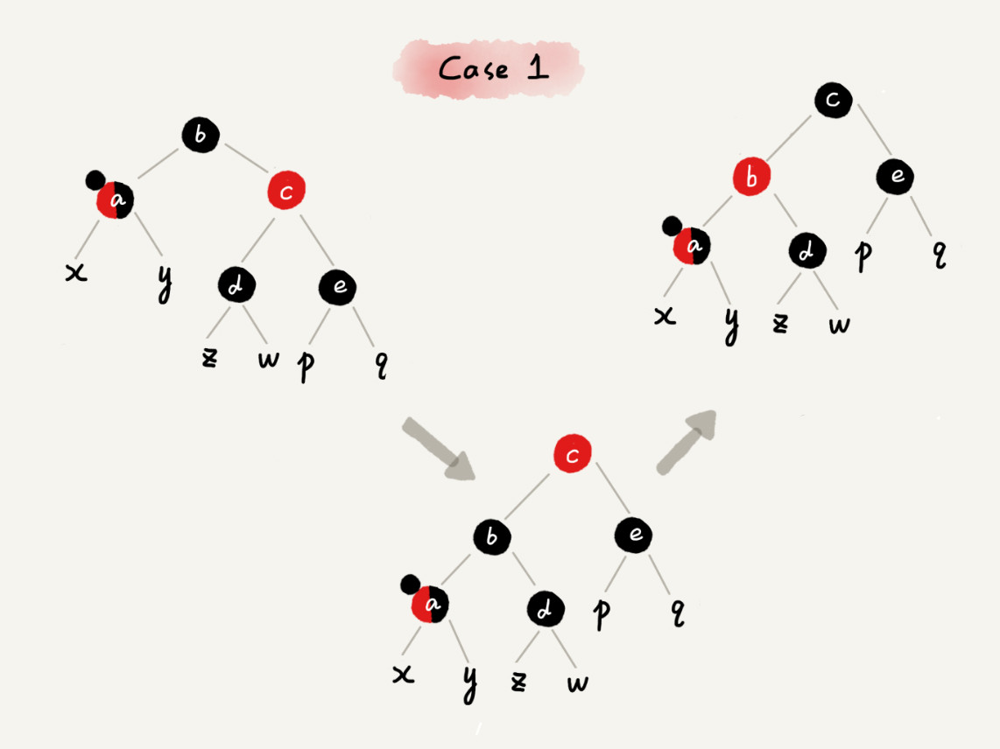

# 红黑树 （Red - Black Tree)

## 介绍

### 动因

二叉查找树是最常用的一种二叉树，它支持快速插入、删除、查找操作，各个操作的时间复杂度跟树的高度成正比，理想情况下，时间复杂度是 $O(logn)$。

但是，二叉查找树在频繁的动态更新过程中，可能会出现树的高度远大于 $log_2n$ 的情况，从而导致各个操作的效率下降。极端情况下，二叉树会退化为链表，时间复杂度会退化到 $O(n)$。

所以，要解决这个复杂度退化的问题，需要设计一种平衡二叉查找树，也就是这章要讲的红黑树（Red - Black Tree).

### 平衡二叉树

很多书籍里，但凡讲到平衡二叉查找树，就会拿红黑树作为例子.不仅如此，如果有一定的开发经验，会发现，在工程中，很多用到平衡二叉查找树的地方都会用红黑树.所以，了解红黑树之前，先了解一下平衡二叉树.

> **平衡二叉树的严格定义** **：** 
>
> - **二叉树中任意一个节点的左右子树的高度相差不能大于 1。**

从定义来看，之前讲的完全二叉树、满二叉树其实都是平衡二叉树，但是非完全二叉树也有可能是平衡二叉树。

平衡二叉查找树不仅满足上面平衡二叉树的定义，还满足二叉查找树的特点.

最先被发明的平衡二叉查找树是 [AVL 树](https://zh.wikipedia.org/wiki/AVL%E6%A0%91), 它严格符合刚讲到的平衡二叉查找树的定义，即任何节点的左右子树高度相差不超过 1，是一种高度平衡的二叉查找树.

但是很多平衡二叉查找树其实并没有严格符合上面的定义（树中任意一个节点的左右子树的高度相差不能大于1），比如下面要讲的红黑树，它从根节点到各个叶子节点的最长路径，有可能会比最短路径大一倍。

注意，学习数据结构和算法是为了应用到实际的开发中，所以，没必要去死抠定义。对于平衡二叉查找树这个概念，要从这个数据结构的由来，去理解 "平衡" 的意思。

>**发明平衡二叉查找树的初衷：**
>
>- **解决普通二叉树查找树在频繁的插入、删除等动态更新的情况下，出现时间复杂度退化的问题.**

所以，平衡二叉查找树种 "平衡" 的意思，其实就是让整棵树左右看起来比较 "对称"、比较 "平衡"，不要出现左子树很高、右子树很矮的情况。这样就能让整棵树的高度相对来说低一些，相应的插入、删除、查找等操作的效率高一些。

所以，现在设计一个新的平衡二叉树查找树，只要树的高度不比 $log_2n$ 大很多（比如树的高度仍然是对数量级的），尽管它不符合前面讲的严格的平衡二叉查找树的定义，但仍然可以说，这是一个合格的平衡二叉查找树。

## 红黑树

### 定义

平衡二叉查找树其实有很多，比如，Splay Tree（伸展树）、Treap（树堆）等，但是提到平衡二叉查找树，听到的基本都是红黑树。它的出镜率甚至要高于“平衡二叉查找树”这几个字，有时候，甚至默认平衡二叉查找树就是红黑树。

红黑树的英文是 `Red - Black Tree`，简称 `R - B Tree`。它是一种不严格的平衡二叉查找树，它的定义是不严格符合平衡二叉查找树的定义的。

>**红黑树定义：**
>
>**红黑树的节点，一类被标记为黑色，一类被标记为红色，除此之外，一棵红黑树还需要满足这样几个要求：**
>
>- **根节点是黑色的；**
>- **每个叶子节点都是黑色的空节点 （NIL），即，叶子节点不存储数据；**
>- **任何相邻的节点都不能同时为红色，即，红色节点是被黑色节点隔开的；**
>- **每个节点，从该节点到达其可达叶子节点的所有路径，都包含相同数目的黑色节点.**

这里的第二点要求，"叶子节点都是黑色的空节点"，是为了简化红黑树的代码实现而设置的，这个接下来的内容会涉及到，这里暂时不考虑这一点，所有，在画图和讲解的时候，将黑色的、空的叶子节点都省略掉了。

### 红黑树的 "近似平衡"

前面提到，平衡二叉树查找树的初衷，是为了解决二叉查找树因动态更新导致的性能退化问题。

所有，**"平衡"的意思可以等价位性能不退化；"近似平衡"就等价位性能不会退化的太严重。**

二叉查找树很多操作饿性能都跟树的高度成正比，一棵极其平衡的二叉树（满二叉树或完全二叉树）的高度大约是 $log_2n$,所有如果要证明红黑树是近似平衡的，只需要分析，红黑树的高度是否比较稳定地趋近 $lon_2n$ 就好了。

### 红黑树的高度分析

- **如果将红色节点从红黑树中去掉，那单纯包含黑色节点的红黑树的高度是多少？**

  红色节点删除后，有些节点就没有父节点了，会直接拿这些节点的祖父节点（父节点的父节点）作为父节点。所以，之前的二叉树就变成了四叉树。

  

  前面红黑树的定义理有这么一条：从任意节点到可达的叶子节点的每个路径包含相同数目的黑色节点。从四叉树中取出某些节点，放到叶子节点位置，四叉树就变成了完全二叉树。所以，仅包含黑色节点的四叉树的高度，比包含相同节点个数的完全二叉树的高度还要小。

  上节说到，完全二叉树的高度近似 $log_2n$,这里的四叉 "黑树" 的高度要低于完全二叉树，所以去掉红色节点的 "黑树" 的高度也不会超过 $log_2n$。

- **现在知道只包含黑色节点的 "黑色" 的高度，那现在把红色节点加回去，高度会变成多少呢？**

  从上面画的红黑树例子和定义来看，在红黑树中，红色节点不能相邻，即，有一个红色节点就要至少一个黑色节点，将它跟其他红色节点隔开。

  红黑树中包含最多黑色节点的路径不会超过 $log_2n$,所以加入红色节点之后，最长路径不会超过 $2log_2n$,即，红黑树的高度近似于 $2log_2n$.

  所以，红黑树的高度只比高度平衡的 AVL 树 的高度 $(log_2n)$ 仅仅大了一倍，在性能上，下降的并不多。

  虽然，这样推导的结果不够精确，但实际上红黑树的性能更好一些。

   

  ## 实现

  

红黑树是一个让人又爱又恨的数据结构，“爱”是因为它稳定、高效的性能，“恨”是因为实现起来实在太难了。

红黑树的实现，对于基础不太好的同学，理解起来可能会有些困难。但是，没必要去死磕它。

为什么这么说呢？

因为，即便将左右旋背得滚瓜烂熟，保证过不几天就忘光了。因为，学习红黑树的代码实现，对于平时做项目开发没有太大帮助。

对于绝大部分开发工程师来说，这辈子可能都用不着亲手写一个红黑树。除此之外，它对于算法面试也几乎没什么用，一般情况下，靠谱的面试官也不会让你手写红黑树的。

如果对数据结构和算法很感兴趣，想要开拓眼界、训练思维，还是很推荐你看一看这节的内容。但是如果学完今天的内容还觉得懵懵懂懂的话，也不要纠结。要有的放矢去学习。

先把平时要用的、基础的东西都搞会了，如果有余力了，再来深入地研究这节内容。

### 实现红黑树的基本思想

魔方的复原解法是有固定算法的：**遇到哪几面是什么样子，对应就怎么转几下，只要跟着这个复原步骤，就肯定能将魔方复原。**

实际上，红黑树的平衡过程跟模方复原非常神似，大致过程就是：**遇到什么样的节点排布，就对怎么去调整,只要按照这些固定的调整规则来操作，就能将一个非平衡的红黑树调整成平衡的。**

### 红黑树定义回顾

一棵合格的红黑树需要满足这样几个要求：

- 每根节点是黑色的；
- 每个叶子节点都是黑色的空节点（NIL），即，叶子节点不存储数据；
- 任何相邻的节点都不能同时为红色，即，红色节点是被黑色节点隔开的；
- 每个节点，从该节点到达其可达叶子节点的所有路径，都包含相同数目的黑色节点.

但是，在插入、删除节点的过程中，第三、第四点要求可能会被破坏，而今天要讲的 "平衡调整"，实际上就是把要被破坏的第三、第四点回复过来。

### 左旋（Roate Left）、右旋（Roate Right） 操作

- **左旋（Roate Left) : 围绕某个节点的左旋；**
- **右旋（Roate Right）：围绕某个节点的右旋。**

下面的平衡调整中，会一直用到这两个操作，所有这里画了一个示意图，其中 a、b、r 表示 子树，可以为 空 :

红黑树的插入、删除操作会破坏红黑树的定义，具体来说就是破坏红黑树的平衡，所有，现在来看一下，红黑树在插入、删除数据之后，如何调整平衡，继续当一棵合格的红黑树。

### 插入操作的平衡调整

> **红黑树规定，插入的结点必须是红色的。而且，二叉查找树中新插入的节点都是放在叶子节点上的.**

所以，关于插入操作的平衡调整，有这样两种特殊情况，但也都是非常好处理的。

>- **如果插入节点的父节点是黑色的，那什么都不用做，它仍然满足红黑树的定义；**
>- **如果插入节点是根节点，那直接改变它的颜色，把它变成黑色就可以了。**

除此之外，其他情况都会违背红黑树的定义，于是就需要进行调整，调整的过程包含两种基础操作：**左右旋** 和 **改变颜色**。

红黑树的调整过程是一个迭代过程，把正在处理的节点叫做 **关注节点**。关注节点会随着不停地迭代处理，而不断发生变化，**最开始的关注节点就是新插入的结点**。

新节点插入之后，如果红黑树的平衡被破，那一般会有有下面三种情况，而只需要根据每种情况的特点，不停地调整，就可以让红黑树继续符合定义，也就是继续保持平衡。

下面依次来看每种情况的调整过程，为了简化描述，把父节点的兄弟节点叫做叔叔节点，父节点的父节点叫做祖父节点。

#### CASE 1 ： 如果关注的节点是 a, 它的叔叔节点 d 是红色

依次执行下面操作：

>- 将关注节点 a 的 父节点 b 、叔叔节点 d 的颜色都设置成黑色；
>- 将关注节点 a 的 祖父节点 c 的颜色设置成红色；
>- 关注节点变成 a 的祖父节点 c;
>- 跳到 CASE 2 or CASE 3.

#### CASE 2 : 如果关注节点是 a，它的叔叔节点 d 是黑色，关注节点 a 是其父节点 b 的右子节点

依次执行下面操作：

>- 关注节点变成节点 a的 父节点 b；
>- 围绕新的关注节点 b 左旋；
>- 跳到 CASE 3.

#### CASE 3 : 如果关注节点是 a,它的叔叔节点 d 是黑色，关注节点 a 是其父节点 b 的左子节点

依次执行下面操作：

>- 围绕关注节点 a 的祖父节点 c 右旋；
>- 将关注节点 a 的父节点、兄弟节点 c 的颜色互换；
>- 调整结束。

### 删除操作的平衡调整

红黑树插入操作的平衡调整还不是很难，但是它的删除操作的平衡调整相对就要难多了。不过原理都是类似的，依旧只需要根据关注节点与周围节点的排布特点，按照一定的规则去调整就行了。

>**删除操作的平衡调整分为两步:**
>
>- **第一步是针对删除节点初步调整**
>
>  **初步调整只是保证整棵红黑树在一个节点删除之后，仍然满足最后一条定义的要求，也就是说，每个节点，从该节点到达其可达叶子节点的所有路径，都包含相同数目的黑色节点；**
>
>- **第二步是针对关注节点进行二次调整**
>
>  **让它满足红黑树的第三条定义，即不存在相邻的两个红色节点。**

#### 1. 针对删除节点初步调整

这里需要注意一下，红黑树的定义中“只包含红色节点和黑色节点”，经过初步调整之后，为了保证满足红黑树定义的最后一条要求，有些节点会被标记成两种颜色，“红 - 黑”或者“黑 - 黑”。如果一个节点被标记为了“黑 - 黑”，那在计算黑色节点个数的时候，要算成两个黑色节点。

在下面的讲解中，如果一个节点既可以是红色，也可以是黑色，在画图的时候，用一半红色一半黑色来表示。如果一个节点是“红 - 黑”或者“黑 - 黑”，用左上角的一个小黑点来表示额外的黑色。

##### CASE 1： 如果要删除的节点是 a, 它只有一个子节点 b

依次执行下面操作:

>- **删除节点 a，并且把节点 b 替换到节点 a 的位置，这一部分操跟普通的二叉查找树的删除操作是一样的；**
>- **节点 a 只能是黑色，节点 b 也只能是红色，其他情况均不符合红黑树的定义；这种情况下，把节点 b 改为 黑色；**
>- **调整结束，不需要进行二次调整.**

##### CASE 2：如果要删除的节点 a 有两个非空子节点，并且它的后继节点就是节点 a 的右子节点 c

依次进行下面的操作：

>- **如果节点 a 的后继节点就是右子节点 c，那右子节点 c 肯定没有左子树。把节点 a 删除，并且将节点 c 替换到节点 a 的位置。这一部分操作跟普通的二叉查找树的删除操作无异；**
>- **然后把节点 c 的颜色设置为跟节点 a 相同的颜色**;
>- **如果节点 c 是黑色，为了不违反红黑树的最后一条定义，给节点 c 的右子节点 d 多加一个黑色，这个时候节点 d 就成了“红 - 黑”或者“黑 - 黑”；**
>- **这个时候，关注节点变成了节点 d，第二步的调整操作就会针对关注节点来做.**

##### CASE 3 : 如果要删除的是节点 a，它有两个非空子节点，并且节点 a 的后继节点不是右子节点

>- **找到后继节点 d，并将它删除，删除后继节点 d 的过程参照 CASE 1；**
>- **将节点 a 替换成后继节点 d；**
>- **把节点 d 的颜色设置为跟节点 a 相同的颜色；**
>- **如果节点 d 是黑色，为了不违反红黑树的最后一条定义，给节点 d 的右子节点 c 多加一个黑色，这个时候节点 c 就成了“红 - 黑”或者“黑 - 黑”；**
>- **这个时候，关注节点变成了节点 c，第二步的调整操作就会针对关注节点来做。**

#### 2. 针对关注节点进行二次调整

经过初步调整之后，关注节点变成了“红 - 黑”或者“黑 - 黑”节点。针对这个关注节点，再分四种情况来进行二次调整。二次调整是为了让红黑树中不存在相邻的红色节点。

##### CASE 1 ：如果关注节点是 a，它的兄弟节点 c 是红色的

>- **围绕关注节点 a 的父节点 b 左旋；**
>- **关注节点 a 的父节点 b 和祖父节点 c 交换颜色；**
>- **关注节点不变；**
>- **继续从四种情况中选择适合的规则来调整。**

##### CASE 2 : 如果关注节点是 a，它的兄弟节点 c 是黑色的，并且节点 c 的左右子节点 d、e 都是黑色的

> - **将关注节点 a 的兄弟节点 c 的颜色变成红色；**
> - **从关注节点 a 中去掉一个黑色，这个时候节点 a 就是单纯的红色或者黑色；**
> - **给关注节点 a 的父节点 b 添加一个黑色，这个时候节点 b 就变成了“红 - 黑”或者“黑 - 黑”；**
> - **关注节点从 a 变成其父节点 b；**
> - **继续从四种情况中选择符合的规则来调整。**

##### CASE 3 : 如果关注节点是 a，它的兄弟节点 c 是黑色，c 的左子节点 d 是红色，c 的右子节点 e 是黑色

>- **围绕关注节点 a 的兄弟节点 c 右旋；**
>- **节点 c 和节点 d 交换颜色；**
>- **关注节点不变；**
>- **跳转到 CASE 4，继续调整**

##### CASE 4 : 如果关注节点 a 的兄弟节点 c 是黑色的，并且 c 的右子节点是红色的

>- **围绕关注节点 a 的父节点 b 左旋；**
>- **将关注节点 a 的兄弟节点 c 的颜色，跟关注节点 a 的父节点 b 设置成相同的颜色；**
>- **将关注节点 a 的父节点 b 的颜色设置为黑色；**
>- **从关注节点 a 中去掉一个黑色，节点 a 就变成了单纯的红色或者黑色；**
>- **将关注节点 a 的叔叔节点 e 设置为黑色；**
>- **调整结束。**

## 总结

很多同学都觉得红黑树很难，其实主要原因是，很多人试图去记忆它的平衡调整策略。实际上，只需要能看懂讲解过程，没有知识盲点，就算是掌握了这部分内容了。

毕竟实际的软件开发并不是闭卷考试，当真的需要实现一个红黑树的时候，可以对照着讲的步骤，一点一点去实现。

关于红黑树，竟需要掌握哪些东西呢？

**首先，学习数据结构和算法，要学习它的由来、特性、适用的场景以及它能解决的问题。**

对于红黑树，也不例外。如果能搞懂这几个问题，其实就已经足够了:

- 红黑树是一种平衡二叉查找树。它是为了解决普通二叉查找树在数据更新的过程中，复杂度退化的问题而产生的。红黑树的高度近似 $log_2n$，所以它是近似平衡，插入、删除、查找操作的时间复杂度都是 $O(logn)$。

- 因为红黑树是一种性能非常稳定的二叉查找树，所以，在工程中，但凡是用到动态插入、删除、查找数据的场景，都可以用到它。不过，它实现起来比较复杂，如果自己写代码实现，难度会有些高，这个时候，其实更倾向用跳表来替代它。

- 操作过程:
  - 第一点，把红黑树的平衡调整的过程比作魔方复原，不要过于深究这个算法的正确性。你只需要明白，只要按照固定的操作步骤，保持插入、删除的过程，不破坏平衡树的定义就行了。
  - 第二点，找准关注节点，不要搞丢、搞错关注节点。因为每种操作规则，都是基于关注节点来做的，只有弄对了关注节点，才能对应到正确的操作规则中。在迭代的调整过程中，关注节点在不停地改变，所以，这个过程一定要注意，不要弄丢了关注节点。
  - 第三点，插入操作的平衡调整比较简单，但是删除操作就比较复杂。针对删除操作，我们有两次调整，第一次是针对要删除的节点做初步调整，让调整后的红黑树继续满足第四条定义，“每个节点到可达叶子节点的路径都包含相同个数的黑色节点”。但是这个时候，第三条定义就不满足了，有可能会存在两个红色节点相邻的情况。第二次调整就是解决这个问题，让红黑树不存在相邻的红色节点。

## 思考

1. **平衡二叉查找树有很多，为什么在工程中大家都喜欢用红黑树这种平衡二叉查找树？**

   前面提到 Treap、Splay Tree，绝大部分情况下，它们操作的效率都很高，但是也无法避免极端情况下时间复杂度的退化。尽管这种情况出现的概率不大，但是对于单次操作时间非常敏感的场景来说，它们并不适用。

   AVL 树是一种高度平衡的二叉树，所以查找的效率非常高，但是，有利就有弊，AVL 树为了维持这种高度的平衡，就要付出更多的代价。每次插入、删除都要做调整，就比较复杂、耗时。所以，对于有频繁的插入、删除操作的数据集合，使用 AVL 树的代价就有点高了。

   红黑树只是做到了近似平衡，并不是严格的平衡，所以在维护平衡的成本上，要比 AVL 树要低。

   所以，红黑树的插入、删除、查找各种操作性能都比较稳定。对于工程应用来说，要面对各种异常情况，为了支撑这种工业级的应用，我们更倾向于这种性能稳定的平衡二叉查找树。

2. **动态数据结构的动态是什么意思？**

   动态数据结构是支持动态的更新操作，里面存储的数据是时刻在变化的，通俗一点讲，它不仅仅支持查询，还支持删除、插入数据。而且，这些操作都非常高效。如果不高效，也就算不上是有效的动态数据结构了。

   这里的红黑树算一个，支持动态的插入、删除、查找，而且效率都很高。链表、队列、栈实际上算不上，因为操作非常有限，查询效率不高。

3. **为什么红黑树的定义中，要求叶子节点是黑色的空节点？**

   之所以有这么奇怪的要求，其实就是为了实现起来方便。只要满足这一条要求，那在任何时刻，红黑树的平衡操作都可以归结为刚刚讲的那几种情况。

   还是有点不好理解，通过一个例子来解释一下。假设红黑树的定义中不包含刚刚提到的那一条“叶子节点必须是黑色的空节点”，往一棵红黑树中插入一个数据，新插入节点的父节点也是红色的，两个红色的节点相邻，这个时候，红黑树的定义就被破坏了。那应该如何调整呢？

​		这个时候，前面在讲插入时，三种情况下的平衡调整规则，没有一种是适用的。但是，如果		把黑色的空节点都给它加上，变成下面这样，可以发现，它满足 CASE 2 了。

- 可以调整一下平衡调整规则？

  比如把 CASE 2 改为“如果关注节点 a 的叔叔节点 b 是黑色或者不存在，a 是父节点的右子节点，就进行某某操作”。当然可以，但是这样的话规则就没有原来简洁了。

- 这样给红黑树添加黑色的空的叶子节点，会不会比较浪费存储空间呢？

  答案是不会的。虽然在讲解或者画图的时候，每个黑色的、空的叶子节点都是独立画出来的。实际上，在具体实现的时候，只需要像下面这样，共用一个黑色的、空的叶子节点就行了。

4. **动态数据结构支持动态的数据插入、删除、查找操作，除了红黑树，我们前面还学习过哪些呢？能对比一下各自的优势、劣势，以及应用场景吗？**

   1. 散列表：插入删除查找都是O(1), 是最常用的，但其缺点是不能顺序遍历以及扩容缩容的性能损耗。适用于那些不需要顺序遍历，数据更新不那么频繁的。

   2. 跳表：插入删除查找都是O(logn), 并且能顺序遍历。缺点是空间复杂度O(n)。适用于不那么在意内存空间的，其顺序遍历和区间查找非常方便。

   3. 红黑树：插入删除查找都是O(logn), 中序遍历即是顺序遍历，稳定。缺点是难以实现，去查找不方便。其实跳表更佳，但红黑树已经用于很多地方了。

      --- kakasi

5. **如果你以前了解或者学习过红黑树，关于红黑树的实现，你也可以在留言区讲讲，你是怎样来学习的？在学习的过程中，有过什么样的心得体会？有没有什么好的学习方法？**

   1. 左旋右旋这个，个人还是认为要画图，不画图我自己也写不出那个代码……哈哈。

   2. 说到插入删除的算法，我说用到了递推，就比如插入的CASE1的情况，CASE1的处理之后，关注节点从本身变成了他的祖父节点（红色节点），这就是往根节点递推。不过我认为CASE1处理过一次之后，不一定会进入case2或者case3，是有可能还在case1的。

   3. 换句话说，就是可以在case1的情况下，一直往根节点走，因为当前节点永远是红色，所以在最后要把根节点涂黑。同时，只要进入到case2,case3的情况，就是变成平衡二叉树的单旋和双旋的情况，双旋的处理逻辑就是把双旋变成单旋（比如先右后左旋就是把树变成“左撇子”）。这个就变成了单左旋能一步到位处理的平衡了，这个就是归纳。把未知情况转化为已知，如果我没有记错的话，数学归纳法的核心思想就是递推和归纳。

   4. 其实只要记住，除了关注的节点所在的子树，其他的子树本身都是一颗红黑树，他们是满足红黑树的所有特征的。当关注节点往根节点递推时，这个时候关注节点的子树也已经满足了红黑树的定义，我们就不用再去特别关注子树的特征。只要注意关注节点往上的部分。这样就能把问题简化，思考的时候思路会清晰一些。

   5. 再说到删除算法，我看到很多同学没理解为什么要红-黑，黑-黑节点的出现。这里我的看法是，红黑树最不好控制的其实是最后一个的性质4（每个节点，从该节点到达其可达叶子节点的所有路径，都包含相同数目的黑色节点），因为你永远不知道别的子树到底有多少个黑色节点。这里加入红-黑，黑-黑节点就可以控制红黑树满足性质4，到时候要恢复颜色，只要去掉多余的黑色即可。

      接下来的处理思路就是要满足：1.每个节点不是红的就是黑的，2.相邻节点不能是红的。这个思路计时变复杂为简单。

      删除的case1情况，并没有真正处理，而且为了进入接下来的case2,case3,case4，这里又是之前说到的归纳思想。case2的情况又是一个递推思路，关注节点往根节点递推，让其左右子树都满足红黑树的定义。因为往上推，右子树多了一个黑色节点，就把关注节点的兄弟节点变红，使其满足性质4.

      删除的case3是为了进入case4，提前变色的原因和case2是一样的，都是为了满足性质4。同样是归纳推理的思路。都要记住一点，各种case下的其他子树节点都满足红黑树的定义，需要分类讨论的，都在这几种case情况中了。

   6. 最后的建议，其实说了这么多，很多的表达都不太清楚，但是个人感觉，数学基础好的同学，理解红黑树会好一些，学习的时候多画画图，人对图形的敏感肯定比文字高，另外的就是大家可以去看看源码，本人是做java开发的，jdk1.8的treemap就是用红黑树实现的，跟着源码多看看，跟着老师的说明或者百度上的教程思考，动笔画画图，都能理解的。我自己看jdk源码的也是看了将近两个月才大概明白（因为也在上班，只有晚上有一些时间来看看代码）。学习的过程中要耐心，学习红黑树本身也不是为了“默写”，而是去学习思想，锻炼思维，复杂问题简单化，新问题转化为已解决过的问题等等。其实说到最后，都是用到了数学的思维，这些思维都会在潜移默化中影响到自己。

      ps:本人并不是什么大牛，不会的东西也是很多很多，上面只是自己的一点感想。老师的建议很多，不要太去扣细节，我们要在一个整体的角度上去看红黑树是怎么处理的，知道他的应用场景，什么时候要用他，什么时候该用他，为什么要用他。这几个地方弄清楚，大部分就够了，我们要有的放矢，抓准学习的核心内容。

      --- 失火的夏天

*`@ 笔记时间 ：2020-11-12 FROM	极客时间 《算法啊与数据结构之美》 王争  专栏`* 