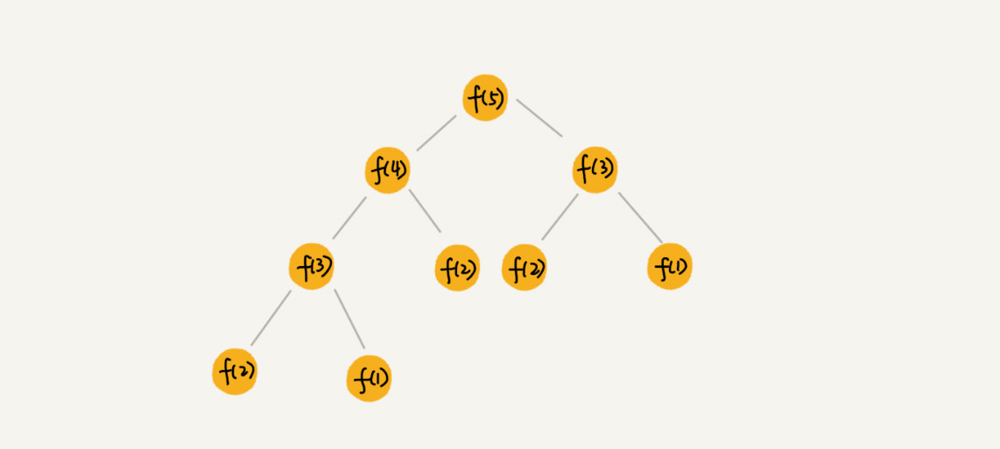

# 递归树

[toc]

## 递归思想

将大问题分解成小问题来求解，然后再将小问题分解为更小的问题，直到问题的数据规模被分解的足够小，不用继续递归分解为止。

## 递归树

- 将问题递归分解的过程画成图，就可以得到一个树，这棵树就是递归树。

- 例子：斐波纳契数列，节点里的数字表示数据的规模，一个节点的求解可以分解为左右子节点两个问题的求解。

  

## 借助递归树来分析时间复杂度

### 举例：用递归树来分析归并排序的时间复杂度

归并排序每次会将数据规模一分为二，画成递归树：

因为每次分解都是一分为二，所以代价很低，把时间上的消耗记作常量1。归并算法中比较耗时的是归并操作，也就是把两个子数合并为大数数组。

**从图中可以看出，每一层归并操作消耗的时间总和是一样的，跟要排序的数据规模有关。把每一层归并操作消耗德 时间记作 n . 只需要知道这颗树的高度 h，用高度 h 乘以每一层的时间消耗 n,就可以得到总的时间复杂度 $O(n * h)$.**

从归并排序的原理和递归树，可以看出来，归并排序递归树是一棵满二叉树，满二叉树的高度大约是 $log_2n$,所以，归并排序递归实现的时间复杂度就是$O(nlongn)$.（注意：以上结果都是估算的，但不影响复杂度的计算结果。）

### 实战一：分析快速排序的时间复杂度

- 回忆用递推公式的分析方法：

  快速排序在最好情况下，每次分区都能一分为2，这个时候用递推公式 $T(n)=2T(\frac{n}{2})+n$,很容易就能推导出时间复杂度是 $O(nlog_n)$,但是，

