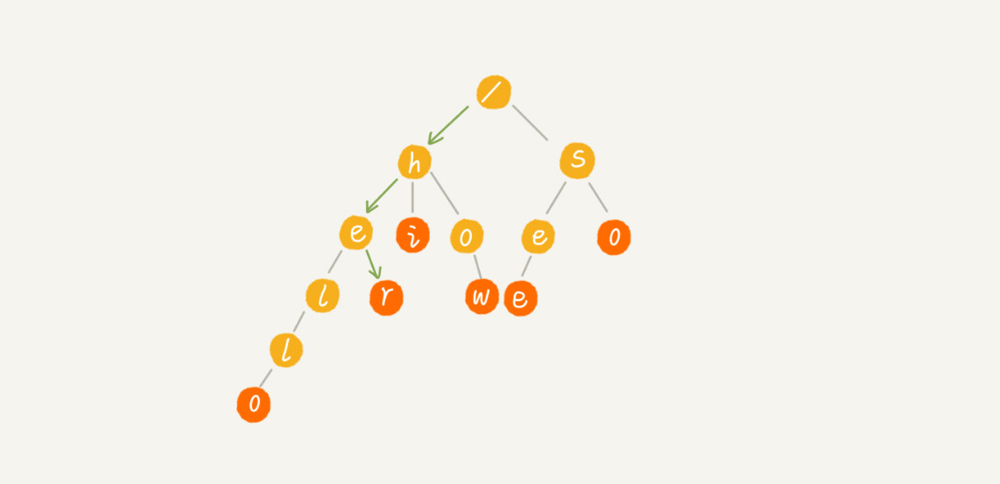

# Trie 树


## Trie 树 （字典树）：

- Trie 树，也叫 "字典树"，是一个树形结构。

- 它是一种专门处理字符串匹配的数据结构，用来解决在一组字符串集合中快速查找某个字符串的问题。

- 举例：

  有6个字符串，它们分别是：how、hi、her、hello、so、see，希望在里面多次查找某个字符串是否存在，如果每次查找，都是拿要查找的字符串跟这 6 个字符串依次进行字符串匹配，那效率就比较低。这个时候，就可以先对这6个字符串做一下预处理，组织成 Trie 树的结构，之后每次查找，都是在 Trie 树种进行匹配查找。`Trie 树的本质，就是利用字符串之间的公共前缀，将重复的前缀合并在一起.`

  

  其中，根节点不包含任何信息，每个节点表示一个字符串中的字符，从根节点到红色节点的一条路径表示一个字符串（注意：红色节点并不都是叶子节点）。

- 构造分解过程：

  构造过程的每一步，都相当于往 Trie 树中插入一个字符串。当所有字符串都插入完成之后，Trie 树就构造好了。

  

  

  当在 Trie 树种查找一个字符串的时候，比如查找字符串 "her",那将要查找的字符串分割成单个的字符h、e、r,然后从 Trie 树的根节点开始匹配。如图所示，绿色的路径就是在 Trie 树中匹配的路径：

  

  如果要查找的字符串是 "he"，用上面同样的方法，从根节点开始，沿着某路径来匹配，如图所示，绿色的路径，是字符串 "he" 匹配的路径。但是，路径的最后一个节点 "e" 并不是红色的。也就是说，"he" 是某个字符串的前缀子串，但不能完全匹配任何字符串。

  

## 实现一棵 Trie 树

### 两种操作

1. 将字符串集合构造成 Trie 树。

   这个过程分解开来的话，就是一个将字符串插入到 Trie 树的过程。

1. 在 Trie 树中查询一个字符串。

   

### 存储 Trie 树

从前面的图中，可以看出，Trie 树是一个多叉树。

二叉树中，一个节点的左右子节点是通过两个指针来存储的，如下 Java 代码所示：

```java
class BinaryTreeNode {
  char data;
  BinaryTreeNode left;
  BinaryTreeNode right;  
}
```


多叉树中，有以下几种存储方法，来存储一个节点的所有子节点的指针：

散列表（经典的存储方式）。借助散列表的思想，通过一个下标与字符一一映射的数组，来存储子节点的指针。假设字符串中只有从 a 到 z 这 26 个小写字母，在数组中下标为 0 的位置，存储指向子节点 a 的指针，下标为 1 的位置存储指向子节点 b 的指针，以此类推，下标为 25 的位置，存储的是指向的子节点 z 的指针。如果某个字符的子节点不存在，就在对应的下标的位置存储 null.


```java
class TrieNode {
  char data;
  TrieNode children[26];
}
```


当在 Trie 树中，查找字符串的时候，可以通过字符的 ASCII 码减去 "a" 的 ASCII 码，迅速找到匹配的子节点的指针。比如，d 的 ASCII 码减去 a 的 ASCII 码就是 3，那子节点 d 的指针就存储在数组中下标为 3 的位置中。


描述了这么多，有可能还有点懵，翻译成代码如下：

```java

public class Trie {
  private TrieNode root = new TrieNode('/'); // 存储无意义字符

  // 往Trie树中插入一个字符串
  public void insert(char[] text) {
    TrieNode p = root;
    for (int i = 0; i < text.length; ++i) {
      int index = text[i] - 'a';
      if (p.children[index] == null) {
        TrieNode newNode = new TrieNode(text[i]);
        p.children[index] = newNode;
      }
      p = p.children[index];
    }
    p.isEndingChar = true;
  }

  // 在Trie树中查找一个字符串
  public boolean find(char[] pattern) {
    TrieNode p = root;
    for (int i = 0; i < pattern.length; ++i) {
      int index = pattern[i] - 'a';
      if (p.children[index] == null) {
        return false; // 不存在pattern
      }
      p = p.children[index];
    }
    if (p.isEndingChar == false) return false; // 不能完全匹配，只是前缀
    else return true; // 找到pattern
  }

  public class TrieNode {
    public char data;
    public TrieNode[] children = new TrieNode[26];
    public boolean isEndingChar = false;
    public TrieNode(char data) {
      this.data = data;
    }
  }
}
```


## 时间复杂度分析

### 在 Trie 树种，查找某个字符串的时间复杂度是多少？

如果在一组字符串中，频繁地查询某些字符串，用 Trie 树会非常高效。构建 Trie 树的过程，需要扫描所有的字符串，时间复杂度是 $O(n)$ (n 表示所有字符串的长度和)。但是，一旦构建成功之后，后续的查询操作会非常高效。

每次查询时，如果要查询的字符串长度是 k,那只需要比对 k 个节点，就能完成查询操作。跟原本那组字符串的长度和个数没有任何关系。所以说，构建好 Trie 树之后，在其中查找字符串的时间复杂度是 $O(k)$，k 表示要查找的字符串的长度。


## 内存分析

### Trie 树真的很耗内存吗？

基于前面的讲解，Trie 树是一种非常独特的、高效的字符串匹配方法。但是，Trie 树是非常耗内存的，用的是一种空间换时间的思路。

Trie 树实现的时候，用数组来存储一个节点的子节点的指针。如果字符串中包含从 a 到 z 这 26 个字符，那每个节点都要存储一个长度为 26 的数组，并且每个数组元素要存储一个 8 个字节指针（或者是 4 字节，这个大小跟 CPU、操作系统、编译器等有关）。而且，即便一个节点只有很少的子节点，远小于26个，比如3、4个，也要维护一个长度为 26 的数组。

Trie 树的本质是避免重复存储一组字符串的相同前缀子串，但是现在每个字符（对应一个节点）的存储远远大于１个字节。按照上面举的例子，数组长度为 26, 每个元素是 8 字节，那每个节点就会额外需要 26 * 8 = 208 个字节。而且，这还是只包含 26 个字符的情况。

如果字符串中不仅包含小写字母，还包含大写字母、数字、甚至是中文，那需要的存储空间就更多了。所以，也就是说，在某些情况下，Trie 树不一定会节省存储空间。在重复的前缀并不多的情况下，Trie 树不但不能节省内存，还有可能会浪费更多的内存。

当然，也不能否认，Trie树尽管可能很浪费内存，但是确实非常高效。

### 优化内存问题

为了解决这个内存问题，可以稍微牺牲一点查询的效率，将每个节点中的数组换成其他数据结构，来存储一个节点的子节点指针，例如：有序数组、跳表、散列表、红黑树。

假设用有序数组，数组中的指针按照所指向的子节点中的字符的大小顺序排列。查询的时候，可以通过二分查找的方法，快速查找到某个字符应该匹配的子节点的指针。但是，在往 Trie 树种，插入一个字符串的时候，为了维护数组中数据的有序性，就会稍微慢了点。替换成其他数据结构的思路是类似的。

实际上，Trie 树的变体有很多，都可以在一定程度上解决内存消耗问题。比如，**缩点优化**就是对只有一个子节点的节点，而且此节点不是一个串的结束节点，可以将此节点与子节点合并。这样可以节省空间，但却增加了编码难度。


## Trie 树与散列表、红黑树的比较

实际上，字符串的匹配问题，笼统上讲，其实就是数据的查找问题。对于支持动态数据高效操作的数据结构，前面已经讲过好多了，比如散列表、红黑树、跳表等等。实际上，这些数据结构也可以实现在一组字符串中查找字符串的功能。这里。选了两种数据结构，散列表和红黑树，跟 Trie 树比较一下，看看它们各自的优缺点和应用场景。

## 缺点：不适合精确匹配查找

在刚刚讲的这个场景，在一组字符串中查找字符串，Trie 树实际上表现得并不好。它对要处理的字符串有极其严苛的要求：

**第一，字符串中包含的字符集不能太大。前面讲到，如果字符集太大，那存储空间可能就会浪费很多。即便可以优化，但也要付出牺牲查询、插入效率的代价。**

**第二，要求字符串的前缀重合比较多，不然空间消耗会变大很多。**

**第三，如果要用 Trie 树解决问题，那就要自己从零开始实现一个 Trie 树，还要保证没有 bug，这个在工程上是将简单问题复杂化，除非必须，一般不建议这样做。**

**第四，通过指针串起来的数据块是不连续的，而 Trie 树中用到了指针，所以，对缓存并不友好，性能上会打个折扣。**

综合这几点，针对在一组字符串中查找字符串的问题，在工程中，更倾向于用散列表或者红黑树。因为这两种数据结构，都不需要自己去实现，直接利用编程语言中提供的现成类库就行了。

## 优点：适合查找前缀匹配的字符串

实际上，Trie 树只是不适合精确匹配查找，这种问题更适合用散列表或者红黑树来解决。Trie 树比较适合的是查找前缀匹配的字符串，也就是类似思考问题的那种场景。

## 思考问题

如何实现搜索引擎的搜索关键词提示功能？

假设关键词库由用户的热门搜索关键词组成。将这个词库构建成一个 Trie 树。当用户输入其中某个单词的时候，把这个词作为一个前缀子串在 Trie 树中匹配。为了讲解方便，假设词库里只有 hello、her、hi、how、so、see 这 6 个关键词。当用户输入了字母 h 的时候，就把以 h 为前缀的 hello、her、hi、how 展示在搜索提示框内。当用户继续键入字母 e 的时候，就把以 he 为前缀的 hello、her 展示在搜索提示框内。这就是搜索关键词提示的最基本的算法原理。


不过，这只是最基本的实现原理，实际上，搜索引擎的搜索关键词提示功能远非这么简单。如果再稍微深入一点，就会想到，上面的解决办法遇到下面几个问题：

- 刚讲的思路是针对英文的搜索关键词提示，对于更加复杂的中文来说，词库中的数据又该如何构建成 Trie 树呢？
- 如果词库中有很多关键词，在搜索提示的时候，用户输入关键词，作为前缀在 Trie 树中可以匹配的关键词也有很多，如何选择展示哪些内容呢？
- 像 Google 这样的搜索引擎，用户单词拼写错误的情况下，Google 还是可以使用正确的拼写来做关键词提示，这个又是怎么做到的呢？

​	可以先思考一下如何来解决，如果不会也没关系，这些问题，会在实战篇里具体来讲解。

​	实际上，Trie 树的这个应用可以扩展到更加广泛的一个应用上，就是自动输入补全，比如输入法自动补全功能、IDE 代码编	辑器自动补全功能、浏览器网址输入的自动补全功能等等。

