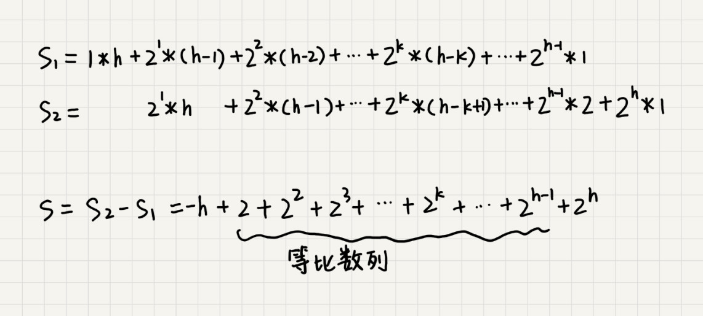
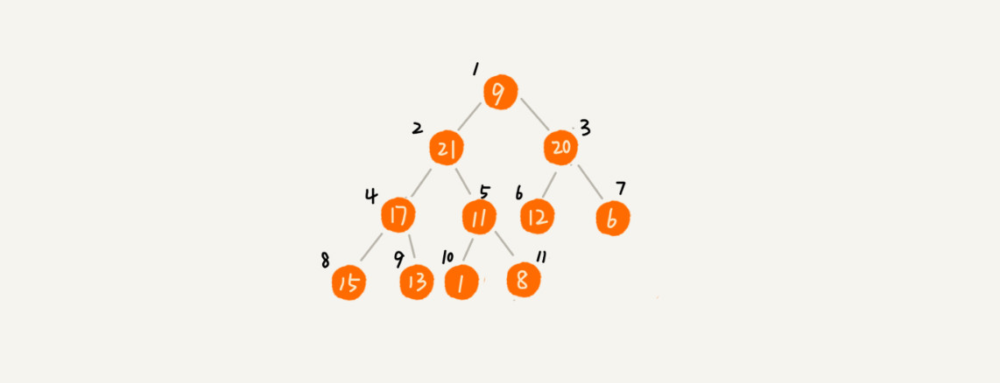

# 堆排序（Heap Sort）

[toc]

## 介绍

借助于堆这种数据结构实现的排序算法，就叫做堆排序。

时间复杂度非常稳定，是 $O(nlogn)$,并且它还是原地排序算法.


## 实现堆排序

两大步骤：`建堆` 和 `排序`.

### 1. 建堆

首先，**将数组原地建成一个堆**。

所谓，**原地**就是，不借助另一个数组，就在原数组上操作。

建堆的过程，有两种思路：


第一种是借助前面讲的，在堆中插入一个元素的思路。尽管数组中包含 n 个数据，但是可以假设，起初堆中只包含一个数据，就是下标为 1 的数据。然后，调用前面讲的插入操作，将下标从 2 到 n 的数据依次插入到堆中。这样就将包含 n 个数据的数组，组织成了堆。


第二种实现思路，跟第一种截然相反。第一种建堆思路的处理过程是从前往后处理数组数据，并且每个数据插入堆中时，都是从下往上堆化。而第二种实现思路，是从后往前处理数组，并且每个数据都是从上往下堆化。


举例：

​	因为叶子节点往下堆化只能自己跟自己比较，所以直接从最后一个非叶子节点开始，依次堆化就行。


代码如下：

```java

private static void buildHeap(int[] a, int n) {
  for (int i = n/2; i >= 1; --i) {
    heapify(a, n, i);
  }
}

private static void heapify(int[] a, int n, int i) {
  while (true) {
    int maxPos = i;
    if (i*2 <= n && a[i] < a[i*2]) maxPos = i*2;
    if (i*2+1 <= n && a[maxPos] < a[i*2+1]) maxPos = i*2+1;
    if (maxPos == i) break;
    swap(a, i, maxPos);
    i = maxPos;
  }
}
```


在这段代码中，对下标从 $\frac{n}{2}$ 开始到 1 的数据进行堆化，下标是 $\frac{n}{2}+1$ 到 n 的节点是叶子节点，不需要堆化。实际上，对于完全二叉树来说，下标从 $\frac{n}{2} + 1$ 到 n 的节点都是叶子节点。

#### 建堆操作的时间复杂度分析

每个节点堆化的时间复杂度是 $O(log n)$,那 $\frac{n}{2} + 1$ 个节点堆化的总时间复杂度是不是就是 $O(nlogn)$? 

这个答案虽然没错，但是这个值不够精确，实际上，堆排序的建堆过程的时间复杂度是 $O(n)$.

##### 推导：

因为叶子节点不需要堆化，所以需要堆化的节点从倒数第二层开始。每个节点堆化的过程中，需要比较和交换的节点个数，跟这个节点的高度 k 成正比.

把每一层的节点个数和对应的高度画出来，可以看到，只需要将每个节点的高度求和，得出的就是建堆的时间复杂度.


将每个非叶子节点的高度求和：


这个公式的求解稍微有点技巧，不过高中都学过：*把公式左右都乘以 2，就得到另一个公式 $S_2$,将$S_2$ 错位拉齐，并且用 $S_2$ 减去 $S_1$,可以得到 S.*



因为 $h=log_2n$，带入公式 S, 就能得到 S = O(n),所以，建堆的时间复杂度就是 O(n).


### 2. 排序

建堆结束之后，数组中的数据已经是按照大顶堆的特性来组织的.数组中的第一个元素就是堆顶，也就是最大的元素.把它跟最后一个元素交换，那最大元素就放到了下标为 n 的位置.

这个过程有点类似上面讲的 "删除堆顶元素"的操作，当堆顶元素移除之后，把下标为 n 的元素放到堆顶，然后再通过堆化的方法，将剩下的 $n-1$ 个元素重新构建成堆。堆化完成之后，再取堆顶的元素，放到下标是 $n-1$ 的位置，一直重复这个过程，直到最后堆中只剩下标为 1 的一个元素，排序工作就完成了.


代码：

```java
// n表示数据的个数，数组a中的数据从下标1到n的位置。
public static void sort(int[] a, int n) {
  buildHeap(a, n);
  int k = n;
  while (k > 1) {
    swap(a, 1, k);
    --k;
    heapify(a, k, 1);
  }
}
```

#### 时间复杂度和稳定性分析

整个堆排序的过程，都只需要极个别临时存储空间，所以堆排序是原地排序算法。堆排序包括建堆和排序两个操作，建堆过程的时间复杂度是 O(n)，排序过程的时间复杂度是 O(nlogn)，所以，堆排序整体的时间复杂度是 O(nlogn)。

堆排序不是稳定的排序算法，因为在排序的过程，存在将堆的最后一个节点跟堆顶节点互换的操作，所以就有可能改变值相同数据的原始相对顺序。


### 说明：为什么下标从1开始

之前假设，堆中的数据是从数组下标为 1 的位置开始存储。

那如果从 0 开始存储，实际上处理思路是没有任何变化的，唯一变化的，可能就是，代码实现的时候，计算子节点和父节点的下标的公式改变了。

**如果节点的下标是 i，那左子节点的下标就是 2∗i+1，右子节点的下标就是 2∗i+2，父节点的下标就是 2i−1。**


## 思考

为什么快速排序要比堆排序性能好？


***第一点，堆排序数据访问的方式没有快速排序友好。***


对于快速排序来说，数据是顺序访问的。而对于堆排序来说，数据是跳着访问的。 


比如，堆排序中，最重要的一个操作就是数据的堆化。比如下面这个例子，对堆顶节点进行堆化，会依次访问数组下标是 1，2，4，8 的元素，而不是像快速排序那样，局部顺序访问，所以，这样对 CPU 缓存是不友好的。




***第二点，对于同样的数据，在排序过程中，堆排序算法的数据交换次数要多于快速排序。***


在讲排序的时候，提过两个概念，有序度和逆序度。对于基于比较的排序算法来说，整个排序过程就是由两个基本的操作组成的，比较和交换（或移动）。快速排序数据交换的次数不会比逆序度多。


但是堆排序的第一步是建堆，建堆的过程会打乱数据原有的相对先后顺序，导致原数据的有序度降低。比如，对于一组已经有序的数据来说，经过建堆之后，数据反而变得更无序了。


​	对于第二点，可以自己做个试验看下。用一个记录交换次数的变量，在代码中，每次交换的时候，就对这个变量加一，排	  

​	序完成之后，这个变量的值就是总的数据交换次数。这样就能很直观地理解，**堆排序比快速排序交换次数多。**

