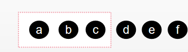

# 数组

[toc]

### 定义

> 数组（Array）是一种线形表数据结构，它用一组连续的内存空间，来存储一组具有相同类型的数据。

### 数组的限制

- 线性表（Linear List）：
  
  数据排成像一条线一样的结构，每个线性表上的数据最多只有前后两个方向。
  
- **连续的内存空间和相同的数据类型**。

### 优点

- **随机访问**，查找操作非常迅速，时间复杂度为$O(1)$.

### 缺点

- 删除、查找操作非常低效
  
  比如，想要在数组中删除、插入一个数据，为了保证连续性，就需要大量的数据搬移工作。

### 插入操作

假设数组的长度为 n, 现在，如果需要将一个数据插入到数组中的 第 k 个位置，则需要把第 k 个位置腾出来，给新的数据，需要将第 k ~ n 这部分的元素都顺序地往后挪一位.

- 时间复杂度分析：

  - 最好情况：
  
    插入在数组末尾，不需要移动数据，时间复杂度为 $O(1)$.

  - 最坏情况：

    插入在数组开头，所有数据依次往后移动一位，时间复杂度为$O(n)$

  - 平均情况：

    因为每个位置插入元素的概率是一样的，所以平均情况时间复杂度为 $(1+2+3+4...+n)/n=O(n)$.

### Tip

- 如果数组中的数据是 **有序的**，在某个位置插入一个新的元素时，就必须按照刚才的方法搬移 k 之后的的数据。
  
- 如果数组中的数据是 **无序的**，数组只是被当做一个存户数据的集合时：

  **如果要讲某个数据插入到第 k 个位置，为了避免大规模的数据搬移，有一个简单的办法就是，直接将第 k 位的数据搬移到数组元素的最后把新的元素直接放入第 k 个位置.**

  利用这种处理技巧，在特定的场景下，在第 k 个位置插入一个元素的时间复杂度就会降为 $O(1)$.


- 例子：
  
  假设数组 a[10] 中存储了如下 5 个元素：a,b,c,d,e.

  现在需要将元素 x 插入到 第 3 个位置.

  按照上面技巧来讲，只需要将 c 放入到 a[5],将 a[2]赋值为 x 即可.

  
  

### 删除操作

跟插入数据类似，如果要删除第 k 个 位置的数据，为了内存的连续性，也需要搬移数据，不然中间就会出现空洞，内存就不连续了。

- 时间复杂度分析：
  - 最好情况：
    与插入操作类似，当要删除的数据在数组末尾时，时间复杂度仍为 $O(1)$.
  - 最坏情况：
    与插入操作类似，当要删除的数据在数组开头时，需要把后面的数据依次前移一位，时间复杂度仍为 $O(n)$.
  - 平均情况：
    与插入操作类似，因为要删除数据的概率是一样的，所以平均时间复杂度仍为 $O(n)$.

### Tip

在某些特殊场景下，并不一定非得追求数组中数据的连续性，如果将多次删除操作集中在一起执行，删除的效率是不是会提高很多？

- 例子：

  假设数组中存储了 8 个元素 ：a,b,c,d,e,f,g,h.

  现在要依次删除 a,b,c 三个元素.

  

  为了避免 d,e,f,g,h 这几个数据会被搬移三次，可以先记录下已经删除的数据.

  每次的删除操作并不是真正地搬移数据，只是记录数据已经被删除；当数组没有更多空间存储数据时，再触发执行一次真正的删除操作，这样就大大减少了删除操作导致的数据搬移。

### 警惕数组的访问越界

先来分析一下这段 C 语言代码的运行结果

```C
int main(int argc, char* argv[]){
    
    int i = 0;
    int arr[3] = {0};
    
    for(; i<=3; i++){
        arr[i] = 0;
        printf("hello world\n");
    }
    
    return 0;
}
```

这段代码的运行结果并非是打印三行“hello word”，而是会无限打印“hello world”，这是为什么呢？

因为，数组大小为 3，a[0]，a[1]，a[2]，而我们的代码因为书写错误，导致 for 循环的结束条件错写为了 i<=3 而非 i<3，所以当 i=3 时，数组 a[3]访问越界.

在 C 语言中，只要不是访问受限的内存，所有的内存空间都是可以自由访问的。根据前面讲的数组寻址公式，a[3]也会被定位到某块不属于数组的内存地址上，**而这个地址正好是存储变量 i 的内存地址，那么 a[3]=0 就相当于 i=0，所以就会导致代码无限循环。**

数组越界在 C 语言中是一种未决行为，并没有规定数组访问越界时编译器应该如何处理。因为，访问数组的本质就是访问一段连续内存，只要数组通过偏移计算得到的内存地址是可用的，那么程序就可能不会报任何错误。

这种情况下，一般都会出现莫名其妙的逻辑错误，就像刚刚举的那个例子，debug 的难度非常的大。而且，很多计算机病毒也正是利用到了代码中的数组越界可以访问非法地址的漏洞，来攻击系统，所以写代码的时候一定要警惕数组越界。

但并非所有的语言都像 C 一样，把数组越界检查的工作丢给程序员来做，像 Java 本身就会做越界检查，比如下面这几行 Java 代码，就会抛出 java.lang.ArrayIndexOutOfBoundsException。

```java
int[] a = new int[3];
a[3] = 10;
```


  *`@ 二次总结 ：2020-11-15 	FROM	极客时间 《算法与数据结构之美》 王争  专栏`* 