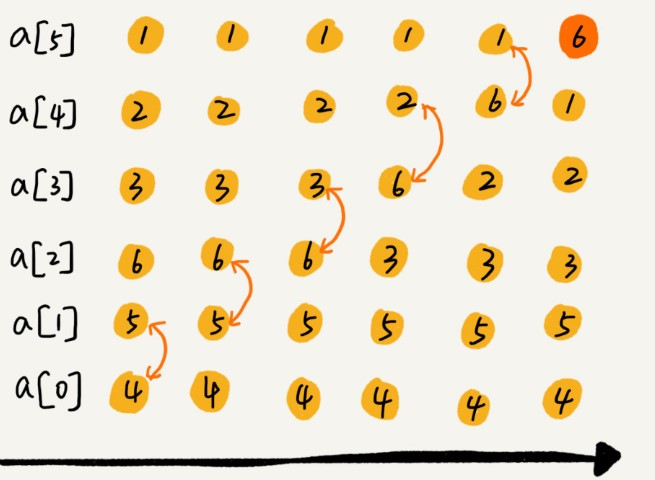
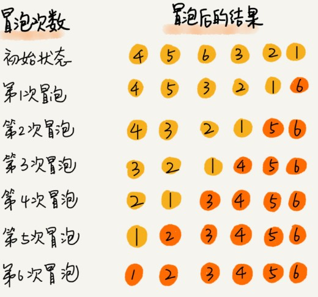

# 冒泡排序 (Bubble Sort)

[toc]

### 什么是冒泡排序 (Bubble Sort)?

> 1. 冒泡排序只会操作 **相邻** 的两个数据；
> 1. 并且，每次冒泡操作都会对相邻的两个元素进行比较，看是否满足 **大小关系要求**；
> 1. 如果 **不满足**，就让它们俩 **互换**；
> 1. 一次冒泡会让至少一个元素移动到它应该在的位置，重复 n 次，就完成了 n 个数据的排序工作。

### 举例说明

将一组数据：4，5，6，3，2，1 从 小 到 大 进行排序。

- 第一次冒泡操作的详细过程：



​		经过一次冒泡操作之后，6 这个元素已经存储在正确的位置上。

- 要想完成所有数据的排序，只需要进行 6 次这样的冒泡操作就行了：

  

### 代码实现（升序排序）

#### 未进行优化：没有排好序，有交换，遍历到结尾

```java
// java code
// Bubble Sort in Ascending Order without optimizing
// a - array, n - the size of array
// e.g. 4，5，6，3，2，1 -> 1, 2, 3, 4, 5, 6

public void bubbleSort(int[] a, int n){
    if (n <= 1) return;
    
    for(int i = 0; i < n; ++i){
        for(int j = 0; j < n - i - 1; ++j){
            if(a[j] > a[j + 1]){ // former > latter, then swap
                int temp = a[j];
                a[j] = a[j + 1];
                a[j + 1] = temp;                
            }
        }
    }
}
```

#### 已优化 ：已排好序，没有交换，提前结束

==当某次冒泡操作已经没有数据交换时，说明已经达到了完全有序，不用再继续执行后续的冒泡操作.==

例子：下面给出要对 6 个 元素进行冒泡排序，但是只是需要 4 次冒泡操作就可以了。


```java
// java code
// Bubble Sort in Ascending Order with optimzing
// a - array, n - the size of array
// e.g. 4，5，6，3，2，1 -> 1, 2, 3, 4, 5, 6

public void bubbleSort(int[] a, int n){
    if (n <= 1) return;
    
    for(int i = 0; i < n; ++i){
      
         // the sign to decide if there is swaping
        // false - no exist swaping, end the program
        // true - exist swaping, continue to swap
        boolean flag = false; 
        
        for(int j = 0; j < n - i - 1; ++i){
            if(a[j] > a[j + 1]){
                int temp = a[j];
                a[j] = a[j + 1];
                a[j + 1] = temp;
               
                // swap operator happence
                flag = true;
            }
        }
        
         // no swap, end early
        if (!flag) break;
    }
}
```

### 冒泡排序分析


**第一，冒泡排序是原地排序算法吗？**

冒泡的过程只涉及相邻数据的交换操作，只需要常量级的临时空间，所以它的**空间复杂度为 $O(1)$，是一个原地排序算法。**


**第二，冒泡排序是稳定的排序算法吗？**

在冒泡排序中，只有交换才可以改变两个元素的前后顺序。

为了保证冒泡排序算法的稳定性，当有**相邻的两个元素大小相等的时候，不做交换，相同大小的数据在排序前后不会改变顺序，所以冒泡排序是稳定的排序算法。**


**第三，冒泡排序的时间复杂度是多少？**

- 最好情况：

  **要排序的数据已经是有序的了，只需要进行一次冒泡操作，就可以结束了，所以最好情况时间复杂度是 $O(n)$。**

- 最坏情况：

  **要排序的数据刚好是倒序排列的，需要进行 n 次冒泡操作，所以最坏情况时间复杂度为 $O(n^2)$。**


- 平均情况 ：

  如果用概率论方法定量分析平均时间复杂度，涉及的数学推理和计算就会很复杂。这里还有一种思路，通过**"有序度"**和**"逆序度"**这两个概念来进行分析：

  **要排序的数组的初始状态是 4，5，6，3，2，1 ，其中，有序元素对有 (4，5) (4，6)(5，6)，所以有序度是 3。**

  **n=6，所以排序完成之后终态的满有序度为 n*(n-1)/2=15。**

  

  冒泡排序包含两个操作原子，**比较**和**交换**，每交换一次，有序度就加 1。

  **但不管算法怎么改进，交换次数总是确定的，即为 ==逆序度==。**

  > $$
  > 逆序度\ = \ 满序度 \ - \ 初始有序度 \ = \ n * (n-1)/2 - 初始有序度
  > $$

  此例中就是 15–3=12，要进行 12 次交换操作。

  **但对于包含 n 个数据的数组进行冒泡排序，平均交换次数是多少呢？**

  - 最坏情况：初始状态的有序度是 $0$，所以要进行$ n*(n-1)/2$ 次交换。

  - 最好情况：初始状态的有序度是 $n*(n-1)/2$，就不需要进行交换。

  - 平均情况：可以取个中间值 $n*(n-1)/4$，来表示初始有序度既不是很高也不是很低的平均情况。

    换句话说，平均情况下，需要 $n*(n-1)/4$ 次交换操作，**比较**操作肯定要比**交换**操作多，而复杂度的上限是 $O(n^2)$，所以平均情况下的时间复杂度就是 $O(n^2)$。

    这个平均时间复杂度推导过程其实并不严格，但是很多时候很实用，毕竟概率论的定量分析太复杂，不太好用。等讲到快排的时候，还会再次用这种“不严格”的方法来分析平均时间复杂度。

`@ 二次总结 ：2020-11-24 	FROM	极客时间 《算法与数据结构之美》 王争  专栏` 