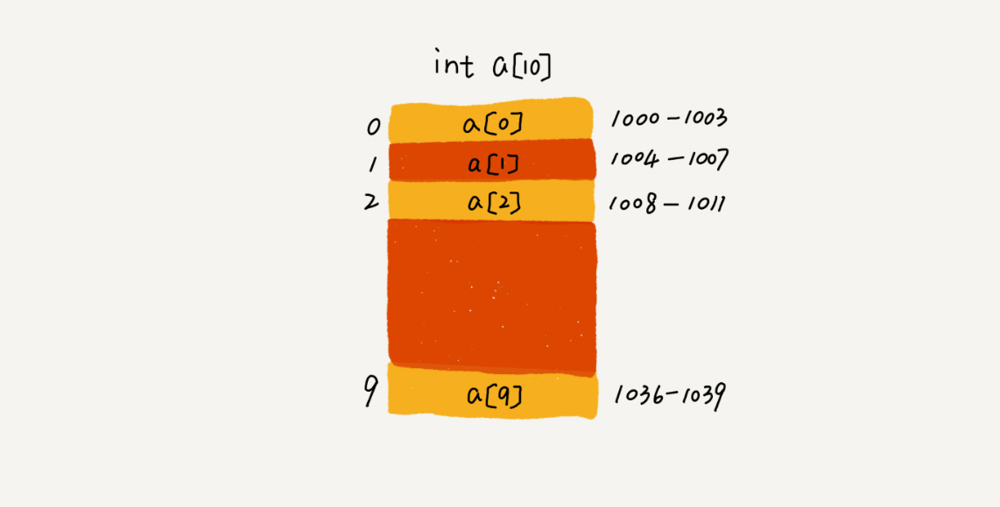

# 数组（Array）

> **数组（Array）是一种线性表数据结构。它用一组连续的内存空间，来存储一组具有相同类型的数据。**

### 数组的两个限制

- 第一是**线性表（Linear List）**。顾名思义，线性表就是数据排成像一条线一样的结构。每个线性表上的数据最多只有前和后两个方向。其实除了数组，链表、队列、栈等也是线性表结构。

  

而与它相对立的概念是**非线性表**，比如二叉树、堆、图等。之所以叫非线性，是因为，在非线性表中，数据之间并不是简单的前后关系。

- 第二个是**连续的内存空间和相同类型的数据**。

###  优点 

正是因为上面两个限制，它才有了一个堪称“杀手锏”的特性：“**随机访问**”。

###  缺点 

这两个限制也让**数组的很多操作变得非常低效**，比如要想在数组中删除、插入一个数据，为了保证连续性，就需要做大量的数据搬移工作。

## 随机访问

- 数组是如何实现根据下标随机访问数组元素的？

拿一个长度为 10 的 int 类型的数组 int[] a = new int[10]来举例。

在下面这个图中，计算机给数组 a[10]，分配了一块连续内存空间 1000～1039，其中，内存块的首地址为 base_address = 1000。

计算机会给每个内存单元分配一个地址，计算机通过地址来访问内存中的数据。当计算机需要随机访问数组中的某个元素时，它会首先通过下面的寻址公式，计算出该元素存储的内存地址

$$
a[i]\_address = base\_address + i * data\_type\_size
$$

- data_type_size 表示数组中每个元素的大小。举的这个例子里，数组中存储的是 int 类型数据，所以 data_type_size 就为 4 个字节。

## 低效的"插入"和"删除"

前面提到，**数组为了保持内存数据的连续性，会导致插入、删除这两个操作比较低效**。

### 插入操作

假设数组的长度为 n，现在，如果需要将一个数据插入到数组中的第 k 个位置。为了把第 k 个位置腾出来，给新来的数据，需要将第 k～n 这部分的元素都顺序地往后挪一位。

- 最好情况：如果在数组的末尾插入元素，那就不需要移动数据了，这时的时间复杂度为$ O(1)$。

- 最坏情况：但如果在数组的开头插入元素，那所有的数据都需要依次往后移动一位，所以最坏时间复杂度是 $O(n)$。 

- 平均情况：因为在每个位置插入元素的概率是一样的，所以平均情况时间复杂度为 $(1+2+…n)/n=O(n)$。

如果数组中的数据是**有序的**，在某个位置插入一个新的元素时，就必须按照刚才的方法搬移 k 之后的数据。

但是，如果数组中存储的数据是**无序的**，数组只是被当作一个存储数据的集合。**在这种情况下，如果要将某个数据插入到第 k 个位置，为了避免大规模的数据搬移，还有一个简单的办法就是，直接将第 k 位的数据搬移到数组元素的最后，把新的元素直接放入第 k 个位置。利用这种处理技巧，在特定场景下，在第 k 个位置插入一个元素的时间复杂度就会降为 O(1)。**

这个处理思想在快排中也会用到，在排序那一节具体来讲，这里就说到这儿。

- 例子：

  假设数组 a[10] 中存储了如下 5 个元素 : a, b, c, d, e. 

  现在需要将元素 x 插入到第 3 个位置. 

  只需要将 c 放入到 a[5]，将 a[2] 赋值为 x 即可.

### 删除操作

跟插入数据类似，如果要删除第 k 个位置的数据，为了内存的连续性，也需要搬移数据，不然中间就会出现空洞，内存就不连续了。

和插入类似，如果删除数组末尾的数据，则最好情况时间复杂度为 $O(1)$；如果删除开头的数据，则最坏情况时间复杂度为 $O(n)$；平均情况时间复杂度也为 $O(n)$。

实际上，在某些特殊场景下，我们并不一定非得追求数组中数据的连续性。如果我们将多次删除操作集中在一起执行，删除的效率是不是会提高很多呢？