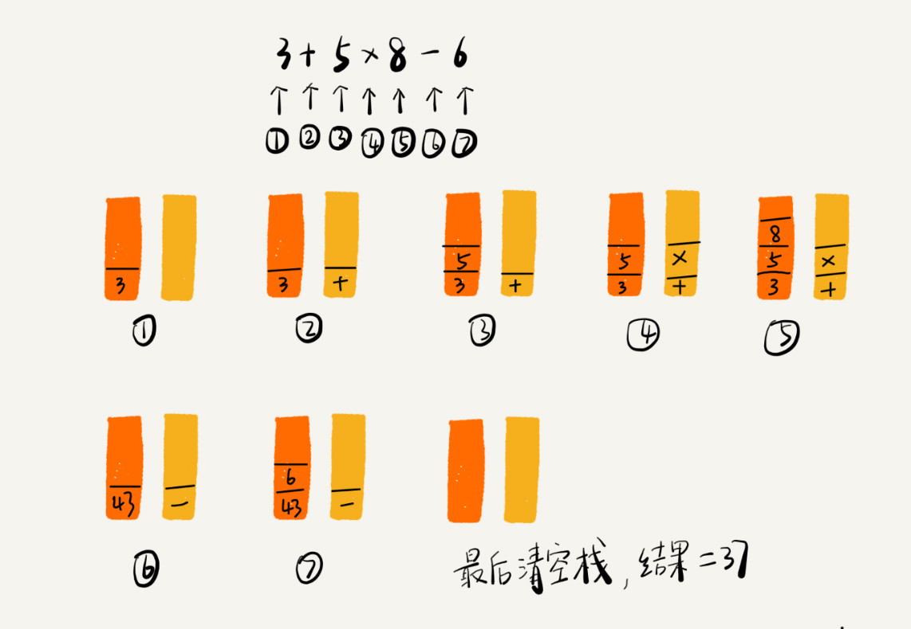
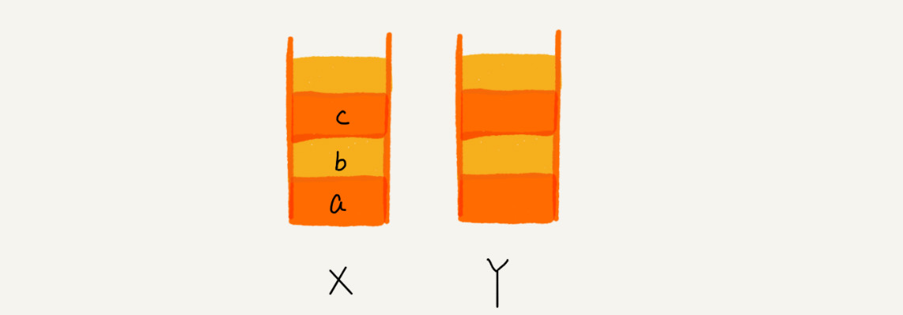

# 栈 （Stack）

[toc]

## 如何理解 **栈** ?

> FILO (First In Last Out) : 先进者后出， 后进者先出，这就是典型的“栈”结

关于“栈”，有一个非常贴切的例子，就是一摞叠在一起的盘子。平时放盘子的时候，都是从下往上一个一个放；取的时候，也是从上往下一个一个地依次取，不能从中间任意抽出。


从栈的操作特性上来看，**栈是一种“操作受限”的线性表**，**只允许在一端插入和删除数据**。

从功能上来说，数组或链表可以替代栈，但要知道，**特定的数据结构是对特定场景的抽象**，而且，**数组或链表暴露了太多的操作接口，操作上的确灵活自由，但使用时就比较不可控，自然也就更容易出错**。

`当某个数据集合只涉及在一端插入和删除数据，并且满足后进先出、先进后出的特性，我们就应该首选“栈”这种数据结构`。

## 如何实现一个栈?

从刚才栈的定义里，可以看出，栈主要包含两个操作，`入栈`和`出栈`，`也就是在栈顶插入一个数据和从栈顶删除一个数据`。

理解了栈的定义之后，来看一看如何用代码实现一个栈。

实际上，栈既可以用数组来实现，也可以用链表来实现。用**数组**实现的栈，叫作**顺序栈**，用**链表**实现的栈，叫作**链式栈**。

这里实现一个基于数组的顺序栈。代码是用 Java 来实现的，但是不涉及任何高级语法，并且还用中文做了详细的注释，所以应该是可以看懂的。

```java
// 基于数组实现的顺序栈
public class ArrayStack {
  private String[] items;  // 数组
  private int count;       // 栈中元素个数
  private int n;           //栈的大小

  // 初始化数组，申请一个大小为n的数组空间
  public ArrayStack(int n) {
    this.items = new String[n];
    this.n = n;
    this.count = 0;
  }

  // 入栈操作
  public boolean push(String item) {
    // 数组空间不够了，直接返回false，入栈失败。
    if (count == n) return false;
    // 将item放到下标为count的位置，并且count加一
    items[count] = item;
    ++count;
    return true;
  }
  
  // 出栈操作
  public String pop() {
    // 栈为空，则直接返回null
    if (count == 0) return null;
    // 返回下标为count-1的数组元素，并且栈中元素个数count减一
    String tmp = items[count-1];
    --count;
    return tmp;
  }
}
```

### 复杂度分析

- 空间复杂度分析

  不管是顺序栈还是链式栈，存储数据只需要一个大小为 n 的数组就够了。

  在入栈和出栈过程中，只需要一两个临时变量存储空间，所以**空间复杂度是 O(1)**。

  注意，**这里存储数据需要一个大小为 n 的数组，并不是说空间复杂度就是 $O(n)$。因为，这 $n$ 个空间是必须的，无法省掉。所以说空间复杂度的时候，是指除了原本的数据存储空间外，算法运行还需要额外的存储空间。**

  

- 时间复杂度分析

  不管是顺序栈还是链式栈，入栈、出栈只涉及栈顶个别数据的操作，所以时间复杂度都是 **O(1)**。

## 支持动态扩容的顺序栈

刚才那个基于数组实现的栈，是一个固定大小的栈，也就是说，在初始化栈时需要事先指定栈的大小。当栈满之后，就无法再往栈里添加数据了。尽管链式栈的大小不受限，但要存储 next 指针，内存消耗相对较多。那如何基于数组实现一个可以支持动态扩容的栈呢？

在数组那一节，当数组空间不够时，就重新申请一块更大的内存，将原来数组中数据统统拷贝过去。这样就实现了一个支持动态扩容的数组。

所以，如果要实现一个支持动态扩容的栈，只需要底层依赖一个支持动态扩容的数组就可以了。当栈满了之后，就申请一个更大的数组，将原来的数据搬移到新数组中。


实际上，支持动态扩容的顺序栈，平时开发中并不常用到。这一块的目的，主要还是练习一下前面讲的复杂度分析方法。所以这一小节的重点是复杂度分析。

### 复杂度分析

#### 时间复杂度

- 出栈操作：不会涉及内存的重新申请和数据的搬移，所以时间复杂度仍是 $O(1)$.
- 入栈操作：
  - 最好情况：**当栈中有空闲空间时，入栈操作的时间复杂度为 O(1)。**
  - 最坏情况：**当空间不够时，就需要重新申请内存和数据搬移，所以时间复杂度就变成了 $O(n)$**.
  - 平均情况：借助 **摊还分析法**。为了分析的方便，需要事先做一些假设和定义：
    - 栈空间不够时，重新申请一个是原来大小两倍的数组；
    - 为了简化分析，假设只有入栈操作没有出栈操作；
    - 定义不涉及内存搬移的入栈操作为 simple-push 操作，时间复杂度为 O(1)


​			如果当前栈大小为 K，并且已满，当再有新的数据要入栈时，就需要重新申请 2 倍大小的内存，并且做 K 个数据的搬移操作，然后再入栈。但是，接			下来的 K-1 次入栈操作，都不需要再重新申请内存和搬移数据，所以这 K-1 次入栈操作都只需要一个 simple-push 操作就可以完成。为了更加直观			地理解这个过程，见下图。

​						

​			以看出来，这 K 次入栈操作，总共涉及了 K 个数据的搬移，以及 K 次 simple-push 操作。将 K 个数据搬移均摊到 K次入栈操作，那每个入栈操作			只需要一个数据搬移和一个 simple-push 操作。以此类推，入栈操作的均摊时间复杂度就为 O(1)。


通过这个例子的实战分析，也印证了前面讲到的，`均摊时间复杂度一般都等于最好情况时间复杂度`。因为在大部分情况下，入栈操作的时间复杂度 O 都是 O(1)，只有在个别时刻才会退化为 $O(n)$，所以把耗时多的入栈操作的时间均摊到其他入栈操作上，平均情况下的耗时就接近 O(1)。


## 栈在函数调用中的应用

现在来看下，栈在软件工程中的实际应用。栈作为一个比较基础的数据结构，应用场景还是蛮多的。其中，比较经典的一个应用场景就是函数调用栈。

**操作系统给每个线程分配了一块独立的内存空间，这块内存被组织成“栈”这种结构, 用来存储函数调用时的临时变量。每进入一个函数，就会将临时变量作为一个栈帧入栈，当被调用函数执行完成，返回之后，将这个函数对应的栈帧出栈。**

为了更好地理解，一块来看下这段代码的执行过程。

```java
int main() {
   int a = 1; 
   int ret = 0;
   int res = 0;
   ret = add(3, 5);
   res = a + ret;
   printf("%d", res);
   reuturn 0;
}

int add(int x, int y) {
   int sum = 0;
   sum = x + y;
   return sum;
}
```

从代码中可以看出，main() 函数调用了 add() 函数，获取计算结果，并且与临时变量 a 相加，最后打印 res 的值。为了清晰地看到这个过程对应的函数栈里出栈、入栈的操作，画了一张图。图中显示的是，在执行到 add() 函数时，函数调用栈的情况。


## 栈在表达式求值中的应用

再来看栈的另一个常见的应用场景，编译器如何利用栈来实现**表达式求值**。

为了方便解释，将算术表达式简化为**只包含加减乘除四则运算**，比如：34+13*9+44-12/3。对于这个四则运算，人脑可以很快求解出答案，但是对于计算机来说，理解这个表达式本身就是个挺难的事儿。

实际上，编译器就是通过**两个栈**来实现的。其中**一个保存操作数的栈**，**另一个是保存运算符的栈**。从左向右遍历表达式，当遇到数字，就直接压入操作数栈；当遇到运算符，就与运算符栈的栈顶元素进行比较。**如果比运算符栈顶元素的优先级高，就将当前运算符压入栈；如果比运算符栈顶元素的优先级低或者相同，从运算符栈中取栈顶运算符，从操作数栈的栈顶取 2 个操作数，然后进行计算，再把计算完的结果压入操作数栈，继续比较。**

- 例子 ：3 + 5 * 8 - 6



## 栈在括号匹配中的应用

除了用栈来实现表达式求值，还可以借助栈来**检查表达式中的括号是否匹配**。

同样简化一下背景。假设表达式中只包含**三种括号**，**圆括号 ()、方括号[]和花括号{}**，并且它们可以**任意嵌套**。比如，{[] ()[{}]}或[{()}([])]等都为合法格式，而{[}()]或[({)]为不合法的格式。那现在给出一个包含三种括号的表达式字符串，如何检查它是否合法呢？

这里也可以用栈来解决。用栈来保存未匹配的左括号，从左到右依次扫描字符串。当扫描到左括号时，则将其压入栈中；当扫描到右括号时，从栈顶取出一个左括号。如果能够匹配，比如“(”跟“)”匹配，“[”跟“]”匹配，“{”跟“}”匹配，则继续扫描剩下的字符串。如果扫描的过程中，遇到不能配对的右括号，或者栈中没有数据，则说明为非法格式。

当所有的括号都扫描完成之后，如果栈为空，则说明字符串为合法格式；否则，说明有未匹配的左括号，为非法格式。

## 思考 (一)

> 如何实现浏览器的前进、后退功能？

其实，用两个栈就可以非常完美地解决这个问题。

使用两个栈，X 和 Y，把首次浏览的页面依次压入栈 X，当点击后退按钮时，再依次从栈 X 中出栈，并将出栈的数据依次放入栈 Y。当点击前进按钮时，依次从栈 Y 中取出数据，放入栈 X 中。当栈 X 中没有数据时，那就说明没有页面可以继续后退浏览了。当栈 Y 中没有数据，那就说明没有页面可以点击前进按钮浏览了。

比如顺序查看了 a，b，c 三个页面，就依次把 a，b，c 压入栈，这个时候，两个栈的数据就是这个样子：



当通过浏览器的后退按钮，从页面 c 后退到页面 a 之后，就依次把 c 和 b 从栈 X 中弹出，并且依次放入到栈 Y。这个时候，两个栈的数据就是这个样子：


这个时候又想看页面 b，于是又点击前进按钮回到 b 页面，就把 b 再从栈 Y 中出栈，放入栈 X 中。此时两个栈的数据是这个样子：


这个时候，通过页面 b 又跳转到新的页面 d 了，页面 c 就无法再通过前进、后退按钮重复查看了，所以需要清空栈 Y。此时两个栈的数据这个样子：


## 思考 （二）

> 在讲栈的应用时，讲到用函数调用栈来保存临时变量，为什么函数调用要用“栈”来保存临时变量呢？用其他数据结构不行吗？

内存中的堆栈和数据结构堆栈不是一个概念，可以说内存中的堆栈是真实存在的物理区，数据结构中的堆栈是抽象的数据存储结构. 

内存空间在逻辑上分为三部分：代码区、静态数据区和动态数据区，动态数据区又分为栈区和堆区。

代码区：存储方法体的二进制代码。高级调度（作业调度）、中级调度（内存调度）、低级调度（进程调度）控制代码区执行代码的切换。

静态数据区：存储全局变量、静态变量、常量，常量包括final修饰的常量和String常量。系统自动分配和回收。

栈区：存储运行方法的形参、局部变量、返回值。由系统自动分配和回收。

堆区：new一个对象的引用或地址存储在栈区，指向该对象存储在堆区中的真实数据

其实，不一定非要用栈来保存临时变量，只不过如果这个函数调用符合后进先出的特性，用栈这种数据结构来实现，是最顺理成章的选择。

从调用函数进入被调用函数，对于数据来说，变化的是什么呢？是作用域。所以根本上，只要能保证每进入一个新的函数，都是一个新的作用域就可以。而要实现这个，用栈就非常方便。在进入被调用函数的时候，分配一段栈空间给这个函数的变量，在函数结束的时候，将栈顶复位，正好回到调用函数的作用域内。


*`@ 笔记时间 ：2020-8-30 FROM	极客时间 《算法啊与数据结构之美》 王争  专栏`* 