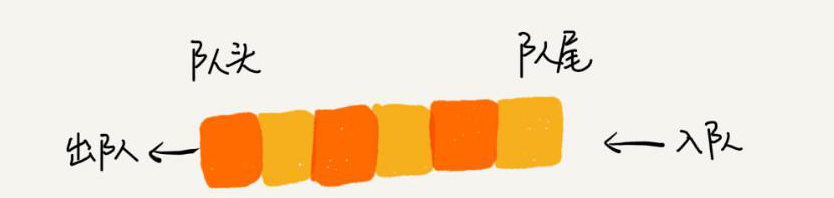
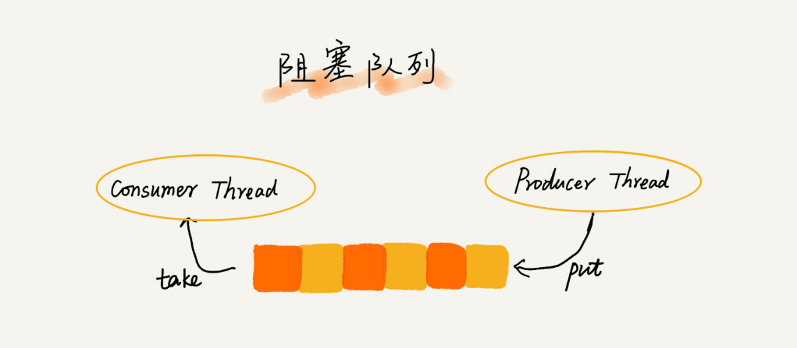

# 队列（Queue）

[toc]

## 如何理解“队列”？

> FIFO(First In First Out) : 进者先出，这就是典型的“队列”

队列这个概念非常好理解。可以把它想象成排队买票，先来的先买，后来的人只能站末尾，不允许插队。

栈只支持两个基本操作：入栈 push()和出栈 pop()。

队列跟栈非常相似，支持的操作也很有限，最基本的操作也是两个：

- `入队 enqueue() : 放一个数据到队列尾部`
- `出队 dequeue() : 从队列头部取一个元素`



所以，**队列**跟栈一样，**也是一种操作受限的线性表数据结构**。

队列的概念很好理解，基本操作也很容易掌握。作为一种非常基础的数据结构，队列的应用也非常广泛，特别是一些具有某些额外特性的队列，比如循环队列、阻塞队列、并发队列。它们在很多偏底层系统、框架、中间件的开发中，起着关键性的作用。比如高性能队列 Disruptor、Linux 环形缓存，都用到了循环并发队列；Java concurrent 并发包利用 ArrayBlockingQueue 来实现公平锁等。

## 顺序队列和链式队列

跟栈一样，队列可以用数组来实现，也可以用链表来实现。用数组实现的栈叫作顺序栈，用链表实现的栈叫作链式栈。同样，用数组实现的队列叫作**顺序队列**，用链表实现的队列叫作**链式队列**。

### 顺序队列

先来看下基于数组的实现方法。用 Java 语言实现了一下，不包含 Java 语言的高级语法：

```java
// 用数组实现的队列
public class ArrayQueue {
    
  // 数组：items，数组大小：n
  private String[] items;
  private int n = 0;
    
  // head表示队头下标，tail表示队尾下标
  private int head = 0;
  private int tail = 0;

  // 申请一个大小为capacity的数组
  public ArrayQueue(int capacity) {
    items = new String[capacity];
    n = capacity;
  }

  // 入队
  public boolean enqueue(String item) {
      
    // 如果tail == n 表示队列已经满了
    if (tail == n) return false;
    items[tail] = item;
    ++tail;
    return true;
  }

  // 出队
  public String dequeue() {
      
    // 如果head == tail 表示队列为空
    if (head == tail) return null;
      
    // 为了让其他语言的同学看的更加明确，把--操作放到单独一行来写了
    String ret = items[head];
    ++head;
    return ret;
  }
}
```

比起栈的数组实现，队列的数组实现稍微有点儿复杂，但是没关系。稍微解释一下实现思路，很容易就能明白了。

对于**栈**来说，只需要一个**栈顶指针**就可以了。但是**队列**需要**两个指针**：一个是 **head 指针，指向队头**；一个是 **tail 指针，指向队尾**。可以结合下面这幅图来理解。当 a、b、c、d 依次入队之后，队列中的 head 指针指向下标为 0 的位置，tail 指针指向下标为 4 的位置。


当调用两次出队操作之后，队列中 head 指针指向下标为 2 的位置，tail 指针仍然指向下标为 4 的位置。

随着不停地进行入队、出队操作，head 和 tail 都会持续往后移动。当 tail 移动到最右边，即使数组中还有空闲空间，也无法继续往队列中添加数据了。这个问题该如何解决呢？

在数组那一节，也遇到过类似的问题，就是数组的删除操作会导致数组中的数据不连续。当时，**用<font color="red">数据搬移</font> 就可解决**！

但是，每次进行出队操作都相当于删除数组下标为 0 的数据，要搬移整个队列中的数据，这样出队操作的时间复杂度就会从原来的 $O(1)$ 变为 $O(n)$。能不能优化一下呢？

实际上，**在出队时可以不用搬移数据**。**如果没有空闲空间了，只需要在入队时，再集中触发一次数据的搬移操作。**借助这个思想，出队函数 dequeue() 保持不变，稍加改造一下入队函数 enqueue() 的实现，就可以轻松解决刚才的问题了。下面是具体的代码：

```java
  // 入队操作，将item放入队尾
  public boolean enqueue(String item) {
      
    // tail == n表示队列末尾没有空间了
    if (tail == n) {
        
      // tail ==n && head==0，表示整个队列都占满了
      if (head == 0) return false;
        
      // 数据搬移
      for (int i = head; i < tail; ++i) {
        items[i-head] = items[i];
      }
        
      // 搬移完之后重新更新head和tail
      tail -= head;
      head = 0;
    }
    
    items[tail] = item;
    ++tail;
    return true;
  }
```

从代码中可以看到，当队列的 tail 指针移动到数组的最右边后，如果有新的数据入队，可以将 head 到 tail 之间的数据，整体搬移到数组中 0 到 tail-head 的位置。


这种实现思路中，出队操作的时间复杂度仍然是 O(1)，但入队操作的时间复杂度，根据摊还分析法还会是 O(1)。

### 链式队列

基于链表的实现，同样需要两个指针：head 指针和 tail 指针。它们分别指向链表的第一个结点和最后一个结点。

如图所示，入队时，tail->next= new_node, tail = tail->next；出队时，head = head->next。


## 循环队列

刚才用数组来实现队列的时候，在 **tail==n** 时，会有数据搬移操作，这样入队操作性能就会受到影响。那有没有办法能够避免数据搬移呢？来看看循环队列的解决思路

循环队列，顾名思义，它长得像一个环。原本数组是有头有尾的，是一条直线。现在把首尾相连，扳成了一个环。画了一张图，可以直观地感受一下。


可以看到，图中这个队列的大小为 8，当前 head=4，tail=7。当有一个新的元素 a 入队时，放入下标为 7 的位置。但这个时候，并不把 tail 更新为 8，而是将其在环中后移一位，到下标为 0 的位置。当再有一个元素 b 入队时，将 b 放入下标为 0 的位置，然后 tail 加 1 更新为 1。所以，在 a，b 依次入队之后，循环队列中的元素就变成了下面的样子：


通过这样的方法，成功避免了数据搬移操作。看起来不难理解，但是循环队列的代码实现难度要比前面讲的非循环队列难多了。要想写出没有 bug 的循环队列的实现代码，最关键的是，**确定好队空和队满的判定条件。**

### 确定 队空 和 队满 的判断条件

- 数组实现的**非循环队列** ：
  - **队满 ： tail == n**
  - **队空： head == tail**
- 数组实现的**循环队列**：
  - **队空： head == tail**
  - **队满：（tail + 1) % n == head, tail 指向的位置没有存储数据，即浪费一个数组的存储空间**

但队列满的判断条件就稍微有点复杂了。下面画了一张队列满的图，试着总结一下规律。


当队列满时，图中的 tail 指向的位置实际上是没有存储数据的。所以，循环队列会浪费一个数组的存储空间。

此时，像图中画的队满的情况，tail=3，head=4，n=8，所以总结一下规律就是：(3+1)%8=4。多画几张队满的图，就会发现，当队满时，**(tail+1)%n==head。**

代码如下：

```java
public class CircularQueue {
  // 数组：items，数组大小：n
  private String[] items;
  private int n = 0;
    
  // head表示队头下标，tail表示队尾下标
  private int head = 0;
  private int tail = 0;

  // 申请一个大小为capacity的数组
  public CircularQueue(int capacity) {
    items = new String[capacity];
    n = capacity;
  }

  // 入队
  public boolean enqueue(String item) {
    // 队列满了
    if ((tail + 1) % n == head) return false;
    items[tail] = item;
    tail = (tail + 1) % n;
    return true;
  }

  // 出队
  public String dequeue() {
    // 如果head == tail 表示队列为空
    if (head == tail) return null;
    String ret = items[head];
    head = (head + 1) % n;
    return ret;
  }
}
```

## 阻塞队列和并发队列

面讲的内容理论比较多，看起来很难跟实际的项目开发扯上关系。确实，队列这种数据结构很基础，平时的业务开发不大可能从零实现一个队列，甚至都不会直接用到。而一些具有特殊特性的队列应用却比较广泛，比如阻塞队列和并发队列。

### 阻塞队列

阻塞队列其实就是在队列基础上增加了阻塞操作。简单来说，就是在队列为空的时候，从队头取数据会被阻塞。因为此时还没有数据可取，直到队列中有了数据才能返回；如果队列已经满了，那么插入数据的操作就会被阻塞，直到队列中有空闲位置后再插入数据，然后再返回。



应该已经发现了，上述的定义就是一个“生产者 - 消费者模型”！是的，可以使用阻塞队列，轻松实现一个“生产者 - 消费者模型”！

这种基于阻塞队列实现的“生产者 - 消费者模型”，可以有效地协调生产和消费的速度。当“生产者”生产数据的速度过快，“消费者”来不及消费时，存储数据的队列很快就会满了。这个时候，生产者就阻塞等待，直到“消费者”消费了数据，“生产者”才会被唤醒继续“生产”。

而且不仅如此，基于阻塞队列，还可以通过协调“生产者”和“消费者”的个数，来提高数据的处理效率。比如前面的例子，可以多配置几个“消费者”，来应对一个“生产者”。


### 并发队列

在多线程情况下，会有多个线程同时操作队列，这个时候就会存在线程安全问题，那如何实现一个线程安全的队列呢？

线程安全的队列叫作并发队列。最简单直接的实现方式是直接在 enqueue()、dequeue() 方法上加锁，但是锁粒度大并发度会比较低，同一时刻仅允许一个存或者取操作。实际上，基于数组的循环队列，利用 CAS 原子操作，可以实现非常高效的并发队列。这也是循环队列比链式队列应用更加广泛的原因。在实战篇讲 Disruptor 的时候，会再详细讲并发队列的应用。


## 思考

> 线程池没有空闲线程时，新的任务请求线程资源时，线程池该如何处理？各种处理策略又是如何实现的呢？

一般有两种处理策略。第一种是非阻塞的处理方式，直接拒绝任务请求；另一种是阻塞的处理方式，将请求排队，等到有空闲线程时，取出排队的请求继续处理。

那如何存储排队的请求呢？希望公平地处理每个排队的请求，先进者先服务，所以队列这种数据结构很适合来存储排队请求。我们前面说过，队列有基于链表和基于数组这两种实现方式。这两种实现方式对于排队请求又有什么区别呢？

基于链表的实现方式，可以实现一个支持无限排队的无界队列（unbounded queue），但是可能会导致过多的请求排队等待，请求处理的响应时间过长。所以，针对响应时间比较敏感的系统，基于链表实现的无限排队的线程池是不合适的。

**而基于数组实现的有界队列（bounded queue），队列的大小有限，所以线程池中排队的请求超过队列大小时，接下来的请求就会被拒绝，这种方式对响应时间敏感的系统来说，就相对更加合理。**不过，设置一个合理的队列大小，也是非常有讲究的。队列太大导致等待的请求太多，队列太小会导致无法充分利用系统资源、发挥最大性能。

除了前面讲到队列应用在线程池请求排队的场景之外，队列可以应用在任何有限资源池中，用于排队请求，比如数据库连接池等。**实际上，对于大部分资源有限的场景，当没有空闲资源时，基本上都可以通过“队列”这种数据结构来实现请求排队。**


*`@ 笔记时间 ：2020-8-30 FROM	极客时间 《算法啊与数据结构之美》 王争  专栏`* 