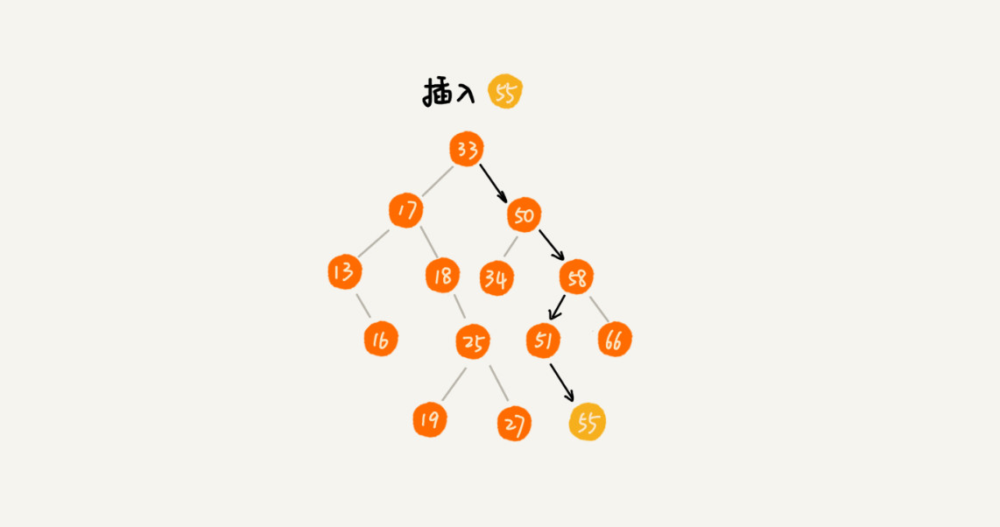

# 二叉查找树(Binary Search Tree)

## 说明

- 介绍

  二叉查找树是二叉树中最常用的一种类型，也叫二叉搜索树。顾名思义，二叉查找树是为了实现快速查找而生的。不过，它不仅仅支持快速查找一个数据，还支持快速插入、删除一个数据。

- 特点

  支持`动态`数据集合的快速`查找`、`插入`、`删除`操作。

- 特殊结构

  `二叉查找树要求，在树中的任意一个节点，其左子树中的每个节点的值，都要小于这个节点的值，而右子树节点的值都大于这个节点的值。`

  

## 操作

### 查找

**先取根节点，如果它等于要查找的数据，那就返回；如果要查找的数据比根节点的值小，那就在左子树中递归查找；如果要查找的数据比根节点的值大，那就在右子树中递归查找。**


- 代码：

  ```java
  public class BinarySearchTree {
    private Node tree;
  
    public Node find(int data) {
      Node p = tree;
      while (p != null) {
        if (data < p.data) p = p.left;
        else if (data > p.data) p = p.right;
        else return p;
      }
      return null;
    }
  
    public static class Node {
      private int data;
      private Node left;
      private Node right;
  
      public Node(int data) {
        this.data = data;
      }
    }
  }
  ```

### 插入

二叉查找树的插入过程有点类似查找操作。

**新插入的数据一般都是在叶子节点上，所以只需要从根节点开始，依次比较要插入的数据和节点的大小关系。**

**如果要插入的数据比节点的数据大，并且节点的右子树为空，就将新数据直接插到右子节点的位置；如果不为空，就再递归遍历右子树，查找插入位置。**

**同理，如果要插入的数据比节点数值小，并且节点的左子树为空，就将新数据插入到左子节点的位置；如果不为空，就再递归遍历左子树，查找插入位置。**



- 代码：

  ```java
  public void insert(int data) {
    if (tree == null) {
      tree = new Node(data);
      return;
    }
  
    Node p = tree;
    while (p != null) {
      if (data > p.data) {
        if (p.right == null) {
          p.right = new Node(data);
          return;
        }
        p = p.right;
      } else { // data < p.data
        if (p.left == null) {
          p.left = new Node(data);
          return;
        }
        p = p.left;
      }
    }
  }
  ```

### 删除

针对要删除节点的子节点个数的不同，需要分三种情况来处理：

- 第一种情况是，如果要删除的节点没有子节点，只需要直接将父节点中，指向要删除节点的指针置为 null。比如图中的删除节点 55。

- 第二种情况是，如果要删除的节点只有一个子节点（只有左子节点或者右子节点），只需要更新父节点中，指向要删除节点的指针，让它指向要删除节点的子节点就可以了。比如图中的删除节点 13。

- 第三种情况是，如果要删除的节点有两个子节点，这就比较复杂了。需要找到这个节点的右子树中的最小节点，把它替换到要删除的节点上。然后再删除掉这个最小节点，因为最小节点肯定没有左子节点（如果有左子结点，那就不是最小节点了），所以，可以应用上面两条规则来删除这个最小节点。比如图中的删除节点 18。

  

- 代码：

  ```java
  public void delete(int data) {
    Node p = tree; // p指向要删除的节点，初始化指向根节点
    Node pp = null; // pp记录的是p的父节点
    while (p != null && p.data != data) {
      pp = p;
      if (data > p.data) p = p.right;
      else p = p.left;
    }
    if (p == null) return; // 没有找到
  
    // 要删除的节点有两个子节点
    if (p.left != null && p.right != null) { // 查找右子树中最小节点
      Node minP = p.right;
      Node minPP = p; // minPP表示minP的父节点
      while (minP.left != null) {
        minPP = minP;
        minP = minP.left;
      }
      p.data = minP.data; // 将minP的数据替换到p中
      p = minP; // 下面就变成了删除minP了
      pp = minPP;
    }
  
    // 删除节点是叶子节点或者仅有一个子节点
    Node child; // p的子节点
    if (p.left != null) child = p.left;
    else if (p.right != null) child = p.right;
    else child = null;
  
    if (pp == null) tree = child; // 删除的是根节点
    else if (pp.left == p) pp.left = child;
    else pp.right = child;
  }
  ```

  实际上，关于二叉查找树的删除操作，还有个非常简单、取巧的方法，就是单纯将要删除的节点标记为“已删除”，但是并不真正从树中将这个节点去掉。这样原本删除的节点还需要存储在内存中，比较浪费内存空间，但是删除操作就变得简单了很多。而且，这种处理方法也并没有增加插入、查找操作代码实现的难度。

### 其他操作

- **快速地查找最大节点和最小节点、前驱节点和后继节点。**

- **中序遍历二叉查找树**

  可以输出有序的数据序列，时间复杂度是 O(n)，非常高效。因此，二叉查找树也叫作二叉排序树。

这些操作会展示在相应的代码中，这里不多做述说.

## 支持重复数据的二叉查找树


前面讲二叉查找树的时候，**默认树中节点存储的都是数字**。很多时候，在实际的软件开发中，在二叉查找树中存储的，是一个包含**很多字段的对象**。**利用对象的某个字段作为键值（key）来构建二叉查找树，把对象中的其他字段叫作卫星数据**。

前面讲的二叉查找树的操作，针对的都是**不存在键值相同的情况**。那如果存储的两个对象键值相同，这种情况该怎么处理呢？

这里有两种解决方法：

- 第一种方法比较容易:

  二叉查找树中每一个节点不仅会存储一个数据，因此通过链表和支持动态扩容的数组等数据结构，把值相同的数据都存储在同一个节点上。

- 第二种方法比较不好理解，不过更加优雅:

  每个节点仍然只存储一个数据。在查找插入位置的过程中，如果碰到一个节点的值，与要插入数据的值相同，就将这个要插入的数据放到这个节点的右子树，也就是说，**把这个新插入的数据当作大于这个节点的值来处理**。

  

  **当要查找数据的时候，遇到值相同的节点，并不停止查找操作，而是继续在右子树中查找，直到遇到叶子节点，才停止。这样就可以把键值等于要查找值的所有节点都找出来。**


**对于删除操作，也需要先查找到每个要删除的节点，然后再按前面讲的删除操作的方法，依次删除。**


## 二叉查找树的时间复杂度分析

实际上，二叉查找树的形态各式各样。比如这个图中，对于同一组数据，构造了三种二叉查找树。它们的查找、插入、删除操作的执行效率都是不一样的。


### 最坏情况 

图中第一种二叉查找树是一种最糟糕的情况，根节点的左右子树极度不平衡，已经退化成了链表，所以查找的时间复杂度就变成了 **$O(n)$**。

### 最好情况

二叉查找树是一棵完全二叉树（或满二叉树）时，插入、删除、查找的时间复杂度是多少呢？

从前面的例子、图，以及还有代码来看，不管操作是插入、删除还是查找，**时间复杂度其实都跟树的高度成正比，也就是 $O(height)$。**

既然这样，现在问题就转变成另外一个了，也就是，**如何求一棵包含 n 个节点的完全二叉树的高度？**


**树的高度就等于最大层数减一，为了方便计算，转换成层来表示。从图中可以看出，包含 n 个节点的完全二叉树中，第一层包含 1 个节点，第二层包含 2 个节点，第三层包含 4 个节点，依次类推，下面一层节点个数是上一层的 2 倍，第 K 层包含的节点个数就是 $2^{K-1}$。**

**不过，对于完全二叉树来说，最后一层的节点个数有点儿不遵守上面的规律了。它包含的节点个数在 1 个到 $2^{L-1}$ 个之间（假设最大层数是 L）。如果把每一层的节点个数加起来就是总的节点个数 n。也就是说，如果节点的个数是 n，那么 n 满足这样一个关系：**
$$
1+2+4+8+...+2^{L-2}+1 \ \le \ n \ \le 1+2+4+8+...+2^{L-2}+2^{L-1}
$$
**借助等比数列的求和公式，可以计算出，L 的范围是 $[log_2{(n+1)}, log_2{n} +1]$。**

**完全二叉树的层数小于等于 $log_2{n} +1$，也就是说，完全二叉树的高度小于等于 $log_2{n}$.**


显然，极度不平衡的二叉查找树，它的查找性能肯定不能满足需求。所以，需要构建一种不管怎么删除、插入数据，在任何时候，都能保持任意节点左右子树都比较平衡的二叉查找树，这就是下一节课要详细讲的，一种特殊的二叉查找树，平衡二叉查找树。平衡二叉查找树的高度接近 $logn$，所以插入、删除、查找操作的时间复杂度也比较稳定，是 $O(logn)$。

## 散列表 VS 二叉查找树

**在散列表那节中讲过，散列表的插入、删除、查找操作的时间复杂度可以做到常量级的 $O(1)$，非常高效。而二叉查找树在比较平衡的情况下，插入、删除、查找操作时间复杂度才是 $O(logn)$，相对散列表，好像并没有什么优势，那为什么还要用二叉查找树呢？**

第一，散列表中的数据是无序存储的，如果要输出有序的数据，需要先进行排序。而对于二叉查找树来说，我们只需要中序遍历，就可以在 $O(n)$ 的时间复杂度内，输出有序的数据序列。

第二，散列表扩容耗时很多，而且当遇到散列冲突时，性能不稳定，尽管二叉查找树的性能不稳定，但是在工程中，我们最常用的平衡二叉查找树的性能非常稳定，时间复杂度稳定在 $O(logn)$。

第三，笼统地来说，尽管散列表的查找等操作的时间复杂度是常量级的，但因为哈希冲突的存在，这个常量不一定比 $logn$ 小，所以实际的查找速度可能不一定比 $O(logn)$ 快。加上哈希函数的耗时，也不一定就比平衡二叉查找树的效率高。

第四，散列表的构造比二叉查找树要复杂，需要考虑的东西很多。比如散列函数的设计、冲突解决办法、扩容、缩容等。平衡二叉查找树只需要考虑平衡性这一个问题，而且这个问题的解决方案比较成熟、固定。

最后，为了避免过多的散列冲突，散列表装载因子不能太大，特别是基于开放寻址法解决冲突的散列表，不然会浪费一定的存储空间。

综合这几点，平衡二叉查找树在某些方面还是优于散列表的，所以，这两者的存在并不冲突。我们在实际的开发过程中，需要结合具体的需求来选择使用哪一个。

## 思考

今天讲了二叉树高度的理论分析方法，给出了粗略的数量级。如何通过编程，求出一棵给定二叉树的确切高度呢？

1. 递归法
   $$
   根节点高度=max(左子树高度，右子树高度)+1
   $$
   
2. 确定二叉树高度有两种思路：

   1. 第一种是深度优先思想的递归，分别求左右子树的高度。当前节点的高度就是左右子树中较大的那个+1；
   2. 第二种可以采用层次遍历的方式，每一层记录都记录下当前队列的长度，这个是队尾，每一层队头从0开始。然后每遍历一个元素，队头下标+1。直到队头下标等于队尾下标。这个时候表示当前层遍历完成。每一层刚开始遍历的时候，树的高度+1。最后队列为空，就能得到树的高度。

3. 思考题：$leetcode 104$ 题，可以使用递归法:

   递归公式： $depth =Math.max(maxDepth(node.left), maxDepth(node.right) )+ 1;$

   递归出口： $depth = 0 (node == null)$


4. 二叉查找树的删除操作（无重复的数据）$leetcode 450$:

   根据老师的思路，先不看代码，自己写了好长段时间，写出来都跑过$leetcode$的所有案例。回过头来再看老师的删除的代码，感觉到了巧妙之处就是：当删除节点有两个子节点的情况，很巧得一起套用了删除结点子节点个数小于1的两种场景。

*`@ 笔记时间 ：2020-11-11 FROM	极客时间 《算法啊与数据结构之美》 王争  专栏`* 