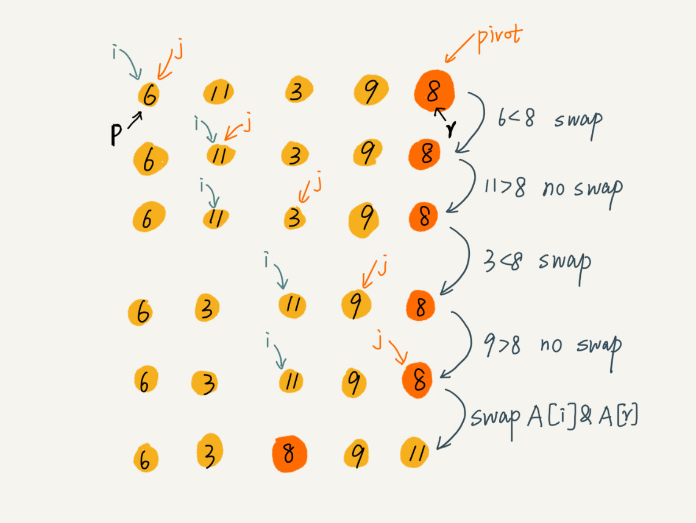

# 快速排序（Quick Sort）

快速排序（Quick Sort）简称为“快排”。快排利用的也是分治思想。乍看起来，它有点像归并排序，但是思路其实完全不一样。

## 原理

>如果要排序数组中下标从 p 到 r 之间的一组数据，选择 p 到 r 之间的任意一个数据作为 pivot（分区点）。
>
>遍历 p 到 r 之间的数据，将小于 pivot 的放到左边，将大于 pivot 的放到右边，将 pivot 放到中间。
>
>经过这一步骤之后，数组 p 到 r 之间的数据就被分成了三个部分，前面 p 到 q-1 之间都是小于 pivot 的，中间是 pivot，后面的 q+1 到 r 之间是大于 pivot 的。
>
>根据分治、递归的处理思想，可以用递归排序下标从 p 到 q-1 之间的数据和下标从 q+1 到 r 之间的数据，直到区间缩小为 1，就说明所有的数据都有序了。


- 公式：

  ```java
  递推公式：
  quick_sort(p…r) = quick_sort(p…q-1) + quick_sort(q+1… r)
  
  终止条件：
  p >= r
  ```

- 伪代码：

  ```java
  // 快速排序，A是数组，n表示数组的大小
  quick_sort(A, n) {
    quick_sort_c(A, 0, n-1)
  }
  
  // 快速排序递归函数，p,r为下标
  quick_sort_c(A, p, r) {
    if p >= r then return
    
    q = partition(A, p, r) // 获取分区点
    quick_sort_c(A, p, q-1)
    quick_sort_c(A, q+1, r)
  }
  ```

  这里有一个 partition() 分区函数。

  **partition() 分区函数实际上就是随机选择一个元素作为 pivot（一般情况下，可以选择 p 到 r 区间的最后一个元素）**，然后对 A[p…r]分区，函数返回 pivot 的下标。

如果不考虑空间消耗的话，partition() 分区函数可以写得非常简单。21申请两个临时数组 X 和 Y，遍历 A[p…r]，将小于 pivot 的元素都拷贝到临时数组 X，将大于 pivot 的元素都拷贝到临时数组 Y，最后再将数组 X 和数组 Y 中数据顺序拷贝到 A[p…r]。


但是，如果按照这种思路实现的话，partition() 函数就需要很多额外的内存空间，所以快排就不是原地排序算法了。

如果希望快排是原地排序算法，那它的空间复杂度得是 O(1)，那 partition() 分区函数就不能占用太多额外的内存空间，就需要在 A[p…r]的原地完成分区操作。

- 原地分区函数的实现思路非常巧妙，见下面伪代码：

```java
partition(A, p, r) {
  pivot := A[r]
  i := p
  for j := p to r-1 do {
    if A[j] < pivot {
      swap A[i] with A[j]
      i := i+1
    }
  }
  swap A[i] with A[r]
  return i

```

这里的处理有点类似选择排序。通过游标 i 把 A[p…r-1]分成两部分。A[p…i-1]的元素都是小于 pivot 的，暂且叫它“已处理区间”，A[i…r-1]是“未处理区间”。每次都从未处理的区间 A[i…r-1]中取一个元素 A[j]，与 pivot 对比，如果小于 pivot，则将其加入到已处理区间的尾部，也就是 A[i]的位置。

在数组某个位置插入元素，需要搬移数据，非常耗时。当时讲了一种处理技巧，**就是交换，在 O(1) 的时间复杂度内完成插入操作。**这里也借助这个思想，只需要将 A[i]与 A[j]交换，就可以在 O(1) 时间复杂度内将 A[j]放到下标为 i 的位置。



## 性能分析

### 第一，归并排序是稳定的排序算法吗？

因为分区的过程涉及交换操作，如果数组中有两个相同的元素，比如序列 6，8，7，6，3，5，9，4，在经过第一次分区操作之后，两个 6 的相对先后顺序就会改变。所以，**快速排序并不是一个稳定的排序算法.**

### 第二，归并排序的时间复杂度是多少？

快排也是用递归来实现的。对于递归代码的时间复杂度，前面总结的公式，这里也还是适用的。

##### 最好情况 ：$O(nlogn)$

如果每次分区操作，都能正好把数组分成大小接近相等的两个小区间，那快排的时间复杂度递推求解公式跟归并是相同的。

那么，快排的时间复杂度也是 $O(nlogn)$。

```java
T(1) = C；   n=1时，只需要常量级的执行时间，所以表示为C。
T(n) = 2*T(n/2) + n； n>1
```

##### 最坏情况 ： $O(n^2)$

但是，公式成立的前提是每次分区操作，选择的 pivot 都很合适，正好能将大区间对等地一分为二。但实际上这种情况是很难实现的。

举一个比较极端的例子。如果数组中的数据原来已经是有序的了，比如 1，3，5，6，8。如果每次选择最后一个元素作为 pivot，那每次分区得到的两个区间都是不均等的。需要进行大约 n 次分区操作，才能完成快排的整个过程。每次分区平均要扫描大约 $n/2$ 个元素，这种情况下，快排的时间复杂度就从 $O(nlogn)$ 退化成了 $O(n^2)$。

刚刚讲了两个极端情况下的时间复杂度，一个是分区极其均衡，一个是分区极其不均衡。它们分别对应快排的最好情况时间复杂度和最坏情况时间复杂度。

##### 平均情况：

假设每次分区操作都将区间分成大小为 9:1 的两个小区间。继续套用递归时间复杂度的递推公式，就会变成这样：

```java
T(1) = C；   n=1时，只需要常量级的执行时间，所以表示为C。

T(n) = T(n/10) + T(9*n/10) + n； n>1
```

这个公式的递推求解的过程非常复杂，虽然可以求解，但不推荐用这种方法。实际上，递归的时间复杂度的求解方法除了递推公式之外，还有递归树，在树那一节再讲，这里暂时不说。

这里直接给你结论：T(n) 在大部分情况下的时间复杂度都可以做到 $O(nlogn)$，只有在极端情况下，才会退化到 $O(n^2)$。而且，也有很多方法将这个概率降到很低，如何来做？后面章节再讲。

### 第三，归并排序的空间复杂度是多少？

按照原地分区的方法进行，归并排序的空间复杂度为 $O(1)$, **是原地排序算法.**

## 归并排序和快速排序的区别


**归并排序的处理过程是由下到上的，先处理子问题，然后再合并。而快排正好相反，它的处理过程是由上到下的，先分区，然后再处理子问题。**

归并排序虽然是稳定的、时间复杂度为 $O(nlogn)$ 的排序算法，但是它是**非原地排序算法**。归并之所以是非原地排序算法，主要原因是**合并函数无法在原地执行**。

快速排序通过**设计巧妙的原地分区函数**，可以实现原地排序，解决了归并排序占用太多内存的问题。


@ 笔记时间 ：2020-8-19	FROM	极客时间 《算法啊与数据结构之美》 王争  专栏 