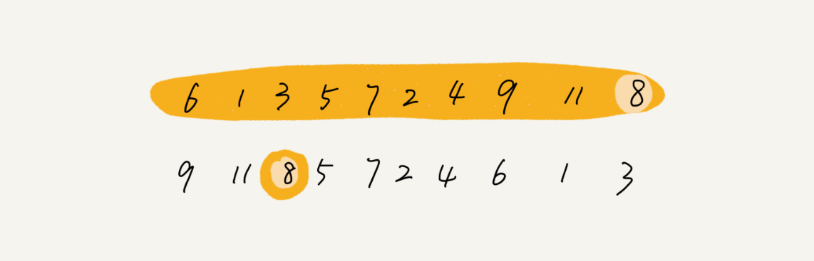

# 如何在 O(n) 的时间复杂度内查找一个无序数组中的第 K 大元素？

快排核心思想就是分治和分区，可以利用分区的思想，来解答。

比如，4， 2， 5， 12， 3 这样一组数据，第 3 大元素就是 4。

选择数组区间 A[0…n-1]的最后一个元素 A[n-1]作为 pivot，对数组 A[0…n-1]原地分区，这样数组就分成了三部分，A[0…p-1]、A[p]、A[p+1…n-1]。如果 p+1=K，那 A[p]就是要求解的元素；如果 K>p+1, 说明第 K 大元素出现在 A[p+1…n-1]区间，再按照上面的思路递归地在 A[p+1…n-1]这个区间内查找。同理，如果 K<p+1，那就在 A[0…p-1]区间查找。

## 分析

第一次分区查找，需要对大小为 n 的数组执行分区操作，需要遍历 n 个元素。第二次分区查找，我们只需要对大小为 n/2 的数组执行分区操作，需要遍历 n/2 个元素。依次类推，分区遍历元素的个数分别为、n/2、n/4、n/8、n/16.……直到区间缩小为 1。

如果把每次分区遍历的元素个数加起来，就是：n+n/2+n/4+n/8+…+1。这是一个等比数列求和，最后的和等于 2n-1。所以，上述解决思路的时间复杂度就为 O(n)。

有个很笨的办法，每次取数组中的最小值，将其移动到数组的最前面，然后在剩下的数组中继续找最小值，以此类推，执行 K 次，找到的数据不就是第 K 大元素了吗？

不过，时间复杂度就并不是 O(n) 了，而是 O(K * n)。

时间复杂度前面的系数不是可以忽略吗？

O(K * n) 不就等于 O(n) 吗？这个可不能这么简单地划等号。

当 K 是比较小的常量时，比如 1、2，那最好时间复杂度确实是 O(n)；但当 K 等于 n/2 或者 n 时，这种最坏情况下的时间复杂度就是 O(n2) 了。