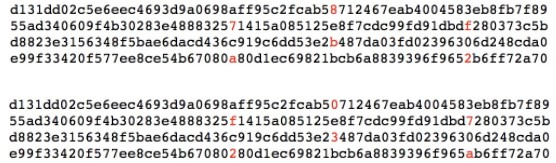
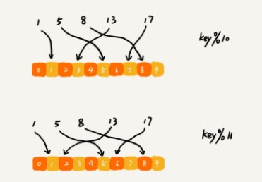

[toc]

# 哈希算法 （Hash Algorithm）

## 什么是哈希算法 (Hash Algorithm)？

###  哈希（Hash） 名称解释

不管是 `散列` 还是 `哈希`，这都是中文翻译的差别，英文都是 `Hash`，所以`散列表`也可以叫做`Hash表`，`Hash表`也可以叫做 `散列表`或 `哈希表`;所以 `哈希算法`可以叫做 `Hash 算法`或者 `散列算法`.

### 哈希算法的 定义 和 原理

>将任意长度的二进制值串映射为固定长度的二进值串，这个映射的规则就是 **哈希算法**，而通过原始数据映射之后得到的二进制值串就是 **哈希值**。

### 优秀哈希算法的设计要求

>1. 从哈希值不能反向推导出原始数据（所以哈希算法也叫单向哈希算法）；
>2. 对输入数据非常敏感，哪怕原始数据只修改了一个 Bit，最后得到的哈希值也大不相同；
>3. 散列冲突的概率要很小，对于不同的原始数据，哈希值相同的概率非常小；
>4. 哈希算法的执行效率要尽量高效，针对较长的文本，也能快速地计算出哈希值.

### 举例说明

- 分别对 "今天我来讲哈希算法" 和 "jiajia" 这两个文本，计算 MD5 哈希值，得到两个看起来毫无规律的字符串（MD5的哈希值是 128 位的 Bit 长度，为了方便表示，把它转换成 16 进制编码).

  ```java
  MD5("今天我来讲哈希算法") = bb4767201ad42c74e650c1b6c03d78fa
      
  MD5("jiajia") = cd611a31ea969b908932d44d126d195b
  ```

  可看出无论要哈希的文本有多长、多短，通过 MD5 哈希之后，得到的 哈希值得长度都是相同的，而且得到 的哈希值看起来像一堆随机数，完全没有规律.

- 再来看两个非常相似的文本，“我今天讲哈希算法！” 和 “我今天讲哈希算法”，这两个文本只有一个感叹号的区别，如果用 MD5 哈希算法分别计算它们的哈希值，可以发现，尽管一字之差，得到的哈希值也是完全不同的.

  ```java
  MD5("我今天讲哈希算法！") = 425f0d5a917188d2c3c3dc85b5e4f2cb
  MD5("我今天讲哈希算法") = a1fb91ac128e6aa37fe42c663971ac3d
  ```

  

- 而且，通过哈希算法得到的哈希值，很难反向推导出原始数据。比如上面的例子中，就很难通过哈希值 "a1fb91ac128e6aa37fe42c663971ac3d" 反推出对应的文本 “我今天讲哈希算法".

## 哈希算法的应用领域

哈希算法最常用的七个领域：安全加密、唯一标识、数据校验、散列函数、负载均衡、数据分片、分布式存储。

先来看前四个应用:

### 应用一：安全加密

- 最常用于加密的哈希算法

  -  **MD5 (Message - Digest Algorithm, MD5 消息摘要算法）** 
  -  **SHA(Secure Hash Algorithm, 安全散列算法）**

- 其他加密算法：

  - **DES（Data Encryption Standard, 数据加密标准）**
  - **AES （Advanced Encryption Standard, 高级加密标准)**

- 对于加密的哈希算法，有两点格外重要：

  - `No.1 很难根据哈希值反向推导出原始数据`；
  - `No.2 散列冲突的概率要很小`.

  第一点很好理解，加密的目的就是防止原始数据泄露，所以很难通过哈希值反向推导出原始数据，这是一个最基本的要求.

  第二点，实际上，不管是什么哈希算法，只能尽量减少碰撞冲突的概率，但理论上做到完全不冲突时不可能的，原因如下：

  先来看组合数学中的一个非常基础的理论，`鸽巢原理（抽屉原理），如果有 10 个鸽巢，有 11 个鸽子，那肯定有 1 个 鸽巢 中的鸽子数量多于 1 个，换句话说就是，肯定有 2 只鸽子在 1 个鸽巢内.`

  哈希算法产生的哈希值得长度是固定且有限的，比如前面举例用的 MD5 , 哈希值是固定的 128 位二进制串，能表示的数据是有限的，最多能表示 $2^{128}$ 个数据，而实际需要的数据是无穷的，基于鸽巢原理，如果对 $2^{128} + 1$ 个数据求哈希值，就必然会存在哈希值相同的情况，所以，`哈希值越长的哈希算法，散列冲突的概率就越低`.

  ```java
  2^128=340282366920938463463374607431768211456
  ```

  举例：下面有两段字符串，经过 MD5 哈希算法加密之后，产生的 哈希值是相同的

  

  不过，虽然哈希算法村咋散列冲突的情况，但是因为哈希值得范围特别大，冲突的概率极低，所以相对来说还是很难被破解的。像 MD5，有 $2^{128}$ 个不同的哈希值，这个数据已经是一个天文数字了，所以散列冲突的概率要小于 $1/2^{128}$.

  如果拿到一个 MD5 哈希值，希望通过毫无规律的穷举得方法，找到跟这个 MD5 值相同的另一个数据，那耗费的时间应该是个天文数字. 所以，即便哈希算法存在冲突，但是在有限的时间和资源下，哈希算法还是很难被破解的.

  除此之外，没有绝对安全的加密，越复杂、越难被破解的加密算法，需要的计算时间也越长。比如 SHA-256 比 SHA-1 要更复杂、更安全，相应的计算时间就会比较长.密码学界也一直致力于找到一种快速并且很难被破解的哈希算法。而在实际的开发过程中，也需要权衡破解难度和计算时间，来决定究竟使用哪种加密算法.

### 应用二：唯一标识

**如果要在海量的图库中，搜索一张图是否存在，不能单纯地用图片的元信息（比如：图片名称）来比较，因为有可能存在名称相同，但图片内容不同；或者名称不同，但图片内容相同的情况**。

\- 那该如何搜索呢？

任何文件在计算中都可以表示成二进制码串，所以，比较笨的方法就是，拿要查找的图片的二进制码串与图库中所有图片的二进制码串一一比较，如果相同，则说明图片在图库中存在。但是，每个图片小则几十 KB、大则几 MB,转化成二进制是一个非常长的串，比较起来非常耗时.

\- 有没有比较快的方法？

`可以给每一个图片取一个唯一标识，或者说信息摘要。`比如，可与从图片的二进制码串开头取 100 个字节，从中间取 100 个字节，从最后再取 100 个字节，然后将这 300 个字节放到一块，通过哈希算法（比如 MD5）, 得到一个哈希字符串，用她作为图片的唯一标识。通过这个唯一标识来判定图片是否在图库中，这样就可以减少很多工作量.

\- 还想继续提高效率？

可以把每个图片的唯一标识，和相应的图片文件在图库中的路径信息，都存储在散列表中。当要查看某个图片是不是在图库中的时候，先通过哈希算法对这个图片取唯一标识，然后在散列表中查找是否存在这个唯一标识.

如果不存在，那就说明这个图片不在图库中；如果存在，再通过散列表中存储的文件路径，获取这个已经存在的图片，跟现在要插入的图片做全量的比对，看是否完全一样。如果一样，就说明已经存在；如果不一样，就说明两张图片尽管唯一标识相同，但是并不是相同的图片。

### 应用三：数据校验

电驴这样的 BT 下载软件的 BT 下载的原理是基于 P2P 协议的。

从多个机器上并行下载一个 2GB 的电影，这个电影文件可能会被分割成很多文件块（比如可以分成 100 块，每块大约 20MB）。等所有的文件块都下载完成之后，再组装成一个完整的电影文件就行了。

网络传输是不安全的，下载的文件块有可能是被宿主机器恶意修改过的，又或者下载过程中出现了错误，所以下载的文件块可能不是完整的。

如果没有能力检测这种恶意修改或者文件下载出错，就会导致最终合并后的电影无法观看，甚至导致电脑中毒。现在的问题是，如何来校验文件块的安全、正确、完整呢？

具体的 BT 协议很复杂，校验方法也有很多，其中的一种思路是，通过哈希算法，对 100 个文件块分别取哈希值，并且保存在种子文件中。

在前面讲过，哈希算法有一个特点，对数据很敏感。只要文件块的内容有一丁点儿的改变，最后计算出的哈希值就会完全不同。

所以，当文件块下载完成之后，可以通过相同的哈希算法，对下载好的文件块逐一求哈希值，然后跟种子文件中保存的哈希值比对。如果不同，说明这个文件块不完整或者被篡改了，需要再重新从其他宿主机器上下载这个文件块。

### 应用四：散列函数

散列函数是设计一个散列表的关键。它直接决定了散列冲突的概率和散列表的性能。

不过，相对哈希算法的其他应用，散列函数对于散列算法冲突的要求要低很多。即便出现个别散列冲突，只要不是过于严重，都可以通过开放寻址法或者链表法解决。

不仅如此，散列函数对于散列算法计算得到的值，是否能反向解密也并不关心。

`散列函数中用到的散列算法，更加关注散列后的值是否能平均分布，也就是，一组数据是否能均匀地散列在各个槽中。除此之外，散列函数执行的快慢，也会影响散列表的性能，所以，散列函数用的散列算法一般都比较简单，比较追求效率。`

### 应用五：负载均衡

负载均衡算法有很多，比如轮询、随机、加权轮询等。

那如何才能实现一个会话粘滞（session sticky）的负载均衡算法呢？即，需要在同一个客户端上，在一次会话中的所有请求都路由到同一个服务器上。

最直接的方法就是，维护一张映射关系表，这张表的内容是客户端 IP 地址或者会话 ID 与服务器编号的映射关系。客户端发出的每次请求，都要先在映射表中查找应该路由到的服务器编号，然后再请求编号对应的服务器。

这种方法简单直观，但也有几个弊端：

- 如果客户端很多，映射表可能会很大，比较浪费内存空间；
- 客户端下线、上线，服务器扩容、缩容都会导致映射失效，这样维护映射表的成本就会很大。

通过哈希算法，可以完美地解决这些问题：

**对客户端 IP 地址 或者 会话 ID 计算哈希值，将取得的哈希值与服务器列表的大小进行取模运算，最终得到的值就	是应该被路由到服务器编号。**

这样，就可以把同一个 IP 过来的所有请求，都路由到同一个后端服务器上.

### 应用六：数据分片

看如下两个问题：

#### 1. 如何统计 "搜索关键词" 出现的次数？

假如有 1T 的日志文件，这里面记录了用户的搜索关键词，想要快速统计出每个关键词被搜索的次数，该怎么做呢？

- 这个问题有两个难点：
  1. 搜索日志很大，没办法放到一台机器的内存中；
  2. 只用一台机器来处理这么巨大的数据，处理时间会很长.

- 解决方法：

  **可以先对数据进行分片，然后采用多台机器处理的方法，来提高处理速度.**

- 具体思路：

  **为了提高处理速度，用 n 台机器并行处理，从搜索的日志文件中，依次读出每个搜索的关键词，并且通过哈希函数计算哈希值，然后再跟 n 取模，最终得到的值，就是应该被分配到的机器编号.这样，哈希值相同的搜索关键词就被分配到了同一个机器上。**

  **即，同一个搜索关键词会被分配到同一个机器上，每个机器会分别计算关键词出现的次数，最后合并起来就是最终的结果.**

实际上，这里的处理过程就是 MapReduce 的基本设计思想.

#### 2. 如何快速判断图片是否在图库中？

- 如何快速判断图片是否在图库中？

  在 应用二 ：唯一标识中，介绍了一种方法，即给每个图片取唯一标识（或者信息摘要），然后构建散列表.

- 假设现在图库中有 1 亿张图片

  很显然，在单台机器上构建散列表是行不通的。因为单台机器的内存有限，而 1 亿张图片构建散列表显然远远超过了单台机器的内存上限。

  **同样可以对数据进行分片，然后采用多机处理。准备 n 台机器，让每台机器只维护某一部分图片对应的散列表。每次从图库中读取一个图片，计算唯一标识，然后与机器个数 n 求余取模，得到的值就对应要分配的机器编号，然后将这个图片的唯一标识和图片路径发往对应的机器构建散列表.**

  **当要判断一个图片是否在图库中的时候，通过同样的哈希算法，计算这个图片的唯一标识，然后与机器个数 n 求余取模。假设得到的值是 k，那就去编号 k 的机器构建的散列表中查找。**

- 估算给这 1 亿张图片构建散列表大约需要多少台机器:

  散列表中每个数据单元包含两个信息，`哈希值`和`图片文件的路径`。

  **假设通过 MD5 来计算哈希值，那长度就是 128 比特，也就是 16 字节。文件路径长度的上限是 256 字节，可以假设平均长度是 128 字节。如果用链表法来解决冲突，那还需要存储指针，指针只占用 8 字节。所以，散列表中每个数据单元就占用 152 字节（这里只是估算，并不准确）。**

  **假设一台机器的内存大小为 2GB，散列表的装载因子为 0.75，那一台机器可以给大约 1000 万（2GB*0.75/152）张图片构建散列表。所以，如果要对 1 亿张图片构建索引，需要大约十几台机器。**

  在工程中，这种估算还是很重要的，能事先对需要投入的资源、资金有个大概的了解，能更好地评估解决方案的可行性。

  实际上，针对这种海量数据的处理问题，都可以采用多机分布式处理。借助这种分片的思路，可以突破单机内存、CPU 等资源的限制。

### 应用七：分布式存储

在互联网面对的都是海量的数据、海量的用户。为了提高数据的读取、写入能力，一般都采用分布式的方式来存储数据，比如分布式缓存。有海量的数据需要缓存，所以一个缓存机器肯定是不够的。于是，就需要将数据分布在多台机器上。

该如何决定将哪个数据放到哪个机器上呢？

可以借用前面数据分片的思想，即通过哈希算法对数据取哈希值，然后对机器个数取模，这个最终值就是应该存储的缓存机器编号。

但是，如果数据增多，原来的 10 个机器已经无法承受了，就需要扩容了，比如扩到 11 个机器，这时候麻烦就来了。因为，这里并不是简单地加个机器就可以了。

原来的数据是通过与 10 来取模的。比如 13 这个数据，存储在编号为 3 这台机器上。但是新加了一台机器中，对数据按照 11 取模，原来 13 这个数据就被分配到 2 号这台机器上了。



因此，所有的数据都要重新计算哈希值，然后重新搬移到正确的机器上。这样就相当于，缓存中的数据一下子就都失效了。所有的数据请求都会穿透缓存，直接去请求数据库。这样就可能发生 [雪崩效应](https://zh.wikipedia.org/wiki/%E9%9B%AA%E5%B4%A9%E6%95%88%E5%BA%94),压垮数据库.

所以，需要一种方法，使得在新加入一个机器后，并不需啊哟做大量的数据搬移，这时，`一致性哈希算法` 就要登场了.

#### 一致性哈希算法

> 假设有 k 个机器，数据的哈希值的范围是[0, MAX]。将整个范围划分成 m 个小区间（m 远大于 k），每个机器负责 m/k 个小区间。
>
> 当有新机器加入的时候，就将某几个小区间的数据，从原来的机器中搬移到新的机器中。
>
> 这样，既不用全部重新哈希、搬移数据，也保持了各个机器上数据数量的均衡。

一致性哈希算法的基本思想就是这么简单。

除此之外，它还会借助一个虚拟的环和虚拟结点，更加优美地实现出来，详细参见 [Consistent hashing](https://en.wikipedia.org/wiki/Consistent_hashing)。

- 举例

  钟表有 60 分钟，从 0 开始到 59，共 60 个点。
  现在我们将机器往这 60 个点分配，规则如下：
  hash(ip) % 60。

  假设有 3 台机器 A，B 和 C，分别被分配到了 14，37 和 46 这三个点上。

  图片的分配规则类似：
  hash(image_id) % 60。
  现有 3 张图片 x， y， z，分别被分配到 5，30，50 这三个点。

  很明示，图片都没被分配到机器的节点上，怎么办呢?在钟表上顺时钟往前寻找，第一台遇到的机器，就是它的归属。

  --- 我是分割线 ---

  现在很不凑巧，A B C 三台机器分别分配到 5，10，15 这三个点。这样对 A 是很不公平的吖，要负责存储绝大多数的图片，那这怎么办呢?我们社会主义核心价值观基本内容：和谐、平等、公正。为建设和谐社会努力奋斗！！

  为了避免不必要的争端，引入“虚拟节点”，每台机器都可以拔一根汗毛，变成若干台，把虚拟节点分散到 60 个点上，归属“虚拟节点”的图片，均保存到它的真身。这样就能解决分配不均匀的问题。

  \------

  应用时，将 60 替换下即可，如替换为 2的 32 次方。

除了上面讲到的分布式缓存，实际上，一致性哈希算法的应用非常广泛，在很多分布式存储系统中，都可以见到一致性哈希算法的影子。

## **思考**

### 1. **如何防止数据被 "脱裤"** ?

即，如何存储像用户密码这么重要的数据？仅仅 MD5 加密一下存储就够了吗？

可以通过哈希算法，对用户密码进行加密之后再存储，不过最好选择相对安全的加密算法，比如 SHA 等（因为 MD5 已经号称被破解了）。

不过仅仅这样加密之后存储就万事大吉了吗？字典攻击你听说过吗？

如果用户信息被“脱库”，黑客虽然拿到是加密之后的密文，但可以通过“猜”的方式来破解密码，这是因为，有些用户的密码太简单。比如很多人习惯用 00000、123456 这样的简单数字组合做密码，很容易就被猜中。

那就需要维护一个常用密码的字典表，把字典中的每个密码用哈希算法计算哈希值，然后拿哈希值跟脱库后的密文比对。如果相同，基本上就可以认为，这个加密之后的密码对应的明文就是字典中的这个密码。（注意，这里说是的是“基本上可以认为”，因为根据前面的学习，哈希算法存在散列冲突，也有可能出现，尽管密文一样，但是明文并不一样的情况。）

针对字典攻击，可以引入一个盐（salt），跟用户的密码组合在一起，增加密码的复杂度。拿组合之后的字符串来做哈希算法加密，将它存储到数据库中，进一步增加破解的难度。

不过这里多说一句，安全和攻击是一种博弈关系，不存在绝对的安全。所有的安全措施，只是增加攻击的成本而已。

### 2. 哈希算法是如何解决分布式问题？

**负载均衡**、**数据分片**、**分布式存储**这三种哈希算法是分布式系统中的应用。

在负载均衡应用中，利用哈希算法替代映射表，可以实现一个会话粘滞的负载均衡策略。

在数据分片应用中，通过哈希算法对处理的海量数据进行分片，多机分布式处理，可以突破单机资源的限制。

在分布式存储应用中，利用一致性哈希算法，可以解决缓存等分布式系统的扩容、缩容导致数据大量搬移的难题。

### 3. 除了讲解哈希算法的7中应用，还有哪些应用？

- 网络协议中的 CRC 校验；
- Git commit id .

### 4. 区块链使用的是哪种哈希算法？是为了解决什么问题而使用的呢？

区块链是一块块区块组成的，每个区块分为两部分：区块头和区块体。

区块头保存着 自己区块体 和 上一个区块头 的哈希值。

因为这种链式关系和哈希值的唯一性，只要区块链上任意一个区块被修改过，后面所有区块保存的哈希值就不对了。

区块链使用的是 SHA256 哈希算法，计算哈希值非常耗时，如果要篡改一个区块，就必须重新计算该区块后面所有的区块的哈希值，短时间内几乎不可能做到。

*`@ 笔记时间 ：2020-11-10	FROM	极客时间 《算法啊与数据结构之美》 王争  专栏`* 

