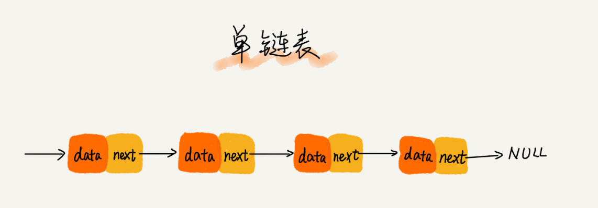

# 链表

[toc]

## 链表结构

相比数组，链表是一种稍微复杂一点的数据结构。对于初学者来说，掌握起来也要比数组稍难一些。这两个非常基础、非常常用的数据结构，常常会放到一块儿来比较。所以先来看，这两者有什么区别。

### 先从底层的存储结构上来


- **数组** : `需要一块连续的内存空间来存储，对内存的要求比较高。`

  如果申请一个 100MB 大小的数组，当内存中没有连续的、足够大的存储空间时，即便内存的剩余总可用空间大于 100MB，仍然会申请失败
  
  

- **链表**：`不需要一块连续的内存空间，它通过“指针”将一组零散的内存块串联起来使用。`

  所以如果申请的是 100MB 大小的链表，根本不会有问题。

  

链表结构五花八门，重点介绍三种最常见的链表结构，它们分别是：**单链表、双向链表和循环链表。**

## 单链表

> 链表通过`指针`将一组零散的内存块串联在一起。其中，把内存块称为链表的“`结点`”。为了将所有的结点串起来，每个链表的结点除了存储数据之外，还需要`记录链上的下一个结点的地址`，将这个记录下个结点地址的指针叫作`后继指针 next`。



从单链表图中，可以发现，其中有两个结点是比较特殊的，它们分别是**第一个结点**和**最后一个结点**。习惯性地把第一个结点叫作`头结点`，把最后一个结点叫作`尾结点`。

- 头结点 : 记录链表的基地址, 遍历得到整条链表。
- 尾结点：指针不是指向下一个结点，而是指向一个空地址 NULL，表示这是链表上最后一个结点。

## 查找、插入、删除

在进行**数组**的**插入、删除**操作时，为了**保持内存数据的连续性，需要做大量的数据搬移**，所以时间复杂度是 $O(n)$。

在**链表**中**插入**或者**删除**一个数据，并**不需要为了保持内存的连续性而搬移结点**，因为链表的存储空间本身就不是连续的。所以，在链表中插入和删除一个数据是非常快速的, 时间复杂度是 $O(1)$.


但是，有利就有弊。链表要想随机访问第 k 个元素，就没有数组那么高效了。

因为链表中的数据并非连续存储的，所以无法像数组那样，根据首地址和下标，通过寻址公式就能直接计算出对应的内存地址，而是**需要根据指针一个结点一个结点地依次遍历，直到找到相应的结点**。

## 循环列表

**循环链表是一种特殊的单链表。**

实际上，循环链表也很简单。它跟单链表唯一的区别就在尾结点。单链表的尾结点指针指向空地址，表示这就是最后的结点了。而**循环链表的尾结点指针是指向链表的头结**点。从循环链表图中，可以看出来，它像一个环一样首尾相连，所以叫作“循环”链表。


**和单链表相比，循环链表的优点是从链尾到链头比较方便。当要处理的数据具有环型结构特点时，就特别适合采用循环链表。**

比如著名的[约瑟夫问题]()。尽管用单链表也可以实现，但是用循环链表实现的话，代码就会简洁很多。

## 双向链表

单向链表只有一个方向，结点只有一个后继指针 next 指向后面的结点。

而双向链表，顾名思义，它支持两个方向，每个结点不止有一个后继指针 next 指向后面的结点，还有一个前驱指针 **prev** 指向前面的结点。


从图中可以看出来，双向链表需要额外的两个空间来存储后继结点和前驱结点的地址

所以，如果存储同样多的数据，双向链表要比单链表占用更多的内存空间。虽然两个指针比较浪费存储空间，但可以支持双向遍历，这样也带来了双向链表操作的灵活性。

那相比单链表，双向链表适合解决哪种问题呢？

**从结构上来看，双向链表可以支持 O(1) 时间复杂度的情况下找到前驱结点，正是这样的特点，也使双向链表在某些情况下的插入、删除等操作都要比单链表简单、高效**。

刚讲到单链表的插入、删除操作的时间复杂度已经是 $O(1)$ 了，双向链表还能再怎么高效呢？

别着急，刚刚的分析比较偏理论，很多数据结构和算法书籍中都会这么讲，但是这种说法实际上是不准确的，或者说是有先决条件的。再来分析一下链表的两个操作。

### <font color="red"> 删除操作</font>

在实际的软件开发中，从链表中删除一个数据无外乎这两种情况：

- 删除结点中“值等于某个给定值”的结点；
- 删除给定指针指向的结点。

对于第一种情况，不管是单链表还是双向链表，为了查找到值等于给定值的结点，都需要从头结点开始一个一个依次遍历对比，直到找到值等于给定值的结点，然后再通过我前面讲的指针操作将其删除。

尽管单纯的删除操作时间复杂度是 $O(1)$，但遍历查找的时间是主要的耗时点，对应的时间复杂度为 $O(n)$。**根据时间复杂度分析中的加法法则，删除值等于给定值的结点对应的链表操作的总时间复杂度为** $O(n)$。

对于第二种情况，已经找到了要删除的结点，但是删除某个结点 q 需要知道其前驱结点，而单链表并不支持直接获取前驱结点，所以，为了找到前驱结点，还是要从头结点开始遍历链表，直到 p->next=q，说明 p 是 q 的前驱结点。

但是对于双向链表来说，这种情况就比较有优势了。因为双向链表中的结点已经保存了前驱结点的指针，不需要像单链表那样遍历。所以，针对第二种情况，单链表删除操作需要 $O(n)$ 的时间复杂度，而双向链表只需要在 $O(1)$ 的时间复杂度内就搞定了！

同理，如果希望在链表的某个指定结点前面插入一个结点，双向链表比单链表有很大的优势。双向链表可以在 $O(1)$ 时间复杂度搞定，而单向链表需要 $O(n)$ 的时间复杂度。

除了插入、删除操作有优势之外，对于一个有序链表，双向链表的按值查询的效率也要比单链表高一些。因为，可以记录上次查找的位置 p，每次查询时，根据要查找的值与 p 的大小关系，决定是往前还是往后查找，所以平均只需要查找一半的数据。

现在，有没有觉得双向链表要比单链表更加高效呢？这就是为什么在实际的软件开发中，双向链表尽管比较费内存，但还是比单链表的应用更加广泛的原因。如果熟悉 Java 语言，肯定用过 LinkedHashMap 这个容器。如果深入研究 LinkedHashMap 的实现原理，就会发现其中就用到了双向链表这种数据结构。

## <font color="red">  用空间换时间 </font>

实际上，这里有一个更加重要的知识点需要掌握，那就是用空间换时间的设计思想。当内存空间充足的时候，如果我们更加追求代码的执行速度，我们就可以选择空间复杂度相对较高、但时间复杂度相对很低的算法或者数据结构。相反，如果内存比较紧缺，比如代码跑在手机或者单片机上，这个时候，就要反过来用时间换空间的设计思路。

举缓存的例子，缓存实际上就是利用了空间换时间的设计思想。如果把数据存储在硬盘上，会比较节省内存，但每次查找数据都要询问一次硬盘，会比较慢。但如果通过缓存技术，事先将数据加载在内存中，虽然会比较耗费内存空间，但是每次数据查询的速度就大大提高了。

所以总结一下，`对于执行较慢的程序，可以通过消耗更多的内存（空间换时间）来进行优化；而消耗过多内存的程序，可以通过消耗更多的时间（时间换空间）来降低内存的消耗。`

## 双向循环链


## 链表 VS 数组性能大比拼

数组和链表是两种截然不同的内存组织方式，正是因为内存存储的区别，它们插入、删除、随机访问操作的时间复杂度正好相反。


不过，数组和链表的对比，并不能局限于时间复杂度。而且，在实际的软件开发中，不能仅仅利用复杂度分析就决定使用哪个数据结构来存储数据。

**数组**简单易用，在实现上使用的是**连续的内存空间**，可以借助 CPU 的缓存机制，预读数组中的数据，所以访问效率更高。而**链表**在内存中**并不是连续存储**，所以对 CPU 缓存不友好，没办法有效预读。

**数组**的**缺点**是**大小固定**，**一经声明就要占用整块连续内存空间**。如果声明的数组过大，系统可能没有足够的连续内存空间分配给它，导致**“内存不足（out of memory）”**。如果声明的数组过小，则可能出现不够用的情况。这时只能再申请一个更大的内存空间，把原数组拷贝进去，非常费时。**链表**本身**没有大小的限制**，天然地支持动态扩容，这也是它与数组最大的区别。

除此之外，如果代码对内存的使用非常苛刻，那数组就更适合。因为链表中的每个结点都需要消耗额外的存储空间去存储一份指向下一个结点的指针，所以内存消耗会翻倍。而且，对链表进行频繁的插入、删除操作，还会导致频繁的内存申请和释放，容易造成内存碎片，如果是 Java 语言，就有可能会导致频繁的 GC（Garbage Collection，垃圾回收）。

## 轻松写出链表代码

想要写好链表代码并不是容易的事儿，尤其是那些复杂的链表操作，比如链表反转、有序链表合并等，写的时候非常容易出错。

能把“链表反转”这几行代码写对的人不足 10%。为什么链表代码这么难写？

究竟怎样才能比较轻松地写出正确的链表代码呢？只要愿意投入时间，大多数人都是可以学会的。

比如说，如果真的能花上一个周末或者一整天的时间，就去写链表反转这一个代码，多写几遍，一直练到能毫不费力地写出 Bug free 的代码。这个坎还会很难跨吗？

当然，自己有决心并且付出精力是成功的先决条件，除此之外，还需要一些方法和技巧。总结了几个写链表代码技巧。如果能熟练掌握这几个技巧，加上主动和坚持，轻松拿下链表代码完全没有问题。

### 技巧一：理解指针或引用的含义

事实上，看懂链表的结构并不是很难，但是一旦把它和指针混在一起，就很容易让人摸不着头脑。所以，要想写对链表代码，首先就要理解好指针。

有些语言有“指针”的概念，比如 C 语言；有些语言没有指针，取而代之的是“引用”，比如 Java、Python。

不管是“指针”还是“引用”，实际上，它们的意思都是一样的，都是`存储所指对象的内存地址`。

接下来，拿 C 语言中的“指针”来讲解，如果用的是 Java 或者其他没有指针的语言也没关系，把它理解成“引用”就可以了。

实际上，对于指针的理解，只需要记住下面这句话就可以了：

`将某个变量赋值给指针，实际上就是将这个变量的地址赋值给指针，或者反过来说，指针中存储了这个变量的内存地址，指向了这个变量，通过指针就能找到这个变量。`

在编写链表代码的时候，经常会有这样的代码：p->next=q。

这行代码是说，p 结点中的 next 指针存储了 q 结点的内存地址。

还有一个更复杂的，也是写链表代码经常会用到的：p->next=p->next->next。

这行代码表示，p 结点的 next 指针存储了 p 结点的下下一个结点的内存地址。


### 技巧二：警惕指针丢失和内存泄漏

写链表代码的时候，指针指来指去，一会儿就不知道指到哪里了。所以，在写的时候，一定注意不要弄丢了指针。


如图所示，希望在结点 a 和相邻的结点 b 之间插入结点 x，假设当前指针 p 指向结点 a。如果将代码实现变成下面这个样子，就会发生指针丢失和内存泄露。

```java
// 插入 x 节点

p->next = x;  // 将p的next指针指向x结点；
x->next = p->next;  // 将x的结点的next指针指向b结点；
```

- 说明：

  p->next 指针在完成第一步操作之后，已经不再指向结点 b 了，而是指向结点 x。

  第 2 行代码相当于将 x 赋值给 x->next，自己指向自己。

  因此，整个链表也就断成了两半，从结点 b 往后的所有结点都无法访问到了。

  

对于有些语言来说，比如 C 语言，内存管理是由程序员负责的，如果没有手动释放结点对应的内存空间，就会产生内存泄露。

所以，插入结点时，一定要注意操作的顺序，要先将结点 x 的 next 指针指向结点 b，再把结点 a 的 next 指针指向结点 x，这样才不会丢失指针，导致内存泄漏。

所以，对于刚刚的插入代码，只需要把第 1 行和第 2 行代码的顺序颠倒一下就可以了。

```java
// 插入 x 节点

x->next = p->next;  // 将x的结点的next指针指向b结点；
p->next = x;  // 将p的next指针指向x结点；
```

同理，**删除链表结点时，也一定要记得手动释放内存空间**，否则，也会出现内存泄漏的问题。当然，对于像 Java 这种虚拟机自动管理内存的编程语言来说，就不需要考虑这么多了。


### <font color="red"> 技巧三：利用哨兵简化实现难度 </font>

首先，先来回顾一下单链表的插入和删除操作。如果在结点 p 后面插入一个新的结点，只需要下面两行代码就可以搞定。

```java
// Insert a new node behind p node

new_node->next = p->next;
p->next = new_node;
```

但是，当要向一个空链表中插入第一个结点，刚刚的逻辑就不能用了。需要进行下面这样的特殊处理，其中 head 表示链表的头结点。所以，从这段代码，可以发现，对于单链表的插入操作，第一个结点和其他结点的插入逻辑是不一样的。

```java
// Insert a new node behind head node

if (head == null) {
  head = new_node;
}
```

再来看单链表结点删除操作。如果要删除结点 p 的后继结点，只需要一行代码就可以搞定。

```java
// delete the next node of p node

p->next = p->next->next;
```

但是，如果要删除链表中的最后一个结点，前面的删除代码就不 work 了。跟插入类似，也需要对于这种情况特殊处理。写成代码是这样子的：

```java
// delete the last node

if (head->next == null) {
   head = null;
}
```

从前面的一步一步分析，可以看出，针对链表的插入、删除操作，需要对插入第一个结点和删除最后一个结点的情况进行特殊处理。

这样代码实现起来就会很繁琐，不简洁，而且也容易因为考虑不全而出错。如何来解决这个问题呢？

技巧三中提到的哨兵就要登场了。`哨兵，解决的是国家之间的边界问题`。同理，这里说的哨兵也是解决“边界问题”的，不直接参与业务逻辑。

还记得如何表示一个空链表吗？head=null 表示链表中没有结点了。其中 head 表示头结点指针，指向链表中的第一个结点。

如果引入哨兵结点，在任何时候，不管链表是不是空，**head 指针都会一直指向这个哨兵结点。也把这种有哨兵结点的链表叫带头链表**。相反，**没有哨兵结点的链表就叫作不带头链表**。

画了一个带头链表，可以发现，`哨兵结点是不存储数据的`。因为哨兵结点一直存在，所以插入第一个结点和插入其他结点，删除最后一个结点和删除其他结点，都可以统一为相同的代码实现逻辑了。


实际上，这种利用哨兵简化编程难度的技巧，在很多代码实现中都有用到，比如插入排序、归并排序、动态规划等。这些内容后面才会讲，现在为了感受更深，再举一个非常简单的例子。代码是用 C 语言实现的，不涉及语言方面的高级语法，很容易看懂，可以类比到你熟悉的语言。

​																						`代码一`

```c
// C Language

// 在数组a中，查找key，返回key所在的位置
// 其中，n表示数组a的长度

int find(char* a, int n, char key) {
  // 边界条件处理，如果a为空，或者n<=0，说明数组中没有数据，就不用while循环比较了
  if(a == null || n <= 0) {
    return -1;
  }
  
  int i = 0;
  // 这里有两个比较操作：i<n和a[i]==key.
  while (i < n) {
    if (a[i] == key) {
      return i;
    }
    ++i;
  }
  
  return -1;
}
```

​																							`代码二`

```C
// C Language

// 在数组a中，查找key，返回key所在的位置
// 其中，n表示数组a的长度
// 我举2个例子，你可以拿例子走一下代码
// a = {4, 2, 3, 5, 9, 6}  n=6 key = 7
// a = {4, 2, 3, 5, 9, 6}  n=6 key = 6
int find(char* a, int n, char key) {
  if(a == null || n <= 0) {
    return -1;
  }
  
  // 这里因为要将a[n-1]的值替换成key，所以要特殊处理这个值
  if (a[n-1] == key) {
    return n-1;
  }
  
  // 把 a[n-1] 的值临时保存在变量tmp中，以便之后恢复。tmp=6。
  // 之所以这样做的目的是：希望find()代码不要改变a数组中的内容
  char tmp = a[n-1];
    
  // 把key的值放到a[n-1]中，此时a = {4, 2, 3, 5, 9, 7}
  a[n-1] = key;
  
  int i = 0;
    
  // while 循环比起代码一，少了i<n这个比较操作
  while (a[i] != key) {
    ++i;
  }
  
  // 恢复a[n-1]原来的值,此时a= {4, 2, 3, 5, 9, 6}
  a[n-1] = tmp;
  
  if (i == n-1) {
    // 如果i == n-1说明，在0...n-2之间都没有key，所以返回-1
    return -1;
  } else {
    // 否则，返回i，就是等于key值的元素的下标
    return i;
  }
}
```

对比两段代码，在字符串 a 很长的时候，比如几万、几十万，哪段代码运行得更快点呢？

答案是代码二，因为两段代码中执行次数最多就是 while 循环那一部分。

第二段代码中，通过一个哨兵 a[n-1] = key，成功省掉了一个比较语句 i<n，不要小看这一条语句，当累积执行万次、几十万次时，累积的时间就很明显了。


### 技巧四：重点留意边界条件处理

软件开发中，代码在一些边界或者异常情况下，最容易产生 Bug。

链表代码也不例外。要实现没有 Bug 的链表代码，一定要在编写的过程中以及编写完成之后，检查边界条件是否考虑全面，以及代码在边界条件下是否能正确运行。

经常用来检查链表代码是否正确的边界条件有这样几个：

1. `如果链表为空时，代码是否能正常工作？`
2. `如果链表只包含一个结点时，代码是否能正常工作？`
3. `如果链表只包含两个结点时，代码是否能正常工作？`
4. `代码逻辑在处理头结点和尾结点的时候，是否能正常工作？`

当写完链表代码之后，除了看下写的代码在正常的情况下能否工作，还要看下在上面列举的几个边界条件下，代码仍然能否正确工作。

如果这些边界条件下都没有问题，那基本上可以认为没有问题了。当然，边界条件不止列举的那些。

针对不同的场景，可能还有特定的边界条件，这个需要自己去思考，不过套路都是一样的。

实际上，不光光是写链表代码，**在写任何代码时，也千万不要只是实现业务正常情况下的功能就好了，一定要多想想，代码在运行的时候，可能会遇到哪些边界情况或者异常情况。遇到了应该如何应对，这样写出来的代码才够健壮**


### 技巧五：举例画图，辅助思考

对于稍微复杂的链表操作，比如前面提到的单链表反转，指针一会儿指这，一会儿指那，一会儿就被绕晕了。总感觉脑容量不够，想不清楚。所以这个时候就要使用大招了，**举例法**和画图法。

可以找一个具体的例子，把它画在纸上，释放一些脑容量，留更多的给逻辑思考，这样就会感觉到思路清晰很多。比如往单链表中插入一个数据这样一个操作，把各种情况都举一个例子，画出插入前和插入后的链表变化，如图所示：


看图写代码，是不是就简单多啦？而且，当写完代码之后，也可以举几个例子，画在纸上，照着代码走一遍，很容易就能发现代码中的 Bug。

### 技巧六：多写多练，没有捷径

**写链表代码是最考验逻辑思维能力的**

如果已经理解并掌握了前面所讲的方法，但是手写链表代码还是会出现各种各样的错误，也不要着急。因为最开始学的时候，这种状况会持续了一段时间。

其实也没有什么技巧，就是把常见的链表操作都自己多写几遍，出问题就一点一点调试，熟能生巧！

所以，精选了 5 个常见的链表操作。只要把这几个操作都能写熟练，不熟就多写几遍，保证你之后再也不会害怕写链表代码。单链表反转链表中环的检测两个有序的链表合并删除链表倒数第 n 个结点求链表的中间结点。

- 单链表反转
- 链表中环的检测
- 两个有序的链表合并删除链表倒数第 n 个结点求
- 链表的中间结点

##　思考 (一)

> 如何基于链表实现 LRU 缓存淘汰算法？

思路是这样的：维护一个有序单链表，越靠近链表尾部的结点是越早之前访问的。当有一个新的数据被访问时，从链表头开始顺序遍历链表。

1. 如果此数据之前已经被缓存在链表中了，我们遍历得到这个数据对应的结点，并将其从原来的位置删除，然后再插入到链表的头部。
2. 如果此数据没有在缓存链表中，又可以分为两种情况：
   - 如果此时缓存未满，则将此结点直接插入到链表的头部；
   - 如果此时缓存已满，则链表尾结点删除，将新的数据结点插入链表的头部。

这样就用链表实现了一个 LRU 缓存，是不是很简单？

现在来看下缓存访问的时间复杂度是多少。因为不管缓存有没有满，都需要遍历一遍链表，所以这种基于链表的实现思路，缓存访问的时间复杂度为 $O(n)$。

实际上，可以继续优化这个实现思路，比如引入散列表（Hash table）来记录每个数据的位置，将缓存访问的时间复杂度降到 $O(1)$。

因为要涉及还没有讲到的数据结构，所以这个优化方案，现在就不详细说了，等讲到散列表的时候，会再拿出来讲。

除了基于链表的实现思路，实际上还可以用数组来实现 LRU 缓存淘汰策略。如何利用数组实现 LRU 缓存淘汰策略呢？这个问题可以思考一下。

## 思考（二）

>“数组简单易用，在实现上使用的是连续的内存空间，可以借助 CPU 的缓存机制，预读数组中的数据，所以访问效率更高。而链表在内存中并不是连续存储，所以对 CPU 缓存不友好，没办法有效预读。” 这里的CPU缓存机制指的是什么？为什么就数组更好了？

CPU在从内存读取数据的时候，会先把读取到的数据加载到CPU的缓存中。而CPU每次从内存读取数据并不是只读取那个特定要访问的地址，而是读取一个数据块(这个大小我不太确定。。)并保存到CPU缓存中，然后下次访问内存数据的时候就会先从CPU缓存开始查找，如果找到就不需要再从内存中取。这样就实现了比内存访问速度更快的机制，也就是CPU缓存存在的意义:为了弥补内存访问速度过慢与CPU执行速度快之间的差异而引入。

对于数组来说，存储空间是连续的，所以在加载某个下标的时候可以把以后的几个下标元素也加载到CPU缓存这样执行速度会快于存储空间不连续的链表存储


*`@ 笔记时间 ：2020-8-29	FROM	极客时间 《算法啊与数据结构之美》 王争  专栏`* 