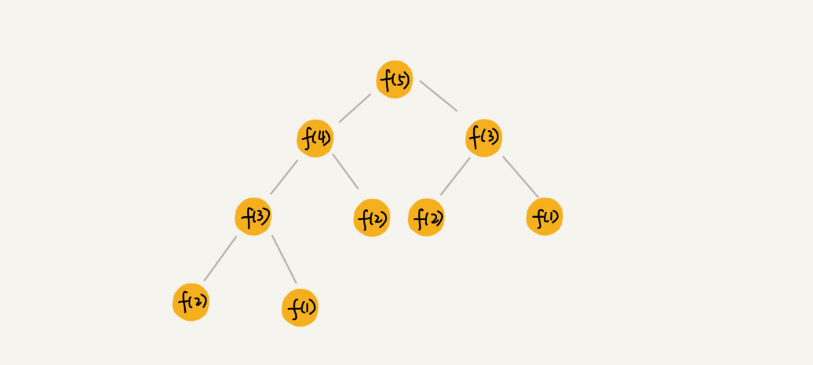
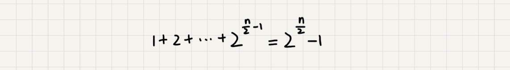

# 递归树

[toc]

## 递归思想

将大问题分解成小问题来求解，然后再将小问题分解为更小的问题，直到问题的数据规模被分解的足够小，不用继续递归分解为止。

## 递归树

- 将问题递归分解的过程画成图，就可以得到一个树，这棵树就是递归树。

- 例子：斐波纳契数列，节点里的数字表示数据的规模，一个节点的求解可以分解为左右子节点两个问题的求解。

  

## 借助递归树来分析时间复杂度

### 举例：用递归树来分析归并排序的时间复杂度

归并排序每次会将数据规模一分为二，画成递归树：


因为每次分解都是一分为二，所以代价很低，把时间上的消耗记作常量1。归并算法中比较耗时的是归并操作，也就是把两个子数合并为大数数组。


**从图中可以看出，每一层归并操作消耗的时间总和是一样的，跟要排序的数据规模有关。把每一层归并操作消耗德 时间记作 n . 只需要知道这颗树的高度 h，用高度 h 乘以每一层的时间消耗 n,就可以得到总的时间复杂度 $O(n * h)$.**


从归并排序的原理和递归树，可以看出来，归并排序递归树是一棵满二叉树，满二叉树的高度大约是 $log_2n$,所以，归并排序递归实现的时间复杂度就是$O(nlongn)$.（注意：以上结果都是估算的，但不影响复杂度的计算结果。）

### 实战一：分析快速排序的时间复杂度

- **回忆用递推公式的分析方法：**

  快速排序在最好情况下，每次分区都能一分为2，这个时候用递推公式 $T(n)=2T(\frac{n}{2})+n$,很容易就能推导出时间复杂度是 $O(nlog_n)$,但是，不可能每次分区都这么幸运，正好一分为二。
  
  假设平均情况下，每次分区之后，两个分区的大小比例为 1:k.当 k = 9时，如果用递推公式的方法来求解时间复杂度的话，递推公式就写成：$T(n)=T(\frac{n}{10})+T(\frac{9n}{10})+n$.
  
  虽然这个公式可以推导出时间复杂度，但是推导过程非诚复杂，以下用递归树来分析快速排序的平均情况时间复杂度，是不是比较简单呢？
  
- **用递归树来分析快速排序的平均情况时间复杂度：**

  取 k = 9，也就是，每次分区都很不平均，一个分区是另一个分区的9倍。

  将递归分解的过程画成递归树，如下：

  

  

  

  快速排序的过程中，每次分区都要遍历待分区区间的所有数据，所以每一层分区操作所遍历的数据的个数之和就是 n . 现在，只要求出递归树的高度 h, 这个快排过程遍历的数据个数就是 $h*n$,也就是说，时间复杂度就是 $O(h*n)$.

  

  因为每次分区并不是均匀地一分为二，所以递归树并不满二叉树，这样一个递归树的高度如下：

  

  快速排序结束的条件就是待排序的小区间，大小为1，也就是叶子节点里的数据规模是1。从根节点 n 到叶子节点1，递归树中最短的一个路径每次都乘以$\frac{1}{10}$,最长的一个路径每次都乘以$\frac{9}{10}$.通过计算，可以得到，从根节点到叶子节点的最短路径是$log_{10}n$,最长的路径是$log_\frac{10}{9}n.$

  


​	所以，**遍历数据的个数总和就介于 $nlong_{10}n$ 和 $nlog_\frac{10}{9}n$ 之间**. 根据复杂度的大O表示法，对数复杂度的底数不管是多少，同一	写成$longn$,所以，当分区大小比列是 1:9 时，快速排序的时间复杂度仍然是 $O(nlog_n)$.


​	类比上面 k = 9 的分析过程，当 k = 99 的时候，树的最短路径就是 $log_{100}n$, 最长路径是 $log_\frac{100}{99}n$.

​	所以，**总遍历数据个数介于 $nlog_{100}n$ 和 $nlog_\frac{100}{99}n$ 之间**。尽管底数变了，但是时间复杂度也仍然是 $O(nlogn)$.

​	

​	也就是说，对于 k = 9，99，甚至 999，9999 ......, 

​	**只要 k 的值不随 n 变化，是一个事先确定的常量，那快排的时间复杂度就是 $O(nlogn)$.** 

​	所以，从概率论的角度来说，快排的平均时间复杂度就是$O(nlogn)$.


### 实战二：分析斐波那契数列的时间复杂度

在递归那一节中，举了一个跨台阶的例子，这个例子实际上就是一个斐波那契数列，代码如下：

```java
int f(int n){
    if (n == 1) return 1;
    if (n == 2) return 2;
    return f(n - 1) + f(n - 2);
}
```

将上面的递归代码画成递归树，如下：


这棵递归树的高度求解：

f(n) 分解为 f(n-1) 和 f(n-2)，每次数据规模都是 -1 或者 -2，叶子节点的数据规模是 1 或者 2。

所以，从根节点走到叶子节点，每条路径是长短不一的。如果每次都是 -1，那最长路径大约是 n; 如果每次都是 -2，那最短路径大约是 $\frac{n}{2}$.


**每次分解之后的合并操作只需要做一次加法运算，把这次加法运算的时间消耗记做1。**所以，从上往下，第一层的总时间消耗是1，第二层的总时间消耗是2，第三层的总时间消耗就是$2^2$.依次类推，第 k 层的时间消耗就是 $2^{k-1}$,那整个算法的总的时间消耗就是每一层时间消耗之和。


如果路径长度都为 n, 那这个总和就是 $2^n-1$:

​	


如果路径长度都为 $\frac{n}{2}$,那整个算法的总的时间消耗就是 $2^\frac{n}{2}-1$:




所以，这个算法的时间复杂度就介于 $O(2^n)$ 和 $O(2^\frac{n}{2})$ 之间，虽然这样得到的结果还不够精确，只是一个范围，但是也基本上知道了上面算法的时间复杂度是指数级别的，非常到。


### 实战三：分析全排列的时间复杂度

前面两个复杂度分析都比较简单，再来看个稍微复杂的。

在高中学过的排列组合，"如何把 n 个数据的所有排列都找出来",这就是全排列的问题。

例子：1，2，3 这样 3 个数据，有下面这几种不同的排列：

```python
1,2,3
1,3,2
2,1,3
2,3,1
3,1,2
3,2,1
```

可以用递归来实现打印一组数据的所有排列：

如果确定了最后一位数据，那就变成了求解剩下 n - 1 个数据的排列问题，而最后一位数据可以是 n 个数据中的任意一个，因此它的取值就有 n 种情况。 所以，"n 个数据的排列" 问题，就可以分解成 n 个 "n - 1 个数据的排列"的子问题。


把它写成递推公式：

```python

假设数组中存储的是1，2， 3...n: 
        
f(1,2,...n) = {最后一位是1, f(n-1)} + {最后一位是2, f(n-1)} +...+{最后一位是n, f(n-1)}。
```

 

将递推公式改写成代码：

```java
// 调用方式：
// int[]a = {1, 2, 3, 4}; printPermutations(a, 4, 4);
// k 表示要处理的子数组的数据个数
public void printPermutations(int[] data, int n, int k) {
  if (k == 1) {
    for (int i = 0; i < n; ++i) {
      System.out.print(data[i] + " ");
    }
    System.out.println();
  }

  for (int i = 0; i < k; ++i) {
    int tmp = data[i];
    data[i] = data[k-1];
    data[k-1] = tmp;

    printPermutations(data, n, k - 1);

    tmp = data[i];
    data[i] = data[k-1];
    data[k-1] = tmp;
  }
}
```


如果不用前面讲的递归树分析方法，这个递归代码的时间复杂度会比较难分析，下面将借助递归树轻松分析出这个代码的时间复杂度：

首先，画出递归树，但已经不是标准的二叉树了。


第一层分解为有 n 次交换操作，第二层有 n 个节点，每个节点分解需要 n - 1 次交换，所以第二层总的交换次数是 $n*(n-1)$.第三层有n*(n-1)个节点，每个节点分解需要 n - 2 此交换，所以第三层的交换次数是 n * (n - 1) * (n - 2).


依次类推，第 k 层 总的交换次数就是$n*(n-1)*(n-2)*..*(n-k+)$. 最后一层的交换次数就是 $n*(n-1)*(n-2)*...*2*1$.每一层的交换次数之和就是总的交换次数.


$$
n + n * (n - 1) + n * (n - 1) * (n - 2) + ... + n * (n - 1)*(n - 2) * ... * 2 * 1
$$


这个公式的求和比较复杂，看最后一个数，$n*(n - 1)*(n - 2)*...*2*1$ 等于  $n!$,而前面的 n - 1 个数都小于最后一个数，所以总和肯定小于 $n*n!$,也就是说，全排列的递归算法的时间复杂度 **大于 $O(n!)$，且小于 $O(n*n!)$**,虽然无法知道非常精确的时间复杂度，但这样一个范围已经让我们知道，全排列的时间复杂度是非常高的。


## 内容小结

`掌握分析方法很重要，思路是重点，不要纠结于精确的时间复杂度到底是多少`.

## 课后思考

- 问：

  1 个细胞的生命周期是 3 小时，1 小时分裂一次。求 n 小时后，容器内有多少细胞？请用已经学过的递归时间复杂度的分析方法，分析一下这个递归问题的时间复杂度。


- 答：

  最开始为0的时刻，放入了1个细胞，然后1小时的时候，分裂变为了2个细胞，然后2小时的时候，分裂成了4个细胞，然后3小时的时候，分裂成了8个细胞，但是最早的那1个细胞死掉了，所以最终剩下7个细胞。列举时刻与个数的关系:

  

  时刻: 0 1 2 3
  个数: 1 2 4 7

  

  将细胞分裂分为两个步骤，先分裂，后死亡。比如第四个小时的时候，从3小时的7个细胞分裂成14个，然后计算要死亡细胞的个数，直观上我们会认为，第1小时的时候2个细胞现在应该会死亡了，所以4小时的时候，细胞个数应该是7*2 - 2 = 12个，得到4小时之后的公式f(n) = f(n-1) * 2 - f(n-3)。

  

  但这是错误的，因为第1小时的2个细胞，其中一个已经在第3小时的时候死掉了，因此第4小时的时候只会死掉1个细胞，正确的个数应该是 14 - 1 = 13.


​	经过这样分析，死掉的细胞数并不是前3小时的细胞总数f(n-3)，因为这里面包含n-3时刻新生的细胞和老细胞，很显然老细胞	在n时刻之前就已经死完了。此时死掉的细胞数应该是n-3时刻新生的细胞数，而n-3时刻新生的细胞数正是前一时刻老细胞分裂	而来的即f(n-4)，因此正确的计算公式是 f(n) = f(n-1) * 2 - f(n-4)。


​	用递归代码写出来就是


```python
int F(int n){
  If(n<0) return 0;
  If(n==0) return 1;
  If(n==1) return 2;
  If(n==2) return 4;
  If(n==3) return 7;
  return F(n-1) * 2 - F(n-4);
}
```


*`@ 笔记时间 ：2021-02-07 FROM	极客时间 《算法啊与数据结构之美》 王争  专栏`* 