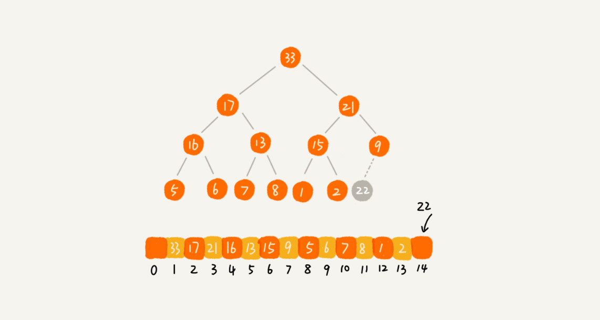
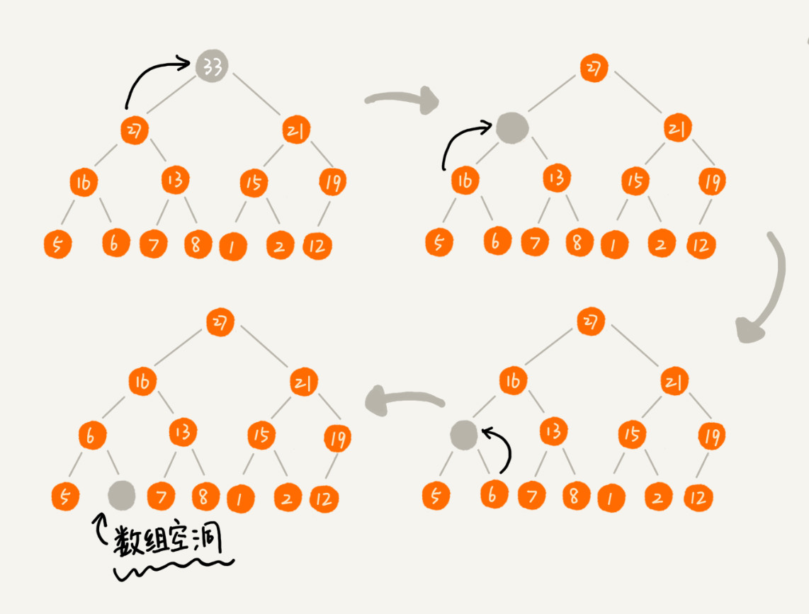

# 堆 （Heap)


## "堆(Heap)"

- `堆（Heap）是一个完全二叉树` ：

  完全二叉树要求，除了最后一层，其他层的节点个数都是满的，最后一层的节点都靠左排列.

- `堆（Heap）中的每一个节点的值都必须大于等于（或小于等于）其子树中每个节点的值`:

  即，堆中每个节点的值都大于等于（或者小于等于）其左右子节点的值。

- `大顶堆`：每个节点的值都大于等于子树中每个节点值；

- `小顶堆`：每个节点的值都小于等于子树种每个节点值.


例子：


大顶堆：1 & 2；

小顶堆：3；

不是堆:4.


## 实现一个堆

要实现一个堆，先要知道，**堆都支持哪些操作** 和 **如何存储一个堆**.


### 存储一个堆


完全二叉树比较适合用数组来存储。用数组来存储完全二叉树是非常省存储空间的，因为不需要存储左右子节点的指针，单纯地通过数组的下标，就可以找到一个节点的左右子节点和父节点。


例子：用数组存储堆


从图中我们可以看到，数组中下标为i的节点的左子节点，就是下标为 $i*2$ 的节点，右子节点就是下标为 $i*2+1$ 的结点，父节点就是下标为 $\frac{i}{2}$ 的节点。


### 堆支持的核心操作

#### 1. 往堆中插入一个元素

**往堆中插入一个元素后，需要继续满足堆的两个特性**

但是，可能出现把新插入的元素放到堆的最后，就不符合堆特性的情况，如下图。这时候就需要进行 *堆化* 处理。



- `堆化(heapify)`：使插入新元素后的堆重新满足堆的两种特性的过程。

  - 两种：

    - 从下往上；

      让新插入的节点放到堆顶，然后与子节点对比大小，如果不满足父节点大于等于子节点的大小关系，就互换两个节点，一直重复这个过程，直到父子节点之间满足刚说的那种大小关系。

    - 从上往下：

      在让新插入的节点与父节点对比大小，如果不满足子节点小于等于父节点的大小关系，就互换两个节点，一直重复这个过程，直到父子节点之间满足刚说的那种大小关系。

  - 操作：顺着节点所在的路径，向上或者向下，对比，然后交换.

  - 过程：

    举例：从下往上，且是大堆顶

    让新插入的节点与父节点对比大小，如果不满足子节点小于等于父节点的大小关系，就互换两个节点，一直重复这个过程，直到父子节点之间满足刚说的那种大小关系。

    

  

- 代码：

  ```java
  public class Heap {
    private int[] a; // 数组，从下标1开始存储数据
    private int n;  // 堆可以存储的最大数据个数
    private int count; // 堆中已经存储的数据个数
  
    public Heap(int capacity) {
      a = new int[capacity + 1];
      n = capacity;
      count = 0;
    }
  
    public void insert(int data) {
      if (count >= n) return; // 堆满了
      ++count;
      a[count] = data;
      int i = count;
      while (i/2 > 0 && a[i] > a[i/2]) { // 自下往上堆化
        swap(a, i, i/2); // swap()函数作用：交换下标为i和i/2的两个元素
        i = i/2;
      }
    }
   }
  ```


### 2. 删除堆顶元素

- 从堆的定义第二条中，任何节点的值都大于等于（或小于等于）子树节点的值，可以发现，堆顶元素存储的就是堆中数据的最大值或者最小值.

- 假设构造的是大顶堆，堆顶元素就是最大的元素。当删除堆顶元素之后，就需要把第二大的元素放到堆顶，那第二大元素肯定会出现在左右子节点中，然后再迭代地删除第二大节点，依次类推，直到叶子节点被删除.

  如下图，但这种方法有点问题，就是最后堆化出来的对并不满足完全二叉树的特性：



​	稍微改变一下思路，就可以解决这个问题：

​	如下图，把最后一个节点放到堆顶，然后利用 **从上往下的堆化方法**使同样的父子节点对比方法，对于不满父子节点大小关系	的，互换两个节点，并且重复进行这个过程，直到父子节点之间满足大小关系为止。

​	因为移除的是数组中的最后一个元素，而在堆化的过程中，都是交换操作，不会出现数组中的 "空洞", 所以这种方法堆化之后	的结果，肯定满足二叉树的特性。                                                                                                                                                                                                                                                                                                                                                                                                 


- 代码:

  ```java
  
  public void removeMax() {
    if (count == 0) return -1; // 堆中没有数据
    a[1] = a[count];
    --count;
    heapify(a, count, 1);
  }
  
  private void heapify(int[] a, int n, int i) { // 自上往下堆化
    while (true) {
      int maxPos = i;
      if (i*2 <= n && a[i] < a[i*2]) maxPos = i*2;
      if (i*2+1 <= n && a[maxPos] < a[i*2+1]) maxPos = i*2+1;
      if (maxPos == i) break;
      swap(a, i, maxPos);
      i = maxPos;
    }
  }
  ```

  

### 时间复杂度分析

一个包含 n 个节点的完全二叉树，树的高度不会超过 $log_2n$.

堆化的过程是顺着节点所在路径比较交换的，所以堆化的时间复杂度跟树的高度成正比，也就是 $O(log_n)$. 

插入数据和删除堆顶元素的主要逻辑激素堆化，所以，往堆中插入一个元素和删除堆顶元素的时间复杂度都是 $O(log_n).$


## 堆的应用

### 堆的应用一：优先级队列

- 定义：

  顾名思义，优先级队列，首先应该是一个队列。队列最大的特性就是先进先出。不过，在优先级队列中，数据的出队顺序不是先进先出，而是按照优先级来，优先级最高的，最先出队。

- 实现：

  实现优先级队列的方法有很多，但因为堆和优先级队列非常相似，所以，堆实现是最直接、最高效的。

  一个堆可以看作一个优先级队列。很多时候，它们只是概念上的区分。往优先级队列中插入一个元素，就相当于往堆中插入一个元素；从优先级队列中取出优先级最高的元素，就相当于取出堆顶元素。

- 应用场景：

  优先级队列的应用场景非常多，比如，霍夫曼编码、图的最短路径、最小生成树算法等等。

  不仅如此，很多语言中，都提供了优先级队列的实现，比如，Java 的 PriorityQueue、C++ 的 priority_queue.

- 举例：

  1. 合并有序小文件

     假设有 100 个小文件，每个文件的大小是 100MB，每个文件中存储的都是有序的字符串。我们希望将这些100个小文件合并成一个有序的大文件。这里就会用到优先级队列。

     整理思路有点像归并排序中的合并函数。从这100个文件中，各取第一个字符串，放入数组中，然后比较大小 ，把最小的那个字符串放入合并后的大文件，并删除。 

     假设，这个最小的字符串来自 13.txt 这个小文件，就再从这个小文件下取一个字符串，放到数组中，重新比较大小，并且选择最小的放入合并后的大文件，将它从数组中删除。依次类推，直到所有的文件中的数据都放入到大文件为止。

     这里用数组这种数据截个，来存储从小文件中取出来的字符串。每次从数组中取最小字符串，都需要循环遍历整个数组，显然这不是很高效。

     这时就可以用到优先级队列，也可以说是堆。将从小文件中取出来的字符串放入到小顶堆中，那堆顶的元素也就是优先级队列首的元素，就是最小的字符串。将这个字符串放入到大文件中，并将其从堆中删除，然后再从小文件中取下一个字符串，放入到堆中。循环这个过程，就可以将100个小文件中的数据依次放入到大文件中。

     删除堆顶数据和往堆中插入数据的时间复杂度都是 $O(logn)$,n表示堆中的数组个数，这里是 100.

  1. 高性能定时器

     假设有一个定时器，定时器中维护了很多定时任务，每个任务都设定了一个要触发执行的时间点。定时器每过一个很小的单位时间（比如：1秒），就扫描一遍任务，看是否有任务达到设定的执行时间。如果到达了，就拿出来执行。

     

     

     但是，这样每过1秒就扫描一遍任务列表的做法比较低效，主要原因有两点：第一，任务的约定执行时间离当前时间可能还有很久，这样前面很多次扫描其实都是徒劳的；第二，每次都要扫描整个任务列表，如果任务列表很大的话，势必会比较耗时。

     

     针对这些问题，可以用优先级队列来解决。按照任务设定的执行时间，将这些任务存储在优先级队列中，队列首部（也就是小顶堆的堆顶）存储的是最先执行的任务。

     

     这样，定时器就不需要每隔1秒就扫描一遍任务列表了。它拿队首任务的执行时间点，与当前时间点相减，得到了一个时间间隔 T.

     

     这个时间间隔 T 就是，从当前时间开始，需要等待多久，才会有第一个任务需要被执行。这样，定时器就可以设定在 T 秒之后，再来执行任务。从当前时间点到（T - 1)秒这段时间里，定时器都不需要做任何事情。

     

     当 T 秒时间过去之后，定时器取优先级队列中队首的任务执行。然后，再计算新的队首任务的执行时间点与当前时间点的差值，把这个值作为定时器执行下一个任务需等待的时间。

     

     这样，定时器，既不用间隔 1 秒就轮询依次，也不用遍历整个任务列表，性能也就提高了。

### 堆的应用二：利用堆求 Top K

- 求 Top K 的问题抽像成两类：
  - 针对静态数据集合，也就是说数据集合事先确定，不会再变；
  - 针对动态数据集合，即，数据集合事先并不确定，有数据动态地加入到集合中。


- 针对静态数据：

  

  如何在一个包含 n 个数据的数组中，查找前 K 大数据呢？

  

  可以维护一个大小为 K 的小顶堆，顺序遍历数组，从数组中取出数据与堆顶元素比较。如果比堆顶元素大，就把堆顶元素删除，并且将这个元素插入到堆中；如果比堆顶元素小，则不做处理，继续遍历数组。这样等数组中的数据都遍历完之后，堆中的数据就是前 K 大数据了。

  

  遍历数组需要 $O(n)$ 的时间复杂度，一次堆化操作需要 $O(logK)$ 的时间复杂度，所以最坏情况下，n 个元素都入堆依次，时间复杂度就是 $O(nlogK)$.

  

- 针对动态数据：

  

  对动态数据求得 Tok K 就是实时 Top K.

  

  例子：一个数据集合中有两个操作，一个是添加数据，另一个询问当前K大数据。如果每次询问前 K 大数据，都基于当前的数据重新计算的话，那时间复杂度就是 O(nlogK), n 表示当前的数据的大小。

  

  实际上，可以一直维护一个 K 大小的小顶堆，当有数据被添加到集合中时，就拿它与顶堆的元素对比。如果比顶堆元素大，就把堆顶元素删除，并且将这个元素插入到堆中；如果比顶堆元素小，则不做处理。这样，无论任何时候需要查询当前的前 K 大数据，都可以立刻返回给他.

### 堆的应用三：利用堆求中位数和百分位的数据

#### 求中位数

- 中位数，就是处在中间位置的那个数。如果数据的个数是奇数，把数据从小到大排列，那第 $\frac{n}{2}+1$ 个数据就是中位数（注意：假设数据是从 0 开始编号的）；如果数据的个数是偶数的话，那处于中间位置的数据有两个，第 $\frac{n}{2}$ 个 $\frac{n}{2}+1$ 个数据，这个时候，可以随意取一个作为中位数，比如取两个数中考前的那个，就是第 $\frac{n}{2}$ 个数据。

  


- **静态数据**，中位数是固定的，可以先排序，第 $\frac{n}{2}$ 个数据就是中位数。每次询问中位数的时候，直接返回这个固定的值就好了。所以，尽管排序的代价比较大，但是边际成本会很小。

- **动态数据**，中位数是不停地变动的，如果再用先排序的方法，每次询问中位数的时候，都要先进行排序，那效率就不高了。

  但是，借助`堆`这种数据结构，不用排序，就可以非常高效地实现求中位数操作：

  首先，需要维护两个堆，一个大顶堆，一个小顶堆。大顶堆中存储前半部分数据，小顶堆中存储后半部分数据，且小顶堆中的数据都大于大顶堆中的数据。

  如果有 n 个数据，n 是偶数，从小到大排序，那前 $\frac{n}{2}$ 个数据存储在大顶堆中，后 $\frac{n}{2}$ 个数据存储在小顶堆中。这样大顶堆中的堆顶元素就是要找的中位数。如果 n 是奇数，情况类似，大顶堆就存储 $\frac{n}{2}+1$ 个数据，小顶堆中就存储 $\frac{n}{2}$ 个数据。

  

  

  但是，数据是动态变化的，当新添加一个数据的时候，如何调整两个堆，让大顶堆中的堆顶元素继续是中位数？

  

  如果新加入的数据小于等于大顶堆的堆顶元素，就将这个新数据插入到大顶堆；否则，就将这个新数据插入到小顶堆。

  

  这时，就可能出现，两个堆中的数据个数不符合前面约定的情况：如果 n 是偶数，两个堆中的数据个数都是 $\frac{n}{2}$;如果是奇数，大顶堆有 $\frac{n}{2}+1$ 个数据，小顶堆有 $\frac{n}{2}$ 个数据。这个时候，可以从一个堆中不停地将堆顶元素移动到另一个堆，来使堆中的数据满足上面的约定。

  

  

  于是，就可以利用两个堆，一个大顶堆、一个小顶堆，实现在动态数据集合中求中位数的操作。

  

  插入数据因为需要涉及堆化，所以时间复杂度就变成了 $O(logn)$,但是求中位数只需要返回大顶堆的堆顶元素即可，所以复杂度就是 $O(1)$.

#### 求百分位的数据

- 问题：如何快速求接口的 99% 响应时间？

- 概念说明：

  

  中位数的概念就是将数据从小到大排列，处于中间位置，就叫做中位数，这个数据会大于等于前面 50% 的数据。

  99 百分位数的概念可以类比中位数，如果将一组数据从小到大排列，这个 99 百分位数就是大于前面 99%数据的那个数据。

  例子：假设有 100 个数据，分别是 1，2，3，......, 100, 那 99 百分位数就是 99，因为小于等于 99 的数占总个数的 99%.

  

  

- 99% 响应时间：

  

  如果有 100 个接口访问请求，每个接口请求的响应时间都不同，比如 55 毫秒、100 毫秒、23毫秒等，把这 100 个接口的响应时间按照从小到大排列，排在第 99 的那个数据就是 99% 响应时间，也叫 99 百分位响应时间。

  

  总结：如果有 n 个数据，将数据从小到大排列之后，99 百分位数大约就是第 $n*99\%$ 个数据，同类，80 百分位数大约就是第 $n*80\%$ 个数据。

  

- 求 99% 响应时间：

  

  维护两个堆，一个大顶堆，一个小顶堆。假设当前总数据的个数是 n, 大顶堆中保存 $n*99\%$ 个数据，小顶堆中保存 $n*1\%$ 个数据。大丁堆堆顶的数据就是要找的 $99\%$ 响应时间。

  

  每次插入一个数据的时候，要判断这个数据跟大顶堆和小顶堆堆顶数据的大小关系，然后决定插入到哪个堆中。如果这个新插入的数据比大顶堆的堆顶数据小，那就插入大顶堆；如果这个新插入的数据比小顶堆的数据大，那就插入小顶堆。


​	但是，为了保持大顶堆中的数据占 $99\%$，小顶堆中的数据占 $1\%$, 在每次新插入数据之后，都要重新计算，这个时候大顶堆和	小顶堆中的数据个数，是否还复合 99:1这个比例。如果不符合，就将一个堆中的数据移动到另一个堆，直到满足这个比例。移	动的方法类似前面求中位数的方法。


​	通过这样的方法，每次插入数据，可能会涉及几个数据的堆化操作，所以时间复杂度是 $O(logn)$.每次求 $99\%$ 响应时间的时	候，直接返回大顶堆中的堆顶数据即可，时间复杂度是 $O(1)$.


****

## 问题

1. 在讲堆排序建堆的时候，说到，对于完全二叉树来说，下标从 2n+1 到 n 的都是叶子节点，这个结论是怎么推导出来的呢？


​	使用数组存储表示完全二叉树时，从数组下标为1开始存储数据，数组下标为i的节点，左子节点为2i, 右子节点为2i + 1. 这	个结论很重要（可以用数学归纳法证明)，将此结论记为『原理1』，以下证明会用到这个原理。


​	为什么，对于完全二叉树来说，下标从n/2 + 1 到 n的节点都是叶子节点？ 使用反证法证明即可：


​	如果下标为n/2 + 1的节点不是叶子节点，即它存在子节点，按照『原理1』，它的左子节点为：2(n/2 + 1) = n + 2，大家	明显可以看出，这个数字已经大于n + 1，超出了实现完全二叉树所用数组的大小（数组下标从1开始记录数据，对于n个节点来	说，数组大小是n + 1），左子节点都已经超出了数组容量，更何况右子节点。以此类推，很容易得出：下标大于n/2 + 1的节	点肯定都是也叶子节点了，故而得出结论：对于完全二叉树来说，下标从n/2 + 1 到 n的节点都是叶子节点


​	备注下：用数组存储表示完全二叉树时，也可以从下标为0开始，只是这样做的话，计算左子节点时，会多一次加法运算


2. 假设现在我们有一个包含 10 亿个搜索关键词的日志文件，如何能快速获取到热门榜 Top 10 的搜索关键词呢？

   

   处理这个问题，有很多高级的解决方法，比如使用 MapReduce 等。但是，如果我们将处理的场景限定为单机，可以使用的内存为 1GB。那这个问题该如何解决呢？


​	因为用户搜索的关键词，有很多可能都是重复的，所以我们首先要统计每个搜索关键词出现的频率。我们可以通过散列表、平衡	二叉查找树或者其他一些支持快速查找、插入的数据结构，来记录关键词及其出现的次数。


​	假设我们选用散列表。我们就顺序扫描这 10 亿个搜索关键词。当扫描到某个关键词时，我们去散列表中查询。如果存在，我	们就将对应的次数加一；如果不存在，我们就将它插入到散列表，并记录次数为 1。以此类推，等遍历完这 10 亿个搜索关键	词之后，散列表中就存储了不重复的搜索关键词以及出现的次数。


​	然后，我们再根据前面讲的用堆求 Top K 的方法，建立一个大小为 10 的小顶堆，遍历散列表，依次取出每个搜索关键词及	对应出现的次数，然后与堆顶的搜索关键词对比。如果出现次数比堆顶搜索关键词的次数多，那就删除堆顶的关键词，将这个出	现次数更多的关键词加入到堆中。


​	以此类推，当遍历完整个散列表中的搜索关键词之后，堆中的搜索关键词就是出现次数最多的 Top 10 搜索关键词了。


​	不知道你发现了没有，上面的解决思路其实存在漏洞。10 亿的关键词还是很多的。我们假设 10 亿条搜索关键词中不重复的有 	1 亿条，如果每个搜索关键词的平均长度是 50 个字节，那存储 1 亿个关键词起码需要 5GB 的内存空间，而散列表因为要	避免频繁冲突，不会选择太大的装载因子，所以消耗的内存空间就更多了。而我们的机器只有 1GB 的可用内存空间，所以我们	无法一次性将所有的搜索关键词加入到内存中。这个时候该怎么办呢？


​	在哈希算法那一节讲过，相同数据经过哈希算法得到的哈希值是一样的。我们可以根据哈希算法的这个特点，将 10 亿条搜索	关键词先通过哈希算法分片到 10 个文件中。


​	具体可以这样做：我们创建 10 个空文件 00，01，02，……，09。我们遍历这 10 亿个关键词，并且通过某个哈希算法对其求	哈希值，然后哈希值同 10 取模，得到的结果就是这个搜索关键词应该被分到的文件编号。


​	对这 10 亿个关键词分片之后，每个文件都只有 1 亿的关键词，去除掉重复的，可能就只有 1000 万个，每个关键词平均 	50 个字节，所以总的大小就是 500MB。1GB 的内存完全可以放得下。


​	我们针对每个包含 1 亿条搜索关键词的文件，利用散列表和堆，分别求出 Top 10，然后把这个 10 个 Top 10 放在一块，	然后取这 100 个关键词中，出现次数最多的 10 个关键词，这就是这 10 亿数据中的 Top 10 最频繁的搜索关键词了。


3. 有一个访问量非常大的新闻网站，我们希望将点击量排名 Top 10 的新闻摘要，滚动显示在网站首页 banner 上，并且每隔 1 小时更新一次。如果你是负责开发这个功能的工程师，你会如何来实现呢？


​	feifei:


- 对每篇新闻摘要计算一个hashcode，并建立摘要与hashcode的关联关系，使用map存储，以hashCode为key，新闻摘要为值

- 按每小时一个文件的方式记录下被点击的摘要的hashCode
- 当一个小时结果后，上一个小时的文件被关闭，开始计算上一个小时的点击top10
- 将hashcode分片到多个文件中，通过对hashCode取模运算，即可将相同的hashCode分片到相同的文件中
- 针对每个文件取top10的hashCode，使用Map<hashCode,int>的方式，统计出所有的摘要点击次数，然后再使用小顶堆（大小为10）计算top10

- 再针对所有分片计算一个总的top10,最后合并的逻辑也是使用小顶堆，计算top10
- 如果仅展示前一个小时的top10,计算结束

- 如果需要展示全天，需要与上一次的计算按hashCode进行合并，然后在这合并的数据中取top10
- 在展示时，将计算得到的top10的hashcode，转化为新闻摘要显示即可


​	

1，合并有序小文件
https://github.com/kkzfl22/datastruct/tree/master/src/main/java/com/liujun/datastruct/heap/solution/margeSmailFile
2，高性能定时器的应用
https://github.com/kkzfl22/datastruct/tree/master/src/main/java/com/liujun/datastruct/heap/solution/highTimeSchedule
3，求topk
https://github.com/kkzfl22/datastruct/tree/master/src/main/java/com/liujun/datastruct/heap/solution/topK
4，求中位数
https://github.com/kkzfl22/datastruct/tree/master/src/main/java/com/liujun/datastruct/heap/solution/midnum
5 ,大文件的关键字的统计
https://github.com/kkzfl22/datastruct/tree/master/src/main/java/com/liujun/datastruct/heap/solution/bigFileTopN


*`@ 笔记时间 ：2021-02-08 FROM	极客时间 《算法啊与数据结构之美》 王争  专栏`* 