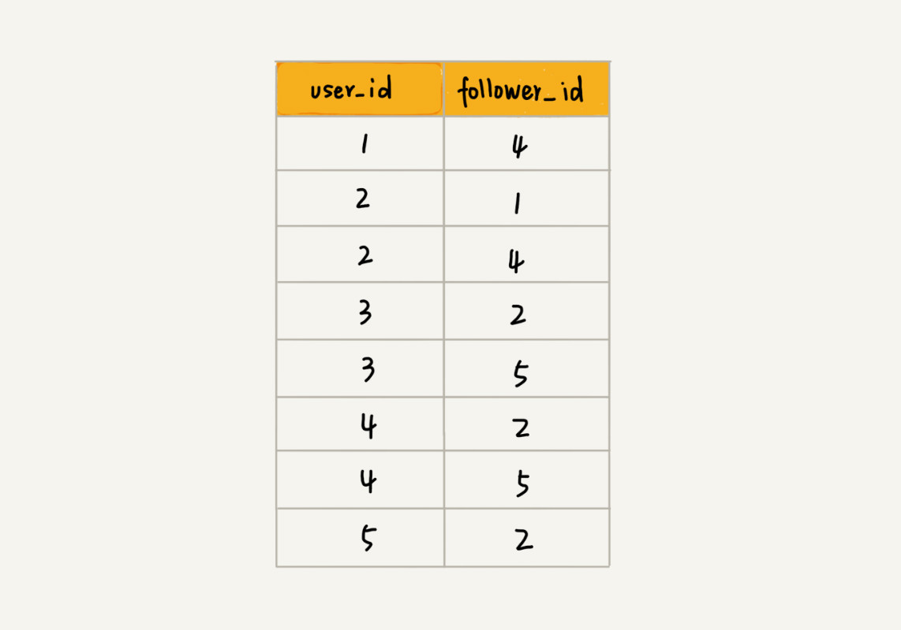

# 图（Graph）

## 理解"图"（Graph)

- 图（Graph）是一种非线性表数据结构，和树比起来，这是一种更加复杂的非线性表结构；

- 概念：

  1. **顶点（Vertex)**:图中的元素；

  2. **边（Edge)**:图中的一个顶点与任意其他顶点建立的连接关系；

  

  4. **方向（Direction）**：把边有方向的图叫做"有向图"；把边没有方向的图叫做"无向图"；

	 5. **度（Degree）**:在无向图中，表示一个顶点有多少条边；在有向图中，把度分为 **入度**（In-Degree) 和 **出度**（Out-Degree)；

	 6. **入度（In-Degree)**：表示有多少条边指向这个顶点；

	 7. **出度（Out-Degree）**：表示有多少条边是以这个顶点为起点指向其他顶点；

     

	 8. **带权图（Weighted Graph）**：图中每条边都有一个权重（Weight），可以通过这个权重来表示 QQ 好友间的亲密度。

     

     

     

- 例子：

  - 微信的社交关系，可以把每个用户看作一个顶点，如果两个用户之间互加好友，那就在两者之间建立一条边。所以，整个微信的关系就可以用一张图来表示。其中，每个用户有多少个好友，对应到图中，就叫做顶点的度。

    

  - 微博的社交关系，跟微信还有点不一样，或者说更加复杂一点。微博允许单向关注，也就是说，用户 A 关注了用户 B,但用户 B 可以不关注用户 A。入度就表示有多少粉丝，出度就表示关注了多少人。

    

  - QQ的社交关系更要复杂一点，qq 密度这样一个功能，不仅记录了用户之间的好友关系，还记录了两个用户之间的亲密度，如果两个用户经常往来，那亲密度就比较高；如不经常往来，那亲密度就比较低。

## 邻接矩阵（Adjacency Matrix）

- 图最直观的一种存储方法就是，邻接矩阵。

- 邻接矩阵的底层依赖一个二维数组，对于无向图来说，如果顶点 i 与 顶点 j 之间有边，就将 A\[i][j] 和 A\[j][i] 标记为 1；对于有向图来说，如果顶点 i 与 顶点 j 之间，有一条箭头从顶点 i 指向顶点 j 的边，那就将 A\[i][j] 标记为 1。对于带权图，数组中就存储相应的权重。

  

- 缺点：浪费存储空间

  对于无向图来说，如果 A\[i][j] 等于 1，那 A\[j][i] 也肯定等于 1. 实际上，只需要存储一个就可以了，也就是说，无向图的二维数组中，如果将其用对角线划分为上下两部分，那只需要利用上面或者下面这样一半的空间就足够了，另外一半白白浪费掉了。

  还有，如果存储的是 **稀疏图（Sparse Matrix）**，也就是说，顶点很多，但每个顶点的边并不多，那邻接矩阵的存储方法就更加浪费空间了。比如，微信有好几亿的用户，对应到图上就是好几亿的顶点。但是每个用户的好友并不会很多，一般也就三五百个而已，如果用邻接矩阵来存储，那绝大部分的存储空间都被浪费了。

- 优点：：

  1. 简单、直接：因为基于数组，所以在获取两个顶点的关系时，就非常高效；

  1. 方便计算：因为用邻接矩阵的方式存储图，可将很多图的运算转换成矩阵之间的运算。

     例子：求解最短路径问题时的会提到一个，`Floyd-Warshall 算法`，就是利用矩阵循环相乘若干次得到的结果。

## 邻接表（Adjacency List）

- 邻接表如下图，每个顶点对应一条链表，链表中存储的是与这个顶点相连接的其他顶点。另外，图中画的是一个有向图的邻接表存储方式，每个顶点对应的链表，存储的是指向的顶点。对于无向图来说，也是类似的，不过，每个顶点的链表中存储的，是跟这个顶点有边相连的顶点：

  

- 时间、空间复杂度互换：

  邻接矩阵比较浪费空间，但是使用起来比较节省时间；相反，邻接表存储起来比较节省空间，但是使用起来比浪费时间。

  就像图中的例子，如果确定，是否存在一条从顶点2到顶点4的边，那就要遍历顶点2对应的那条链表，看链表中是否存在顶点4；而且，前面讲过，链表的存储方式对缓存不友好。所以，比起，邻接矩阵的存储方式，在邻接表中查询两个顶点之间的关系就没有那么高效了。

  在散列表中讲过，在基于链表法解决冲突的散列表中，如果链过长，为了提高查找效率，可以将链表换成其他更加高效的数据结构，比如平衡二叉查找树等。刚刚也讲到，邻接表长的很像散列表，所以，可以将邻接表同散列表一样进行"改进升级"。

  可将邻接表中的链表改成平衡二叉查找树，实际开发中，可以选择用红黑树。这样，就可以更加快速地查找两个顶点之间是否存在边。当然，这里的二叉查找树，可以换成其他动态数据结构，比如跳表、散列表等；除此之外，还可以将链表改成有序动态数组，可以通过二分查找的方法来快速定位两个顶点之间是否是存在边。

## 思考

1. 如何存储微博、微信等这些社交网络的好友关系？

   前面分析了，微博、微信是两种 "图"，前者是有向图，后者是无向图。在这个问题上，两者的解决思路差不多，所以只拿微博来讲解。

   *数据机构是为算法服务的，所以具体选择哪种存储方法，与期望支持的操作有关系。针对微博用户关系，假设需要支持下面这样几个操作：*

   1. 判断用户 A 是否关注了用户 B；
   1. 判断用户 A 是否是用户 B 的粉丝；
   1. 用户 A 关注用户 B；
   1. 用户 A 取消关注用户 B；
   1. 根据用户名称的首字母排序，分页获取用户的粉丝列表；
   1. 根据用户名称的首字母排序，分页获取用户的关注列表。

   关于如何存储一个图，前面讲到两种主要的存储方法，邻接矩阵和邻接表。因为社交网络是一张稀疏图，使用邻接矩阵存储比较浪费就存储空间。所以，这里才用了邻接表来存储。

   不过，用一个邻接表来存储这种有向图是不够的。去查找某个用户关注了哪些用户非常容易，但是如果要想知道某个用户都被哪些用户关注了，也就是用户的粉丝列表，是非常困难的。

   基于此，需要一个逆邻接表。邻接表中存储了用户的关注关系，逆邻接表中存储的是用户的被关注关系。对应到图上，邻接表中，每个顶点的链表中，存储的就是这个顶点指向的顶点，逆邻接表中，每个顶点的链表中，存储的是指向这个顶点的顶点。

   如果要查找某个用户关注了哪些用户，可以在邻接表中查找；如果要查找某个用户被哪些用户关注了，从逆邻接表中查找。

   

基础的邻接表不适合快速判断两个用户之间是否是关注与被关注的关系，所以选择改进版本，将邻接表中的链表改为支持快速查找的动态数据结构。但是选择哪种动态数据结构呢？红黑树、跳表、有序动态数组还是散列表？

因为需要按照用户名称的首字母排序，分页来获取用户的粉丝列表或者关注列表，用跳表这种结构再合适不过了。这是因为，跳表插入、删除、查找都非常高效，时间复杂度是 $O(logn)$，空间复杂度上稍高，是$O(n)$.最重要的一点，跳表中存储的数据本来就是有序的，分页获取粉丝列表或关注列表，就非常高效。

如果对于小规模的数据，比如社交网络中只有几万、几十万个用户，可以将整个社交关系存储在内存中，上面的解决思路是没有问题的。但是如果像微博那样有上亿的用户，数据规模太大，就无法全部存储在内存中了。这个时候，怎么办呢？

可以通过哈希算法等数据分片方式，将邻接表存储在不同的机器上。可以看下面这幅图，在机器1上存储顶点1、2、3的邻接表，在机器2上，存储顶点4、5的邻接表。逆邻接表的处理方式也一样，当要查询顶点与顶点的关系的时候，就利用同样的哈希算法，先定位顶点所在的机器，然会再相应的机器上查找。

除此之外，还有另外一种解决思路，就是利用外部存储（比如硬盘），因为外部存储的存储空间要比内存会宽裕很多。数据库是经常来持久化存储关系数据的，所以这里介绍一种数据库的存储方式。

下面这张表来存储这样一个图，为了高效地支持前面定义的操作，可以在表上建立多个索引，比如第一列、第二列，给这两列都建立索引：

2. 像微信这种无向图，因该怎么存储？

   微信好友关系存储方式。无向图，也可以使用邻接表的方式存储每个人所对应的好友列表。为了支持快速查找，好友列表可以使用红黑树存储。

2. 除了今天局的社交网络可以用图来表示之外，符合图这种结构特点的例子还有很多，比如知识图谱（Knowledge Graph),关于图这种数据结构，还能想到其他生活或工作中的例子吗？

   生活工作中应用图的例子。很多，互联网上网页之间通过超链接连接成一张有向图；城市乃至全国交通网络是一张加权图；人与人之间的人际关系够成一张图，著名的六度分割理论据说就是基于这个得到的。

*`@ 笔记时间 ：2021-02- 12 FROM	极客时间 《算法啊与数据结构之美》 王争  专栏`* 