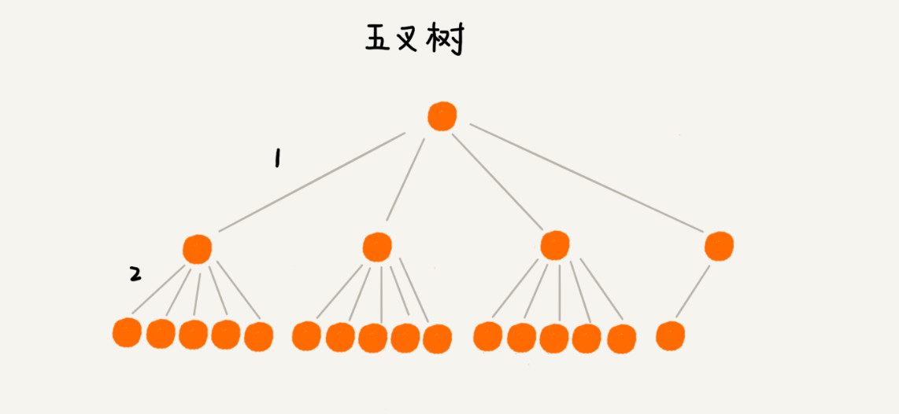

# B+ 树

[toc]

## 算法解析 ：思考的过程比结论更重要

### 1. 解决问题的前提是定义清楚问题

如何定义清楚问题呢？除了对问题进行详细的调研，还有一个办法，就是，`通过对一些模糊的需求进行假设，来限定要解决的问题的范围。`

首先，假设要解决的问题，只包含这样两个常用的需求：

- 根据某个值查找数据，比如 SELECT * FROM user WHERE id = 1234;
- 根据区间值来查找某些数据，比如 SELECT * FROM user WHERE id > 1234 and id < 2345.

除了这些功能性需求之外，往往还涉及一些非功能性需求，比如安全、性能、用户体验等等。限于专栏要讨论的主要是数据结构和算法，对于非功能性需求，着重考虑 **性能方面**的需求。性能方面的需求，主要考察时间和空间两方面，也就是 **执行效率和存储空间**。

执行效率，希望通过索引，查询数据的效率尽可能地高；在存储空间方面，希望索引不要消耗太多的内存空间。

### 2. 尝试用学过的数据结构解决这个问题

问题的需求大致定义清楚了，现在回想一下，能否利用已经学过的数据结构解决这个问题？

支持快速查询、插入等操作的动态数据结构：散列表、平衡二叉查找树、跳表。

- 散列表：散列表的查询性能很好，时间复杂度是 $O(1)$。但是，散列表不能支持按照区间快速查找数据，所以，散列表不能满足需求。

- 平衡二叉查找树：尽管平衡二叉查找树查询的性能也很高，时间复杂度是 $O(logn)$。而且，对树进行中序遍历，还可以得到一个从小到大有序的数据序列，但这仍然不足以支持按照区间快速查找数据。

- 跳表：跳表是在链表之上加上多层索引构成的。它支持快速地插入、查找、删除数据，对应的时间复杂度是 $O(logn)$.并且，跳表也支持按照区间快速地查找数据。只需要定位到区间起点值对应在链表中的节点，然后从这个节点开始，顺序遍历链表，直到区间终点对应的结点为止，这期间遍历得到的数据就是满足区间值得数据。

  

  这样看来，跳表是可以解决这个问题。实际上，数据库索引所用到的数据结构跟跳表非常相似，叫作 **B+ 树**。不过，它是通过二叉树演化过来的，而非跳表。

### 3. 改造二叉查找树来解决这个问题

为了让二叉查找树按照区间来查找数据，可以对它进行这样的改造：树中的节点并不存储数据本身， 而是只是作为索引。除此之外，把每个叶子节点串在一条链表上，链表中的数据从小到大是有序的。经过改造之后的二叉树，如下图，看起来很像跳表：


改造之后，如果要求某个区间的数据，只需要拿区间的起始值，在树中进行查找，当查找到某个叶子节点之后，再顺着链表往后遍历，直到链表中的节点数据值大于区间的终止值为止。所有遍历到的数据，就是符合区间值得所有数据。


但是，要为几千万、上亿的数据构建索引，如果将索引存储在内存中，尽管内存访问的速度非常快，查询的效率非常高，但是，占用的内存会非常多。

比如，给一亿个数据构建二叉查找树索引，那索引中会包含大约1一亿个节点，每个节点假设占用16个字节，那就需要大约 1GB 的内存空间。给一张表建立索引，需要 1GB 的内存空间。如果要给 10 张表建立索引，那对内存的需求是无法满足的，如何解决这个索引占用太多内存的问题？

可以借助时间换空间的思路，把索引存储在硬盘中，而非内存中。但，硬盘是一个非常慢速的存储设备，通常内存的访问速度是纳秒级别的，而磁盘访问的速度是毫秒级别的。读取同样大小的数据，从磁盘中读取花费的时间，是从内存中读取所花费时间的上万倍，甚至是几十万倍。

这种将索引存储在硬盘的方案，尽管减少了内存消耗，但是在数据查找的过程中，需要读取磁盘中的索引，因此数据查询效率就相应降低很多。

二叉查找树，经过改造之后，支持区间查找的功能就实现了。不过了，为了节省内存，如果把树存储在硬盘中，那么每个节点的读取（或者访问），都对应依次磁盘 IO 操作。树的高度就等于每次查询数据时磁盘 IO 操作的次数。

前面讲到，比起内存读写操作，磁盘 IO 操作非常耗时，所以优化的重点就是尽量减少磁盘 IO 操作，也就是，尽量降低树的高度。那如何降低树的高度呢？

如果把索引构建成 m 叉树，高度是不是比 二叉树要小呢？如图所示，给 16 个数据构建二叉树索引，树的高度是4，查找一个数据，就需要 4 个磁盘 IO 操作（如果根节点存储在内存中，其他节点存储在磁盘中），如果对16个数据构建五叉树索引，那高度只有2，查找一个数据，对应只需要 2 次磁盘操作。如果 m 叉树中的 m 是 100，那对一亿个数据构建索引，树的高度也只是 3，最多只要 3 次磁盘 IO 就能获取到数据。磁盘 IO 变少了，查找数据的效率也就提高了。




如果将 m 叉树实现 B+ 树索引，用代码实现出来，就是下面这个样子（假设给 int 类型的数据库字段添加索引，所以代码中的 kewwords 是 int 类型的）：

```java
/**
 * 这是B+树非叶子节点的定义。
 *
 * 假设keywords=[3, 5, 8, 10]
 * 4个键值将数据分为5个区间：(-INF,3), [3,5), [5,8), [8,10), [10,INF)
 * 5个区间分别对应：children[0]...children[4]
 *
 * m值是事先计算得到的，计算的依据是让所有信息的大小正好等于页的大小：
 * PAGE_SIZE = (m-1)*4[keywordss大小]+m*8[children大小]
 */
public class BPlusTreeNode {
  public static int m = 5; // 5叉树
  public int[] keywords = new int[m-1]; // 键值，用来划分数据区间
  public BPlusTreeNode[] children = new BPlusTreeNode[m];//保存子节点指针
}

/**
 * 这是B+树中叶子节点的定义。
 *
 * B+树中的叶子节点跟内部节点是不一样的,
 * 叶子节点存储的是值，而非区间。
 * 这个定义里，每个叶子节点存储3个数据行的键值及地址信息。
 *
 * k值是事先计算得到的，计算的依据是让所有信息的大小正好等于页的大小：
 * PAGE_SIZE = k*4[keyw..大小]+k*8[dataAd..大小]+8[prev大小]+8[next大小]
 */
public class BPlusTreeLeafNode {
  public static int k = 3;
  public int[] keywords = new int[k]; // 数据的键值
  public long[] dataAddress = new long[k]; // 数据地址

  public BPlusTreeLeafNode prev; // 这个结点在链表中的前驱结点
  public BPlusTreeLeafNode next; // 这个结点在链表中的后继结点
}
```

代码说明：对于相同个数的数据构建 m 叉树索引，m 叉树中的 m 越大，那树的高度就越小，那 m 叉树中的 m 是不是越大越好呢？到底多大才最合适？

不管是内存中的数据，还是磁盘中的数据，操作系统都是按页（一页大小通常是 4KB,这个值可以通过 getconfig PAGE_SIZE 命令查看）来读取的，一次会读取一页的数据。如果要读取的数据量超过一页的大小，就会触发多次 IO 操作。所以，在选择 m 大小的时候，要尽量让每个节点的大小等于一个页的大小。读取一个节点，只需要一次磁盘 IO 操作。


尽管索引可以提高数据库的查询效率，但是，作为一名开发工程师，索引有利也有弊，它会让写入数据的效率下降。

原因如下：

对于一个 B+ 树来说，m 值是根据页的大小事先计算好的，即，每个节点最多只能有 m 个子节点。在往数据库中写入数据的过程中，这样就可能使索引中某些节点的子节点个数超过 m，这个节点的大小超过了一个页的大小，读取这样一个节点，就会导致多次磁盘 IO 操作。如何解决呢？

实际上，处理思路并不复杂。只需要将这个节点分裂成两个节点。但是，节点分裂之后，其上层父节点的子节点个数就有可能超过 m 个。不过，这也没关系，可以用同样的方法，将父节点也分裂成两个节点。这种级联反应会从下往上，一直影响到根节点。这个分裂过程，可以结合下图一起看，会更容易理解（图中的 B+ 树一个三叉树，限定叶子节点中，数据的个数超过 2 个就分裂节点；非叶子节点中，子节点的个数超过 3 个就分裂节点）。


正是因为要时刻保证 B+ 树索引是一个 m 叉树，所以，索引的存在会导致数据库写入的速度降低。实际上，不光写入数据会变慢，删除数据也会变慢。

这是因为，在删除某个数据的时候，也要对应地更新索引节点，这个处理思路有点类似跳表中删除数据的处理思路。频繁的数据删除，就会导致某些节点中，子节点的个数变得非常少，长此以往，如果每个节点的子节点都比较少，势必会影响索引的效率。

所以，可以设置一个阙值。在B+树种，这个阙值等于 $m/2$。如果某个节点的子节点个数小于 $m/2$，就将它根相邻的兄弟节点合并。不过，合并之后节点的子节点个个数有可能会超过 m。针对这种情况，可以借助插入数据时候的处理方法，再分裂节点。

如下图所示：图中的B+树是一个五叉树，限定叶子节点中，数据的个数少于2个就合并节点；非叶子节点中，子节点的个数少于3个就合并节点。


B+树的结构和操作，跟跳表非常类似，理论上讲，对跳表稍加改造，也可以替代B+树，作为数据库的索引实现。

## 总结引申

数据库索引的实现，依赖底层数据结构：B+ 树。它通过存储在磁盘的多叉树结构，做到了时间、空间的平衡，既保证了执行效率，又节省了内存。

#### B+ 树

B+ 树特点总结：

- 每个节点中子节点的个数不能超过 $m$，也不能小于 $m/2$；
- 根节点的子节点个数可以不超过 $m/2$，这是一个例外；
- $m$ 叉树只存储索引，并不真正存储数据，这个有点儿类似跳表；
- 通过链表将叶子节点串联在一起，这样可以方便按区间查找；
- 一般情况，根节点会被存储在内存中，其他节点存储在磁盘中。

#### B 树

除了 B+ 树，还有 B 树、B- 树 实际上，B- 树就是 B 树，英文翻译都是 B-Tree，这里的“-”并不是相对 B+ 树中的“+”，而只是一个连接符。

而 B 树实际上是低级版的 B+ 树，或者说 B+ 树是 B 树的改进版。B 树跟 B+ 树的不同点主要集中在这几个地方：

- B+ 树中的节点不存储数据，只是索引，而 B 树中的节点存储数据；
- B 树中的叶子节点并不需要链表来串联。

也就是说，B 树只是一个每个节点的子节点个数不能小于 m/2 的 m 叉树。


*`@ 笔记时间 ：2021-02- 14 FROM	极客时间 《算法啊与数据结构之美》 王争  专栏`* 