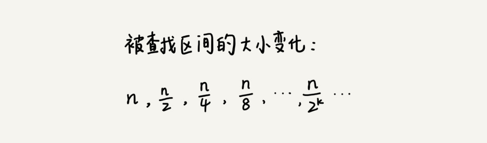

# 二分查找 （Binary Search）

[toc]

## 介绍

>**二分查找 (Binary Search) 针对的是一个`有序`的数据集合，查找思想有点类似分治思想。**
>
>**每次都通过跟区间的中间元素对比，将待查找的区间缩小为之前的一半，直到找到要查找的元素，或者区间被缩小为 0。**

## 二分思想

二分查找是一种非常简单易懂的快速查找算法，生活中到处可见。

比如说，现在来做一个猜字游戏。随机写一个 0 到 99 之间的数字，然后来猜写的是什么。猜的过程中，每猜一次，就会告诉猜的大了还是小了，直到猜中为止。来想想，如何快速猜中我写的数字呢？

假设写的数字是 23，可以按照下面的步骤来试一试。（如果猜测范围的数字有偶数个，中间数有两个，就选择较小的那个。）


7 次就猜出来了，是不是很快？这个例子用的就是二分思想，按照这个思想，即便猜的是 0 到 999 的数字，最多也只要 10 次就能猜中。


这是一个生活中的例子，现在回到实际的开发场景中。假设有 1000 条订单数据，已经按照订单金额从小到大排序，每个订单金额都不同，并且最小单位是元。现在想知道是否存在金额等于 19 元的订单。如果存在，则返回订单数据，如果不存在则返回 null。

最简单的办法当然是从第一个订单开始，一个一个遍历这 1000 个订单，直到找到金额等于 19 元的订单为止。但这样查找会比较慢，最坏情况下，可能要遍历完这 1000 条记录才能找到。那用二分查找能不能更快速地解决呢？

为了方便讲解，假设只有 10 个订单，订单金额分别是：8，11，19，23，27，33，45，55，67，98。需要查找的订单金额为 19。

还是利用二分思想，每次都与区间的中间数据比对大小，缩小查找区间的范围。

为了更加直观，画了一张查找过程的图。其中，low 和 high 表示待查找区间的下标，mid 表示待查找区间的中间元素下标。


## O(logn) 惊人的查找速度

二分查找是一种非常高效的查找算法，高效到什么程度呢？来分析一下它的时间复杂度。

假设数据大小是 n，每次查找后数据都会缩小为原来的一半，也就是会除以 2。最坏情况下，直到查找区间被缩小为空，才停止。



可以看出来，这是一个等比数列。

其中 $n/2k=1$ 时，k 的值就是总共缩小的次数。

而每一次缩小操作只涉及两个数据的大小比较，所以，经过了 k 次区间缩小操作，时间复杂度就是 **O(k)**。通过 $n/2k=1$,可以求得 $k=log_2n$，所以时间复杂度就是 $O(logn)$。

### 为什么 O(logn) 这种对数时间复杂度十分地高效？

$O(logn)$ 这种对数时间复杂度,是一种极其高效的时间复杂度，有的时候甚至比时间复杂度是常量级 $O(1) $的算法还要高效。

$logn$ 是一个非常“恐怖”的数量级，即便 n 非常非常大，对应的 logn 也很小。比如 n 等于 2 的 32 次方，这个数很大了吧？大约是 42 亿。也就是说，如果在 42 亿个数据中用二分查找一个数据，最多需要比较 32 次。

用大 O 标记法表示时间复杂度的时候，会省略掉常数、系数和低阶。对于常量级时间复杂度的算法来说，O(1) 有可能表示的是一个非常大的常量值，比如 O(1000)、O(10000)。所以，常量级时间复杂度的算法有时候可能还没有 O(logn) 的算法执行效率高。

反过来，对数对应的就是指数。有一个非常著名的“阿基米德与国王下棋的故事”，可以自行搜索一下，感受一下指数的“恐怖”。这也是为什么说，指数时间复杂度的算法在大规模数据面前是无效的。

## 二分查找的递归与非递归实现

简单的二分查找并不难写，但是二分查找的变体问题，那才是真正烧脑的。

### 最简单的情况 ：有序数组中不存在重复元素

#### 循环实现 ：

```java
// java code

// 循环实现
public int bsearch(int[] a, int n, int value) {
  int low = 0;
  int high = n - 1;

  while (low <= high) {
    int mid = (low + high) / 2;
    if (a[mid] == value) {
      return mid;
    } else if (a[mid] < value) {
      low = mid + 1;
    } else {
      high = mid - 1;
    }
  }

  return -1;
}
```

这个代码稍微解释一下，low、high、mid 都是指数组下标，其中 low 和 high 表示当前查找的区间范围，初始 low=0， high=n-1。mid 表示[low, high]的中间位置。

通过对比 a[mid]与 value 的大小，来更新接下来要查找的区间范围，直到找到或者区间缩小为 0，就退出。

如果有一些编程基础，看懂这些应该不成问题。现在，着重强调一下**容易出错的 3 个地方**。

##### `1. 循环退出条件`

注意是 low<=high，而不是 low<high。

##### `2. mid 的取值`

实际上，$mid=(low+high)/2$ 这种写法是有问题的。因为如果 low 和 high 比较大的话，两者之和就有可能会**溢出**。

改进的方法是将 mid 的计算方式写成 $low+(high-low)/2$。

更进一步，如果要将性能优化到极致的话，可以将这里的除以 2 操作转化成位运算 $low+((high-low)>>1)$。因为相比除法运算来说，计算机处理位运算要快得多。

##### `3. low 和 high 的更新`

$low=mid+1$，$high=mid-1$。

注意这里的 +1 和 -1，如果直接写成 low=mid 或者 high=mid，就可能会发生死循环。比如，当 high=3，low=3 时，如果 a[3]不等于 value，就会导致一直循环不退出。

#### 递归实现 ：

```java
// java code
// 二分查找的递归实现
public int bsearch(int[] a, int n, int val) {
  return bsearchInternally(a, 0, n - 1, val);
}

private int bsearchInternally(int[] a, int low, int high, int value) {
  if (low > high) return -1;

  int mid =  low + ((high - low) >> 1);
  if (a[mid] == value) {
    return mid;
  } else if (a[mid] < value) {
    return bsearchInternally(a, mid+1, high, value);
  } else {
    return bsearchInternally(a, low, mid-1, value);
  }
}
```

## 局限性

### 1. 二分查找依赖的是`顺序表结构`，简单点说就是`数组`

那二分查找能否依赖其他数据结构呢？比如链表。答案是不可以的，主要原因是**二分查找算法需要按照下标随机访问元素**。

在数组和链表那两节讲过，**数组**按照下标随机访问数据的时间复杂度是 $O(1)$，而**链表**随机访问的时间复杂度是 $O(n)$。

所以，如果数据使用链表存储，二分查找的时间复杂就会变得很高。二分查找只能用在数据是通过顺序表来存储的数据结构上。如果数据是通过其他数据结构存储的，则无法应用二分查找。

### 2. 二分查找针对的是`有序数据`。

二分查找对这一点的要求比较苛刻，数据必须是**有序的**;如果数据没有序，就需要先**排序**。

前面章节里讲到，排序的时间复杂度最低是 $O(nlogn)$。

所以，如果针对的是一组静态的数据，没有频繁地插入、删除，可以进行一次排序，多次二分查找。这样排序的成本可被均摊，二分查找的边际成本就会比较低。

但是，如果数据集合有频繁的插入和删除操作，要想用二分查找，要么每次插入、删除操作之后保证数据仍然有序，要么在每次二分查找之前都先进行排序。针对这种动态数据集合，无论哪种方法，维护有序的成本都是很高的。

所以，二分查找只能用在插入、删除操作不频繁，一次排序多次查找的场景中。针对动态变化的数据集合，二分查找将不再适用。那针对动态数据集合需要用到 **二叉树**。

### 3. 数据量太小不适合二分查找。

如果要处理的数据量很小，完全没有必要用二分查找，顺序遍历就足够了。

比如在一个大小为 10 的数组中查找一个元素，不管用二分查找还是顺序遍历，查找速度都差不多。

只有数据量比较大的时候，二分查找的优势才会比较明显。

不过，这里有一个例外。如果**数据之间的比较操作非常耗时，不管数据量大小，都推荐使用二分查找**。比如，数组中存储的都是长度超过 300 的字符串，如此长的两个字符串之间比对大小，就会非常耗时。需要尽可能地减少比较次数，而比较次数的减少会大大提高性能，这个时候二分查找就比顺序遍历更有优势。

### 4. 数据量太大也不适合二分查找。

二分查找的底层需要依赖数组这种数据结构，而数组为了支持随机访问的特性，要求内存空间`连续`，对内存的要求比较苛刻。比如，有 1GB 大小的数据，如果希望用数组来存储，那就需要 1GB 的连续内存空间。

注意这里的“连续”二字，也就是说，即便有 2GB 的内存空间剩余，但是如果这剩余的 2GB 内存空间都是零散的，没有连续的 1GB 大小的内存空间，那照样无法申请一个 1GB 大小的数组。

而二分查找是作用在数组这种数据结构之上的，所以太大的数据用数组存储就比较吃力了，也就不能用二分查找了。

## 二分查找的变体


要特别说明一点，为了简化讲解，数据是**从小到大排列**为前提，如果要处理的数据是从大到小排列的，解决思路也是一样的。

### 变体一： 查找第一个值等于给定值的元素

之前讲的二分查找是最简单的一种，即**有序数据集合中不存在重复的数据，在其中查找值等于某个给定值的数据。**

现在，**有序数据集合中存在重复的数据，希望找到第一个值等于给定值的数据**。

比如下面这样一个有序数组，其中，a[5]，a[6]，a[7]的值都等于 8，是重复的数据。希望查找第一个等于 8 的数据，也就是下标是 5 的元素。


如果用之前课讲的二分查找的代码实现，首先拿 8 与区间的中间值 a[4]比较，8 比 6 大，于是在下标 5 到 9 之间继续查找。下标 5 和 9 的中间位置是下标 7，a[7]正好等于 8，所以代码就返回了。

尽管 a[7]也等于 8，但它并不是想要找的第一个等于 8 的元素，因为第一个值等于 8 的元素是数组下标为 5 的元素。

之前讲的无重复元素的二分查找代码就无法处理这种情况了。所以，针对这个变形问题，可以稍微改造一下无重复元素二分查找的代码。

```java
// java

// 查找第一个值等于给定值的元素
public int bsearch(int[] a, int n, int value) {
  int low = 0;
  int high = n - 1;
  while (low <= high) {
    int mid = low + ((high - low) >> 1);
    if (a[mid] >= value) {
      high = mid - 1;
    } else {
      low = mid + 1;
    }
  }

  if (low < n && a[low]==value) return low;
  else return -1;
}
```

尽管简洁，理解起来却非常烧脑，也很容易写错。看完这个实现之后，是不是觉得很不好理解？如果只是死记硬背这个写法，过不了几天，就会全都忘光，再让你写，90% 的可能会写错。所以，换了一种实现方法，看看是不是更容易理解呢？

```java
// java

public int bsearch(int[] a, int n, int value) {
  int low = 0;
  int high = n - 1;
  while (low <= high) {
    int mid =  low + ((high - low) >> 1);
    if (a[mid] > value) {
      high = mid - 1;
    } else if (a[mid] < value) {
      low = mid + 1;
    } else {
      if ((mid == 0) || (a[mid - 1] != value)) return mid;
      else high = mid - 1;
    }
  }
  return -1;
}
```

- 说明：

  $a[mid]$ 跟要查找的 value 的大小关系有三种情况：大于、小于、等于。

  -  $a[mid]>value$ : $high= mid-1$

  -  $a[mid] < value$ : $low=mid+1$

  - $a[mid]=value$ : 

    - 如果查找的是**任意一个值等于给定值的元素**，当 $a[mid]$ 等于要查找的值时，$a[mid]$ 就是要找的元素。

    - 但是，如果求解的是**第一个值等于给定值的元素**，当 $a[mid]$ 等于要查找的值时，就需要确认一下这个 $a[mid]$  是不是第一个值等于给定值的元素。

      

**重点看第 11 行代码。如果 mid 等于 0，那这个元素已经是数组的第一个元素，那它肯定是要找的；如果 mid 不等于 0，但 $a[mid]$的前一个元素 $a[mid-1]$ 不等于 value，那也说明 $a[mid]$ 就是要找的第一个值等于给定值的元素。**

**如果经过检查之后发现 a[mid]前面的一个元素 a[mid-1]也等于 value，那说明此时的 a[mid]肯定不是要查找的第一个值等于给定值的元素。那就更新 high=mid-1，因为要找的元素肯定出现在[low, mid-1]之间。**


对比上面的两段代码，是不是下面那种更好理解？

实际上，**很多人都觉得变形的二分查找很难写，主要原因是太追求第一种那样完美、简洁的写法**。而对于做工程开发的人来说，**代码易读懂、没 Bug**，其实更重要.


### 变体二：查找最后一个值等于给定值的元素

```java
// java code

// 查找最后一个值等于给定值的元素
public int bsearch(int[] a, int n, int value) {
  int low = 0;
  int high = n - 1;
  while (low <= high) {
    int mid =  low + ((high - low) >> 1);
    if (a[mid] > value) {
      high = mid - 1;
    } else if (a[mid] < value) {
      low = mid + 1;
    } else {
      if ((mid == n - 1) || (a[mid + 1] != value)) return mid;
      else low = mid + 1;
    }
  }
  return -1;
}
```

重点看第 11 行代码。如果 a[mid]这个元素已经是数组中的最后一个元素了，那它肯定是要找的；如果 a[mid]的后一个元素 a[mid+1]不等于 value，那也说明 a[mid]就是要找的最后一个值等于给定值的元素。

如果经过检查之后，发现 a[mid]后面的一个元素 a[mid+1]也等于 value，那说明当前的这个 a[mid]并不是最后一个值等于给定值的元素。就更新 low=mid+1，因为要找的元素肯定出现在[mid+1, high]之间。


### 变体三： 查找第一个大于等于给定值的元素

在有序数组中，查找第一个大于等于给定值的元素。

比如，数组中存储的这样一个序列：3，4，6，7，10。

如果查找第一个大于等于 5 的元素，那就是 6。

实际上，实现的思路跟前面的那两种变形问题的实现思路类似，代码写起来甚至更简洁。

```java
// java code

// 查找第一个大于等于给定值的元素
public int bsearch(int[] a, int n, int value) {
  int low = 0;
  int high = n - 1;
  while (low <= high) {
    int mid =  low + ((high - low) >> 1);
    if (a[mid] >= value) {
      if ((mid == 0) || (a[mid - 1] < value)) return mid;
      else high = mid - 1;
    } else {
      low = mid + 1;
    }
  }
  return -1;
}
```

- $a[mid] < value : low=mid+1$ , 说明要查找的值肯定在$$[mid+1, high]$$之间.

- $a[mid] >=  value$ : 要先看下这个 $ a[mid] $是不是要找的第一个值大于等于给定值的元素。
  - $a[mid]$ 前面已经没有元素 or $a[mid]$ 前一个元素 $< value$ ，那 $a[mid]$ 就是要找的元素,对应的代码是第 7 行。
  - $a[mid-1] >= value : high = mid + 1$ , 说明要查找的元素在[low, mid-1]之间.

### 变体四：查找最后一个小于等于给定值的元素

查找最后一个小于等于给定值的元素。

比如，数组中存储了这样一组数据：3，5，6，8，9，10。

最后一个小于等于 7 的元素就是 6。

是不是有点类似上面那一种？实际上，实现思路也是一样的。

```java
// java code

// 查找最后一个小于等于给定值的元素
public int bsearch7(int[] a, int n, int value) {
  int low = 0;
  int high = n - 1;
  while (low <= high) {
    int mid =  low + ((high - low) >> 1);
    if (a[mid] > value) {
      high = mid - 1;
    } else {
      if ((mid == n - 1) || (a[mid + 1] > value)) return mid;
      else low = mid + 1;
    }
  }
  return -1;
}
```

## 思考

>1. 如何在 1000 万个整数中快速查找某个整数？

这个问题并不难。的内存限制是 100MB，每个数据大小是 8 字节，最简单的办法就是将数据存储在数组中，内存占用差不多是 80MB，符合内存的限制。借助今天讲的内容，可以先对这 1000 万数据从小到大排序，然后再利用二分查找算法，就可以快速地查找想要的数据了。

看起来这个问题并不难，很轻松就能解决。实际上，它暗藏了“玄机”。如果对数据结构和算法有一定了解，知道散列表、二叉树这些支持快速查找的动态数据结构。可能会觉得，用散列表和二叉树也可以解决这个问题。实际上是不行的。

虽然大部分情况下，用二分查找可以解决的问题，用散列表、二叉树都可以解决。但是，后面会讲，不管是散列表还是二叉树，都会需要比较多的额外的内存空间。如果用散列表或者二叉树来存储这 1000 万的数据，用 100MB 的内存肯定是存不下的。而二分查找底层依赖的是数组，除了数据本身之外，不需要额外存储其他信息，是最省内存空间的存储方式，所以刚好能在限定的内存大小下解决这个问题。

> 2. 如果数据使用链表存储，二分查找的时间复杂就会变得很高，那查找的时间复杂度究竟是多少呢？如果自己推导一下，就会深刻地认识到，为何会选择用数组而不是链表来实现二分查找了。

假设链表长度为n，二分查找每次都要找到中间点(计算中忽略奇偶数差异):
第一次查找中间点，需要移动指针n/2次；
第二次，需要移动指针n/4次；
第三次需要移动指针n/8次；
......
以此类推，一直到1次为值

总共指针移动次数(查找次数) = n/2 + n/4 + n/8 + ...+ 1，这显然是个等比数列，根据等比数列求和公式：Sum = n - 1.

最后算法时间复杂度是：O(n-1)，忽略常数，记为O(n)，时间复杂度和顺序查找时间复杂度相同

但是稍微思考下，在二分查找的时候，由于要进行多余的运算，严格来说，会比顺序查找时间慢

> 3. 如何编程实现“求一个数的平方根”？要求精确到小数点后 6 位。

...............

>4. 如何快速定位出一个 IP 地址的归属地？

如果 IP 区间与归属地的对应关系不经常更新，可以先预处理这 12 万条数据，让其按照起始 IP 从小到大排序。

如何来排序呢? IP 地址可以转化为 32 位的整型数。所以，可以将起始地址，按照对应的整型值的大小关系，从小到大进行排序。

然后，这个问题就可以转化为第四种变形问题“在有序数组中，查找最后一个小于等于某个给定值的元素”了。

当要查询某个 IP 归属地时，可以先通过二分查找，找到最后一个起始 IP 小于等于这个 IP 的 IP 区间，然后，检查这个 IP 是否在这个 IP 区间内，如果在，就取出对应的归属地显示；如果不在，就返回未查找到。


> 5. 如果有序数组是一个循环有序数组，比如 4，5，6，1，2，3。
>
>    针对这种情况，如何实现一个求“值等于给定值”的二分查找算法呢？

有三种方法查找循环有序数组

 一、

1. 找到分界下标，分成两个有序数组
2. 判断目标值在哪个有序数据范围内，做二分查找

 二、

1. 找到最大值的下标 x;

2. 所有元素下标 +x 偏移，超过数组范围值的取模;

3. 利用偏移后的下标做二分查找；

4. 如果找到目标下标，再作 -x 偏移，就是目标值实际下标。

    两种情况最高时耗都在查找分界点上，所以时间复杂度是 O(N）。

    复杂度有点高，能否优化呢？

 三、
循环数组存在一个性质：以数组中间点为分区，会将数组分成一个有序数组和一个循环有序数组。

 如果首元素小于 mid，说明前半部分是有序的，后半部分是循环有序数组；
 如果首元素大于 mid，说明后半部分是有序的，前半部分是循环有序的数组；
 如果目标元素在有序数组范围中，使用二分查找；
 如果目标元素在循环有序数组中，设定数组边界后，使用以上方法继续查找。

 时间复杂度为 O(logN)。


>6. 为什么要写 int mid = low + ((high - low)>>1)，而不是 int mid = (low + high)/2 呢？

​	第二种的写法有可能会导致溢出，比如low很大，high也很大，之和就溢出了。


*`@ 笔记时间 ：2020-09-03	FROM	极客时间 《算法啊与数据结构之美》 王争  专栏`* 

